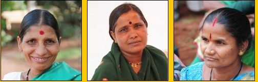

 *\[Editor’s Note: This is the first of a 3-part series on a unique urban cooperative organization – an evolution from a ‘Convention of 800 Ragpickers’ to a registered trade union and finally to its current form.\]*

<figure aria-describedby="caption-attachment-1053" class="wp-caption alignleft" id="attachment_1053" style="width: 504px">

<figcaption class="wp-caption-text" id="caption-attachment-1053">Pic: Courtesy wastepickerscollective.org</figcaption></figure>

Panchayats and cooperatives are associated with rural India, right? Or so I thought until I started reading up on Pune-based [SWaCH](http://swachcoop.com/about-swachpune.html) (Solid Waste and Collection Handling) – which lays claim to being India’s first wholly owned *urban cooperative* of self-employed ragpickers and waste collectors. The parent organization is Kagad Kach Patra Kashtakari Panchayat – KKPKP (no! that’s not a morphed version of the IPL team King’s XI Punjab). I’m reproducing the content of KKPKP’s [About Us](http://www.wastepickerscollective.org/index.php?mod=about_us) page – one of the more unique ways of introducing a community-based organization:

> We pick up what someone has discarded as having no value and give it value through our labour. Long ago in 1990, we were treated like the trash we collect. People would shoo us away like they would dogs. They would cover their noses when they passed us. It hurt. We were not sitting in garbage because we enjoyed it! We were there because we wanted the recyclables. We mostly worked alone, sometimes with friends who did not care too much about it either. Our mothers and grandmothers had done it before us. It was this work that brought us money to feed ourselves and our families so we did it.
> 
> One summer’s day in 1993 all of us gathered in a hall to talk. We talked like we never had before giving vent our anger and frustration at the way we were treated…..like trash!
> 
> That was the turning point for us. That day we decided to stand tall.
> 
> That day we decided to walk with dignity on the road we had never travelled, as human beings…….as part of Kagad Kach Patra Kashtakari Panchayat.
> 
> Kagad Kach Kashtakari Panchayat is our trade union. It brings together waste pickers, itinerant waste buyers, waste collectors and other informal recyclers. We recover, collect, categorise and sell scrap materials such as corrugated board, paper, plastics, metals and glass for recycling. We also provide garbage collection, composting and related waste management services. Our members are self employed workers.

Their [Newsmakers](http://www.wastepickerscollective.org/index.php?mod=item&com=news) page also has a unique preamble:

> Many years ago, no one noticed us. Journalists took pictures of overflowing garbage containers. We may have been around and so got included in the frame. That was all. We had never heard of conferences or meetings regarding waste management. Of course no one thought to invite us.
> 
> Times have changed since then and we are in the news. We attend meetings and address conferences. We even organise some of our own! It’s not just about our photos and interviews in the news. We want real changes in our lives. We want out contributions to be recognised. We cannot achieve those only on our own. We need the help of governments and others like you. So we are in the news telling India and the world about our issues; our concerns; our struggles; our challenges; and our victories…

Next post in this series – *[Ragpicker Chronicles: how a cooperative transformed their lives](http://www.techsangam.com/2012/04/05/ragpicker-chronicles-how-a-cooperative-transformed-their-lives/)*.