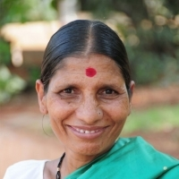
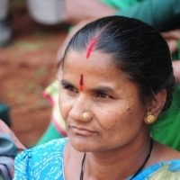
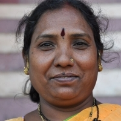

 *\[Editor’s Note: This is Part 2 of a 3-part series on a unique urban cooperative organization – an evolution from a ‘Convention of 800 Ragpickers’ to a registered trade union and finally to its current form. Part 1 was [Kagad Kach Patra Kashtakari Panchayat](http://www.techsangam.com/2012/04/05/kagad-kach-patra-kashtakari-panchayat-kkpkp/).\]*

In this post, I present 3 stories. Three stories (from KKPKP’s website) that reveal the dramatic transformation in a lowly ragpicker’s life – as she moved from an unorganized single entity to being part of an organized trade union (eventually cooperative) – within two decades.

<figure aria-describedby="caption-attachment-1070" class="wp-caption alignleft" id="attachment_1070" style="width: 200px">

<figcaption class="wp-caption-text" id="caption-attachment-1070">Sunanda More (Pic: courtesy KKPKP)</figcaption></figure>

**Suman Mariba More**

> Suman More is a proud mother – her son L. More has completed his Bachelor in Arts, a diploma in journalism and is currently pursuing his Masters degree.
> 
> This did not come easily to Suman, a wastepicker in Pune city, India. Her parents had migrated to Pune from their village in search of work and began wastepicking. She started wastepicking with them when she was around 13 years old. Suman married Mr. More at the age of fourteen and had her 4th child when she turned 22. Their main source of income was waste picking. Suman’s husband also earned money by performing on traditional drums and conducting religious ceremonies. However income from these activities was sporadic and irregular.
> 
> When Suman started work she would pick up recyclable waste on the roadside, in local waste depositories or public waste bins provided by the Pune Municipal Corporation. She walked long distances and worked from dawn to dusk. Her children helped to sort the waste at home as sorted scrap fetched a better price.
> 
> In 1992-93 organizers of KKPKP trade union of wastepickers came to her community to talk about the need to organize waste workers. They explained that the benefits of organizing included getting access to waste at source, fewer hours of work for the same amount of money, cleaner working conditions, insurance etc. Many of her neighbours discouraged her becoming a member saying that these benefits are utopian and that it was a new way for some people to make money!!! However, she decided to join KKPKP with a few other people in the community and has never regretted her decision.
> 
> Now her working conditions have improved. Suman explains: “I work only 4 hours for more money, since I collect the waste from door to door. The quality and condition of waste is much better”. Door to door collection has other benefits. She builds relationships with people and engages in casual conversation over a cup of tea. Coming from a lower caste and class of society she never thought this would happen in her lifetime. She is happy that she is able to have a proper lunch break and that they are provided with soap to wash their hands and legs before they sit to have lunch in a cool, clean place in the residential complex where she works. A higher income has also meant that she can afford proper medical care instead of self-medicating with the help of a pharmacist to avoid going to the doctor.
> 
> Suman no longer takes the waste home to sort. The municipal corporation has provided a sorting shed where several waste pickers gather to sort their waste while engaging in conversation and easy banter lightening up their day. Once she goes home, she has time now to watch some television to ease off the day’s hard work.
> 
> As a member of KKPKP Suman took an oath to educate her children, and enlisted the help of KKPKP to enroll her children in school. Both her first and last sons have received cash prizes from KKPKP for their achievements. Her daughter-in-law is a computer engineer from a Brahmin (upper caste) family for whom she wants to be a good mother-in-law. She married her daughter only after she turned eighteen and did not give dowry, she smiles proudly.

<figure aria-describedby="caption-attachment-1071" class="wp-caption alignright" id="attachment_1071" style="width: 200px">

<figcaption class="wp-caption-text" id="caption-attachment-1071">Sunanda Kalunkhe (Pic: courtesy KKPKP)</figcaption></figure>

**Sunanda Kalunkhe**

> Sunandabai Kalunke spends most of her day sorting through the waste generated by over a hundred households allocated to her by SWACH, a cooperative of waste pickers. Paper, plastic, bottles, fruit and vegetable peels, and food – lots and lots of leftover food. There may have been a time when a waste picker and her children may have been tempted to eat these scraps. But for Sunandabai, working with a cooperative has brought a certain dignity and financial security, and she is not tempted. But her heart aches to see large sections of pizza, chapattis, bread, rice, sometimes even fish or chicken, go waste.
> 
> So she does not let it go waste. She collects it all in a bag, and takes it to a piece of open ground near her house in Pune. And there she distributes it to a hungry flock of crows. Well, it started with the crows, five years ago. By some unknown grapevine, the news spread, and sparrows began to join in. Then came mynas, and dogs. Squirrels followed soon after. Now there is a menagerie of around 200 birds and animals that eagerly waits for Sunandabai every morning. And she is always there, with her bagfuls of leftovers.
> 
> On Sundays, Sunandabai does not go on her waste-picking round, and there are no leftovers. But the menagerie knows no Sunday, and the crows come to her door, cawing raucously for their breakfast. So Sunandabai has taken to keeping some food ready for Sunday. If she can’t make the waste food last, she makes fresh chapattis!
> 
> What drives this woman, living at the brink of a subsistence existence, working at a back-breaking and filthy occupation, to spare time and effort for the birds?
> 
> “Their souls will be satisfied, their blessings will be with me, that is enough,” she says smiling. The waste-pickers play a crucial role in the preservation of the environment by recycling waste. Sunandabai adds another, rather spiritual dimension to this role.

<figure aria-describedby="caption-attachment-1072" class="wp-caption alignleft" id="attachment_1072" style="width: 200px">

<figcaption class="wp-caption-text" id="caption-attachment-1072">Mangal Gaikwad (Pic: courtesy KKPKP)</figcaption></figure>

**Mangal Gaikwad**

> Mangal Gaikwad resides in a slum in Aundh. The difference that her involvement in door-step collection and in the Union made to her life is presented in her own words. “Today I earn RsRs.3000 from doorstep collection and the sale of scrap. The residents in the area who used to frown at me while I was at the garbage bin, now know my name and greet me. A resident gave me a second hand bicycle. I had never ridden one before. Today, I ride to work on that cycle. When I was a child I used to envy the children who went to school with their bags and water-bottles while I had to go waste picking. Since my work day is shorter now I was able to attend the literacy class in my slum. I am now literate. I am the Treasurer of the credit co-operative and the representative for my slum. I used to be terrified of my abusive alcoholic husband. Twice I sent him to a de-addiction centre. He stopped for a while but continues to drink. I am no longer terrified of him. I do not give him money to drink. I have bought a bigger house for Rs.65000 from my savings and a loan I took from the credit co-operative”.

More tales below. Read them all — you won’t regret it.

- A feminist ([Jana Dutta Kamble](http://www.wastepickerscollective.org/index.php?mod=item_info&com=gallery&cID=&ivID=20))
- A courageous HIV-positive woman ([Manisha Barode](http://www.wastepickerscollective.org/index.php?mod=item_info&com=gallery&cID=&ivID=23))
- A fighter that’ll make any RTI activist proud ([Rahi Ingale](http://www.wastepickerscollective.org/index.php?mod=item_info&com=gallery&cID=&ivID=21))
- The fair leader who’s already had a taste of recession ([Chaya Sontakke](http://www.wastepickerscollective.org/index.php?mod=item_info&com=gallery&cID=&ivID=24))