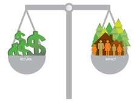

<figure aria-describedby="caption-attachment-1065" class="wp-caption alignleft" id="attachment_1065" style="width: 221px">

<figcaption class="wp-caption-text" id="caption-attachment-1065">Pic: courtesy giirs.org</figcaption></figure>

**Aavishkar and Cisco**

Cisco announced that it will invest in Aavishkaar’s Aavishkar II fund – a Mauritius based US$120 million fund. The funding will be part of Cisco’s commitment to invest about $200 million of venture capital investments in India, of which almost half has been utilized. Aavishkaar II’s focus will be on rural India, specifically agriculture, education, health, and energy sectors. With the [Cisco announcement](http://www.sys-con.com/node/2234269), the fund also achieved its first closing at US$70 million. Its other institutional investors include IFC, KFW, FMO and CDC. The fund seeks significant developmental impact in addition to commercial value generation. Previously, Aavishkaar has invested in the following rural social enterprises – INI Farms, Milk Mantra, Vortex Engineering, Waterlife Foundation, [Vaatsalya](http://www.techsangam.com/category/2011/06/20/vaatsalya-affordable-high-quality-healthcare-formula-smaller-towns/), Swas Healthcare, GV Meditech, Rangsutra, Desert Artisans Handicrafts, Zameen Organic, B2R Technologies, and Servals).

**IFMR Rural Channels and Lok Capital**

[Lok Capital](http://lokcapital.com/), an impact investing firm with an exclusive focus on MFIs and financial inclusion, and Proparco (a French development body) announced an investment of $5 million in IFMR Rural Channels. According to [IFMR’s website](http://www.ifmr.co.in/our-companies/), IFMR Rural Channels is one among 4 groups of companies that the umbrella trust manages. A few days ago, the President of IFMR Trust (Bindu Ananth) tweeted this:

https://twitter.com/#!/binduananth/status/185563365807095808

Which begs the questions – what is KGFS? and what is a *KGFS franchise*?

The first one is easily answered. KGFS stands for Kshetriya Gramin Financial Services and aims to deliver a suite of financial products and services to people living in *remote rural* locations. Currently there are three KGFS locations:

- Thanjavur, Tamilnadu (Pudhuaaru KGFS)
- Ganjam, Orissa (Dhanei KGFS)
- Uttarakhand (Sahastradhara KGFS)

IFMR starting promoting its KGFS model in 2008 and its loan portfolio includes group loans, retailer loans, asset-backed loans, micro enterprise and emergency loans) and also provides insurance products (accident, life, livestock). IFMR Rural has 107 branches across the 3 centers and caters to 173,000+ customers.

