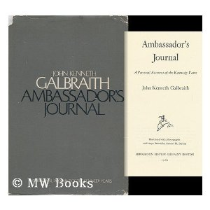

I recently started reading [Ambassador’s Journal](http://www.amazon.com/Ambassadors-Journal-Personal-Account-Kennedy/dp/0241016193) – John Kenneth Galbraith’s personal account of the Kennedy years. It’s a 500+ page heavy tome but my pal (@zenrainman) tells me why it should be a fun read:

https://twitter.com/#!/zenrainman/status/187195027158609921

After the first 20 pages itself, I can see that he’s right. I’ve transcribed the Jan 29, 1961 journal entry where he talks about the first time hard liquor was served at a White House party.

<figure aria-describedby="caption-attachment-1413" class="wp-caption alignleft" id="attachment_1413" style="width: 300px">

<figcaption class="wp-caption-text" id="caption-attachment-1413">Pic: courtesy amazon.com</figcaption></figure>

**January 29 – Washington**

*I worked all morning – Sunday – on drafts for the balance-of-payments message. What prose! Meaning was everywhere elaborately but not deliberately concealed. I finally got a new and more tolerable version.*

*This afternoon there was a big party at the White House. I was invited verbally and arrived without a ticket – since I had a White House car, I was waved into the grounds. After some telephoning, it was concluded that I belonged. The mood was gay and agreeable; I found I knew almost everyone; Jackie looked tall and soignee. For the first time in the White House at a public function, hard liquor was served. There was also smoking but, I believe, no smutty stories. The Republic may be in decline, but more likely it is only becoming less stuffy. Afterward there was an agreeable party at the Lippmanns’ and thereafter dinner with the Harrimans and the Murrows. I doubt that Ed is going to be a success at USIA to which he has just been appointed. He is too inclined to act when he should think — and plays for effect. But after dinner he settled down and talked quite rationally.*

Footnote (on Ed Murrow): Ed Murrow had been a news analyst and commentator with CBS for some twenty-six years before heading to the United States Information Agency. In my initial reaction, I could scarcely have been more mistaken. I soon came to think of im as the most effective of the New Frontier appointments.