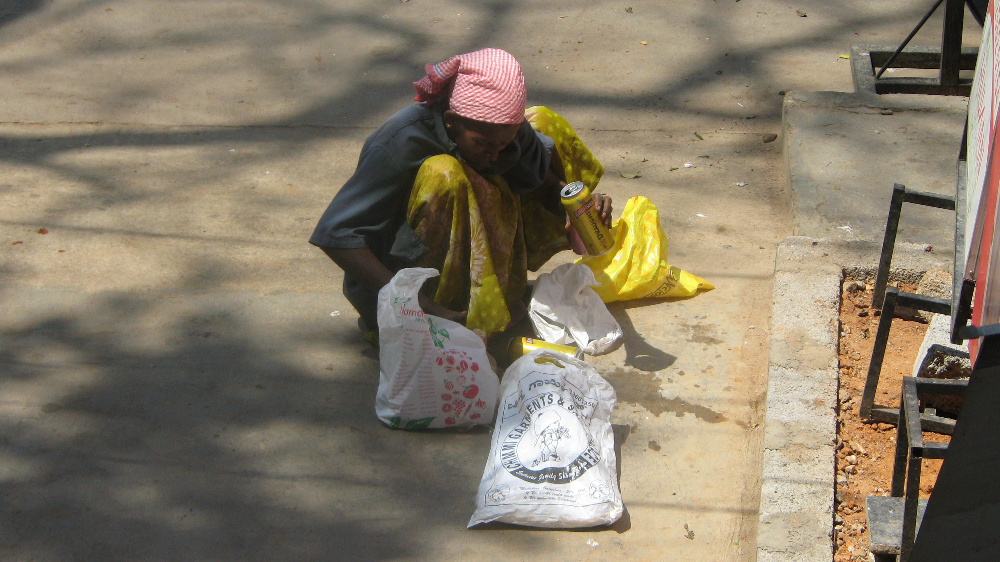
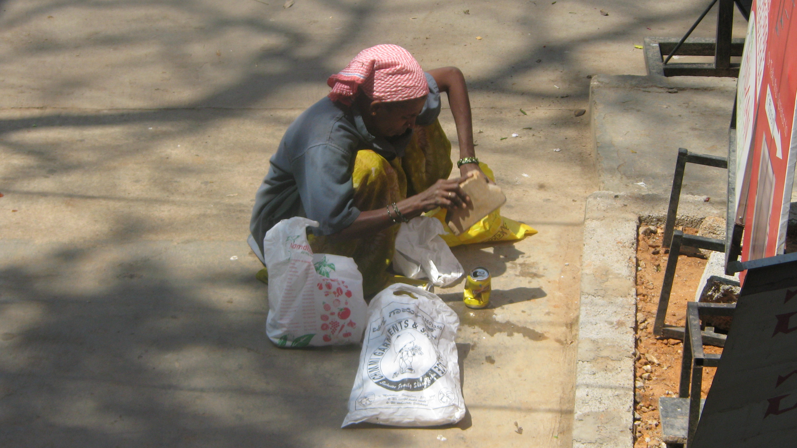
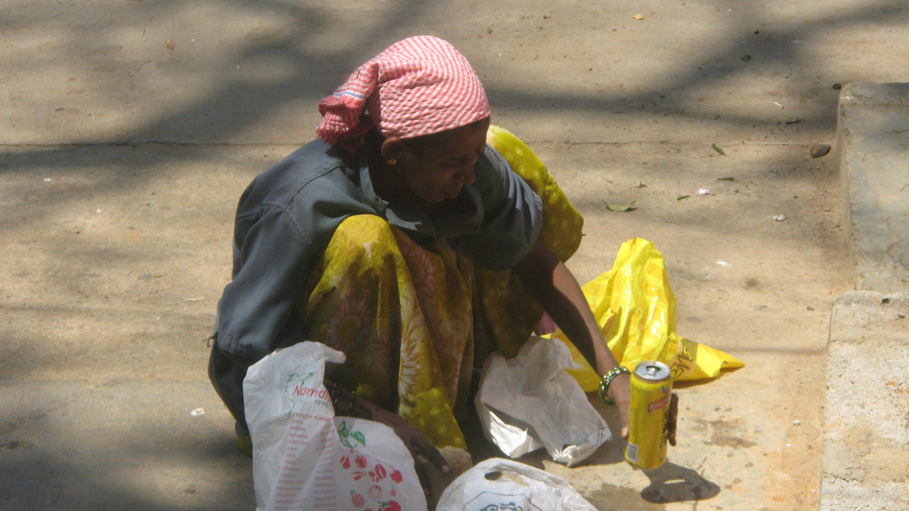

You can probably surmise what the 3 pictures are all about. Scroll down just a bit and any lingering doubts will be dispelled by the 10 second video.

<figure aria-describedby="caption-attachment-1077" class="wp-caption aligncenter" id="attachment_1077" style="width: 300px">

<figcaption class="wp-caption-text" id="caption-attachment-1077">Picture #1</figcaption></figure>

<figure aria-describedby="caption-attachment-1078" class="wp-caption aligncenter" id="attachment_1078" style="width: 300px">

<figcaption class="wp-caption-text" id="caption-attachment-1078">Picture #2</figcaption></figure>

<figure aria-describedby="caption-attachment-1079" class="wp-caption aligncenter" id="attachment_1079" style="width: 300px">

<figcaption class="wp-caption-text" id="caption-attachment-1079">Picture #3</figcaption></figure>

….

….

….

….

….

….

….

….

<iframe allowfullscreen="true" class="youtube-player" height="394" src="https://www.youtube.com/embed/BpOXe02xDgE?version=3&rel=1&fs=1&autohide=2&showsearch=0&showinfo=1&iv_load_policy=1&wmode=transparent" style="border:0;" width="700"></iframe>

This scene played out in front of Costa Coffee in Koramangala 5th Block. The woman is one of Bangalore’s numerous BBMP workers – responsible for sweeping the sidewalks, collecting trash from residential neighborhoods, ferrying it all to a spot where it gets loaded onto a BBMP truck. Not *everything* gets loaded on the trucks. Some (like the Kingfisher beer cans) can fetch extra money in the recyclables market. This woman took about 3 bags of cans and ‘optimized’ them into one bag.

No – I am *not* presenting this as a bizarre example of *jugaad*.

These days everybody and their brother is writing about India as an *emerging superpower*. Next time you read one of those articles or hear someone gushing about it at a social gathering, just point them to this little cog in Bangalore’s waste management workflow. In short, no danger of India becoming a superpower.. anytime soon.