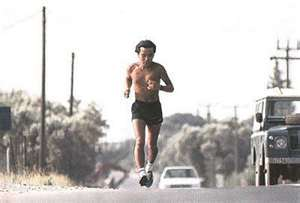

<figure aria-describedby="caption-attachment-1424" class="wp-caption alignleft" id="attachment_1424" style="width: 300px">

<figcaption class="wp-caption-text" id="caption-attachment-1424">Haruki Murakami (Pic: courtesy operatic.wordpress.com)</figcaption></figure>

*On the way I passed a few other joggers, about an equal number of men and women. The energetic ones were zipping down the road, slicing through the air like they had robbers down their heels. Others, overweight, huffed and puffed, their eyes half-closed, shoulders slumped like this was the last thing in the world they wanted to be doing. They looked maybe a week ago their doctors had told them they have diabetes and warned them they had to start exercising. I’m somewhere in the middle.*

This is how Haruki Murakami, famous novelist and marathon runner, describes himself in [What I talk about when I talk about running](http://www.amazon.com/What-About-Running-Vintage-International/dp/0307389839/ref=tmm_pap_title_0). You realize it’s a self-effacing assessment only after you finish reading his memoir. It reminded me that I’ve long wanted to create a catalog of the different types of runners – a diverse group that’s *somewhere in the middle*. Here’s a partial list:

- <figure aria-describedby="caption-attachment-1425" class="wp-caption alignright" id="attachment_1425" style="width: 300px">

<figcaption class="wp-caption-text" id="caption-attachment-1425">Pic: courtesy runnerimg.com</figcaption></figure>
  
  The *let-me-tell-you-everything-that-happened-last-week* runner who is
- Definitely not the same as The Talking Runner (subject of next week’s post – The Talking Runner is a parallel to PG Wodeshouse’s Oldest Member and RK Narayan’s Talkative Man)
- The Loner Runner
- The *listener-who-won’t-talk* Runner
- The Chic Runner
- The *I-run-so-I-can-eat-whatever-I-want* Runner
- Very different from *I-run-so-I-am-a-finicky-eater* Runner

- The Group Runner
- The Social Media Runner (who shares details of every single confounding training run)
- The Social Runner (runs occasionally, rarely forgets to bring a camera and never misses the post-run breakfast)
- The Bottle Carrying Runner (whether it’s a 30k training run or a race, you’ll never catch this runner without his trusty water bottle)
- The Gear Toting Runner (iPod Nano, heart rate monitor, waist pouch laden with fluids, head and arm bands, shades and running cap, maybe even a running jacket)
- (And of course) The Barefoot Runner

What kind of runner am I? During my Chicago running days (a scenic route alongside Lake Michigan from Diversey Street to Navy Pier — sometimes even upto Balbo Street), I was a Loner Runner and always had the Walkman preset set to 93XRT (rock station). Water fountains at regular intervals meant I never needed to carry a bottle. As I trained for my first marathon (training routes were Sunnyvale and Los Altos roads), I shed the Walkman but remained a Loner Runner.

My last 4 years in Bangalore have been low on solo running and high on group running — probably the single biggest driver for my increased monthly mileage and increased race participation. However, m solo running roots are very much intact — still quite comfortable with solo 30k+ runs. My gear toting waxed in my initial Bangalore years and is now on the wane — currently at Garmin, sweat band and bottle for 20k+ training runs; cap and Gu gels get added for the race. My Social Media runner persona was probably at its peak in 2010 (Facebook’ing all my long runs and tweeting just about every other training run). Thankfully, that persona has undergone significant attenuation.

On a somewhat related note, I was really happy to read about Bubba Watson winning this year’s Masters. I loved this quote from his post-win interview *“The thing is, golf is not my everything.”* That’s exactly how I feel about my running these days. I’m really enjoying running, hope I’ll continue enjoying it for decades to come but… *it’s not my everything*.

So what kind of runner are you?
