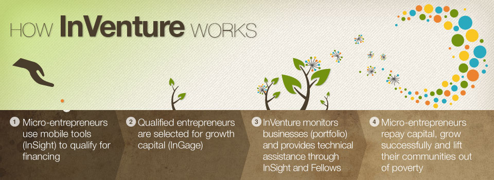

At the outset I need to mention that I’ll be missing out on this year’s action at [Sankalp Forum](http://sankalpforum.com/). Due to a last-minute personal situation, I had to cancel my plans. Instead of live-tweeting with gusto (like [last year](http://www.techsangam.com/2011/05/10/selected-shorts-from-sankalp-forum-2011-day-2/)), I shall be consuming live tweets with gusto. For the uninitiated, Sankalp Forum is India’s largest annual gathering of folks from the social enterprise ecosystem.

I spent some time yesterday going through the list of 31 social enterprise finalists (25 if you exclude the 6 from the “South East Asia” category). It’s now time to confess that I’ve indulged in a mild case of link-baiting with my post headline. My “five reasons” are really my “five picks” from the 25 Sankalp finalists. I found Inventure, Bhushan Agro, Eram Scientific, Ecoreco, and Safe Harvest to be the biggest potential game changers. Am I saying that they are sure to win awards in their categories? No. What I *am* saying, however, is that if I had been on the Sankalp jury, I would have voted for them. I also would have voted for Eko and Driptech but regular blog readers already know how bullish I am about [Mobile Banking](http://www.techsangam.com/category/banking/) and [agricultural extension](http://www.techsangam.com/category/agriculture-2/). I’ve pasted below the descriptions (of my “top picks”) from Sankalp Forum’s [Award Finalists](http://sankalpforum.com/419-2/finalists/) page.

<figure aria-describedby="caption-attachment-1091" class="wp-caption alignleft" id="attachment_1091" style="width: 300px">

<figcaption class="wp-caption-text" id="caption-attachment-1091">Pic: courtesy inventure.org</figcaption></figure>

*[Inventure](http://www.inventure.org/)**:** InVenture facilitates financial inclusion by providing a credit scoring platform for low-income and unbanked individuals through a simple SMS-enabled tool called InSight. There are currently an estimated 400 Million individuals in India who lack access to formal lending institutions and credit scores. Due to a lack of credit scores, banks are unwilling to lend to these individuals. InSight is a simple accounting tool that works via SMS to help low-income individuals and businesses perform daily accounting and cash-management. Data collected through InSight is compiled into unique credit scores and shared with lenders to help individuals qualify and access affordable financial services tailored to their needs (i.e home loans, insurance, education and personal loans). InVenture’s goal is to provide a credit score for each individual thereby revolutionizing the financial services sector for low-income and unbanked populations. We will be able to increase efficiency, reduce risk, increase the capital available and lower interest rates – thereby increases overall financial inclusion within India.*

***Bhushan Agro** aims to contribute towards rural transformation and 2nd Green revolution of India by improving yield/revenue of agricultural lands in Sagar, Madhya Pradesh.The Company is involved in agriculture using modern scientific methods resulting in improved agricultural yield and productivity. There are plans to set up food processing units to produce value added items. The business model is to lease agricultural land from farmers at Rs. 8000-10,000 per acre per year and carry farming using modern scientific methods, equipment, systematic crop rotation, and water harvesting techniques. The projected result is an improved yield and 3 crops per year instead of the 2 currently possible in that region. The revenue from agricultural activities per acre per year is approximately Rs. 100,000 – 150,000.*

*[Eram Scientific](http://www.eramscientific.net/) aims to develop innovative and utility solutions by combining cross platform technologies and domains. Eram scientific created ‘Delight’, the automatic public Toilet Unit developed by ESS is intended to improve the sanitation facilities in urban geographies especially in developing nations. The unit has a unique structure that facilitates the display of advertisement boards on its outer surface. This can act as a source for additional income. This can also be a source of income for the people who are given charge of operating a unit.*  
 *Another major project is a ‘Connected Home Security Project.’ Their focus is on combining platform technologies to solve social problems.*

<iframe allowfullscreen="true" class="youtube-player" height="394" src="https://www.youtube.com/embed/IYsygg1ZJAg?version=3&rel=1&fs=1&autohide=2&showsearch=0&showinfo=1&iv_load_policy=1&wmode=transparent" style="border:0;" width="700"></iframe>

*[Ecoreco](http://ecoreco.com/) was incorporated in September 2007 to manage end of life electrical &amp; electronic waste in an organized manner employing necessary technology &amp; methodology to derive commercial objective and also to protect ecology &amp; environment. EcoReco provides the full spectrum of activities covered under e-waste management right from collection of e-waste from the door step of the generators, transporting, sorting them into working / non-working equipments / components, secured data destruction, dismantling of end of life equipments, size reduction, sorting in to different commodities like glass, plastic, iron / steel, aluminum, copper and other fractions, remarketing of reusable equipments, components and various recovered commodities as well as disposal of hazardous substances as per the prescribed rules. Ecoreco‘s facility carries out the above activities near Mumbai.*

*[Safe Harvest](http://www.safeharvest.com/) is a supplier of fresh, locally grown, high quality organic produce to wholesalers and consumers. Safe Harvest farms its product indoors, producing crops year round. Their proposal is to scale indoor farming so that a wide variety of produce is harvested in quantity enough to sustain even the largest of cities without significantly relying on resources beyond the city limits. The enterprise aims to do so in a sustainable manner using no herbicides, pesticides or petroleum based fertilizers and eliminating agricultural runoff by recycling black water.*