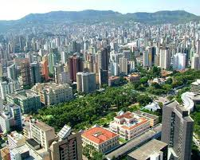

<figure aria-describedby="caption-attachment-1110" class="wp-caption alignleft" id="attachment_1110" style="width: 251px">

<figcaption class="wp-caption-text" id="caption-attachment-1110">Belo (Brazil’s 3rd largest city) – Pic courtesy trialx.com</figcaption></figure>

*\[Editor’s Note: (Sep 12, 2012): According to this [Newslaundry editorial](http://www.newslaundry.com/2012/09/all-facts-no-conjecture/), Samar Halamkar (on whose column I based this post) might have indulged in plagiarism. Until I figure out what action I need to take, I’ve made no changes to my original post.\]*

*“Hunger is not caused by a scarcity of food but a scarcity of democracy”* *– Frances Moore Lappé, author of [Diet for a Small Planet](http://www.amazon.com/Diet-Small-Planet-Anniversary-Edition/dp/0345321200) (1971 bestseller on meat production and global food scarcity)*

Belo Horizonte is the capital and largest city in the Brazilian state of Minas Gerais and third largest metro in the country. Samar Halamkar’s column in Hindustan Times today ([Not much on the plate](http://www.hindustantimes.com/News-Feed/Samar/Not-much-on-the-plate/Article1-839106.aspx)) threw up interesting insights on how the leadership of the city (led by Mayor Patrus Ananais) executed on a whole range of hunger alleviation initiatives that transformed Belo Horizonte. In 1993, 11% of its 2.5 million people lived in absolute poverty and 20% of Belo’s children were hungry. Following a recent visit by Moore *Lappé*, she observed that the hunger programme (costing Rs. 5,000 crore and approximately 2% of the city’s budget) benefited a fourth of the city’s inhabitants and cut the infant death rate by more than 50% in a decade. Here’s how they pulled it off:

- *Newly-elected government declared that food was a fundamental right of every citizen, much as India will do when it passes the Right to Food Act sometime this year.*
- *Local farmers were, and are, given prime public spots to sell their produce to consumers, thus eliminating retail commissions that reached 100%. The poor got access to cheap food, and farmers, themselves poor, prospered at a time when farm incomes were declining across Brazil.*
- *Entrepreneurs were given rights to run, on public land, 34 local retail markets, where the government fixes the price, usually about two-thirds of the market price, for about 20 healthy foods.*
- *Perhaps the biggest direct cushion against hunger is Belo’s series of government-run cafeterias. Each offers people — not just to those officially declared poor — hot meals (rice, beans, salad, ground beef and an apple) for about Rs. 50. Homeless people eat next to construction workers, uniformed policemen, mothers with babies and nurses.*
- *The local university is deeply involved in keeping the system honest and functioning. Students survey the prices of more than 40 basic foods, supply these to local media outlets and paste them on walls and bus stands.*

Halamkar has several sobering things to say about India’s own pathetic efforts in combating hunger.> Belo and Brazil’s great strides against hunger and poverty offer critical lessons to India, at a time when the right-to-food legislation is its final stretch and worryingly devoid of a framework that will involve local governments and farmers. It is also without a key provision in the original draft — the cafeterias that have been so successful in Brazil.
> 
> Every exploration of India’s hunger and malnutrition crisis indicates how state intervention has, thus far, failed. Over the last two years, Hindustan Times and Mint reporters have, as part of the ‘Tracking Hunger’ project ([www.hindustantimes.com/trackinghunger](http://www.hindustantimes.com/trackinghunger)), documented how India’s anti-poverty programmes are deeply rotten, ineffectual and Delhi-driven, despite $10 billion (more than Rs. 50,000 crore) now spent on them annually.

The critique about the lack of a framework involving local governments is a common theme across all of this Indian government’s (UPA-2) welfare programs – whether it is NREGA or Right to Food.

*Update (Apr 13)*

In response to the post, an email subscriber (VK Raman) shared a highly encouraging development in Tamil Nadu. I’ve included our conversation below:

> *VK Raman*: We in Tamil Nadu have special market place where villagers/farmers bring their produce to sell directly to the consumers bypassing commission agents. The Chennai Municipal Corporation has plans to start community restaurants to supply cheaper food items.*Me*: Thanks a lot for your comment. Which cities is this already in place? I presume Chennai of course. Also, when does Chennai Municipal Corp plan to start the community restaurants?*VK Raman*: “Uzhavar Sandhai” is in place in almost all towns in T.N. for many years now. It was started during the previous tenure of M.K. as C.M. of T.N. Chennai Corporation’s budget proposal for 2012-13 includes the scheme for inexpensive restaurants for persons from lower strata of the society. I hope it will get going from July/August this year, if not earlier.

