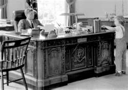

<figure aria-describedby="caption-attachment-1433" class="wp-caption alignleft" id="attachment_1433" style="width: 250px">

<figcaption class="wp-caption-text" id="caption-attachment-1433">Possibly the Presidential desk being referenced (Pic: courtesy masslive.com)</figcaption></figure>

In [Ambassador’s Journal](http://www.amazon.com/Ambassadors-Journal-Personal-Account-Kennedy/dp/0241016193), John Kenneth Galbraith writes about the origins of JFK’s presidential desk in his February 14, 1961 journal entry.

*Yesterday the FBI invaded Cambridge. If my loyalty is imperfect, it will be one of the most dangerously delayed discoveries in modern history.*

*Meanwhile my diplomatic career continues to be subordinate to the price of hogs. I went to a long meeting last night at the Department of Agriculture, followed by one with Mike Feldman and Freeman this morning, followed by a lengthy session with the President.*

… (skipping a paragraph on corn, pork and soybean prices) …

*The President looked relaxed and rested. His new desk, made from the timbers of a sunken ship (H.M.S. Resolute \*) is massive and elegant, and the office is beginning to look rather more agreeable. The bookshelves still contain the public papers of F.D.R. and the complete volumes and testimony of the Temporary National Economic Committee of the late thirties. Such was Ike’s reading — just possibly.*

*\* The desk was presented to President Rutherford B. Hayes by Queen Victoria.*