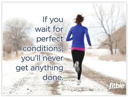

<figure aria-describedby="caption-attachment-1446" class="wp-caption alignleft" id="attachment_1446" style="width: 259px">

<figcaption class="wp-caption-text" id="caption-attachment-1446">Pic: courtesy Google Images/Pinterest.com</figcaption></figure>

Haruki Murakami, famous novelist and marathon runner, this question in his memoir [What I talk about when I talk about running](http://www.amazon.com/What-About-Running-Vintage-International/dp/0307389839/ref=tmm_pap_title_0).

> Marathon runners well understand what I mean. We don’t really care whether we beat any other particular runner. World-class runners, of course, want to outdo their closest rivals, but for your average, everyday runner, individual rivalry isn’t a major issue. I’m sure there are garden-variety runners whose desire to beat a particular rival spurs them to train harder. But what happens if your rival, for whatever reason, drops out of the competition? Their motivation for running would disappear or at least diminish, and it’d be hard for them to remain runners for long.
> 
> Most ordinary runners are motivated by an individual goal, more than anything: namely, a time they want to beat. As long as he can beat that time, a runner will feel he’s accomplished what he set out to do. Even if he doesn’t break the time he’d hoped for, as long as he has the sense of satisfaction at having done his very best — and, possibly, having made some significant discovery about himself in the process — then that in itself is an accomplishment, a positive feeling he can carry over to the next race.

Murakami’s interpretation totally resonates with me… and my relationship with long distance running.

Later on in the book, after a blow-by-blow description of his first successful 100k ultra-marathon, following by a protracted period of “runner’s blues” from which he recovers, he has this to say:

> ‎”Competing against time isn’t important. What’s going to be much more meaningful to me is how much I can enjoy myself, whether I can finish twenty-six miles with a feeling of contentment. I’ll enjoy and value things that can’t be expressed in numbers, and I’ll grope for a feeling of pride that comes from a slightly different place.”

I’m not there yet… but someday hope to get there.