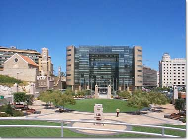

<figure aria-describedby="caption-attachment-1465" class="wp-caption alignleft" id="attachment_1465" style="width: 380px">

<figcaption class="wp-caption-text" id="caption-attachment-1465">Khalil Gibran parc in Beirut</figcaption></figure>

In [Ambassador’s Journal](http://www.amazon.com/Ambassadors-Journal-Personal-Account-Kennedy/dp/0241016193), John Kenneth Galbraith writes about his 3-day layover in Beirut, enroute to India — where he would begin his tenure as US Ambassador to India. Below are selected extracts from April 5,6,7 journal entries.

*We arrived in Beirut about 7:30pm, were met by a formidable delegation from the Embassy and went to a pleasant dinner with Ambassador and Mrs. Robert McClintock. Lebanon looked much as before — partly Mediterranean and partly Oriental. There is much new building out of oil money. The currency is strong, the gold cover huge and there are lots of cars and tourists. After the troubles of two years ago, the political situation is stable with the top jobs carefully divided, in the manner of a New York political ticket, between the various religious claimants — Sunni and Shi’a Moslems and Christians. The Lebanese are the least temperamental of the Arabs — there is a story that at the outbreak of the Israeli war in 1948, they pulled back their army several miles since wars raise the danger of death by shooting. The Ambassador says this is not so.*

…

*By day, Beirut is busy, untidy and reminiscent of a half-finished city in Southern California. The sky is clear and the water outside our hotel is very blue. The people have an aspect of well-fed rascality which may not be entirely misleading.*

<figure aria-describedby="caption-attachment-1466" class="wp-caption alignright" id="attachment_1466" style="width: 264px">

<figcaption class="wp-caption-text" id="caption-attachment-1466">Roman bridge over the Dog River in Beirut (Pic: courtesy michaeltotten.com)</figcaption></figure>

*A bright blue Mediterranean day and one of the most relaxed of recent memory. We did some shopping and then drove out along the coast road to the Dog River to see the old Roman bridge — of three light stone arches — and the inscriptions cut in the rocks. These inscriptions, cut by all the passing armies of history from Darius to the Free French, are in a narrow passage between the hills and the sea. The instinct to immortalize oneself by writing on a wall seems basic; excavations of the primeval privy no doubt prove the point. Actually, much of the romance has gone from the Dog River. The ancient road once wound along a narrow corniche. It was here, at the narrowest corner, that the armies shaved a space on the rock and carved their names. Even five years ago the place had sparse, barren and romantic aspect. Now a highway tunnel has been cut under the hill where it juts out to the coast, and future armies will write their names on the inside of an underpass.*