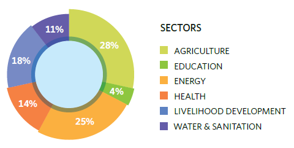
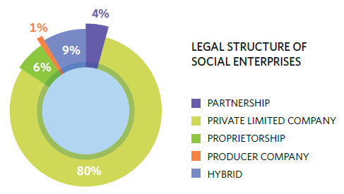
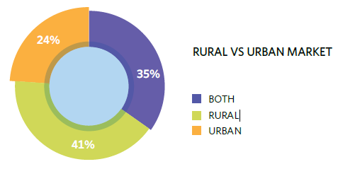
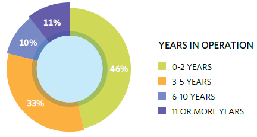

*Another day. Another PDF (this time a 66-pager).*

*Where’s my ‘Executive Summary’ hat?*

*Ah… there – I found it!*

At the recently concluded Sankalp Forum, Intellecap released a comprehensive study on India’s social enterprise sector. The most interesting subset was an online survey of 100 social enterprises followed by in-depth qualitative interviews with over 50 social enterprises, impact investors and sector enablers. Below are the most interesting findings.

### The industry took off in 2005-06 and has grown dramatically since then.

- Energy and agriculture have experienced the greatest growth in number of new enterprises over this timeframe, but health, livelihood development and water/sanitation have also witnessed growth. Education, on the other hand, appears poised for take-off.

### Social enterprises base their headquarters in India’s metropolises but operate across the country.

- Majority establish their headquarters in major urban centers in the southern and western regions. Nearly 60% operate in at least one low-income state.

### Most social enterprises target the BoP as consumers rather than as producers.

- Nearly three-quarters of enterprises target individuals in the BoP as consumers of critical goods and services. The remaining socents incorporate small-scale producers into their supply chain and work to improve their productivity, quality of outputs and market linkages.

### Majority of socents are small, reflecting the industry’s youth, but not its potential.

- Half of surveyed enterprises generate less than INR50 lakh (USD100,000)1 in revenue annually while sixty-four percent have fewer than twenty employees.

### India’s social enterprises are capital hungry businesses.

- Only 7% report that they do not need any form of external capital currently. Equity is in highest demand across all growth stages, wanted by 78% of survey respondents, but there is also significant demand for grants and debt.

### The greatest financing challenge is not a limited supply of capital but socents’ limited access to it.

- Socents report that they cannot secure available funding either because they do not meet investor requirements or because their business model needs further refinement before they are “investor ready.” Very few enterprises cite a limited supply of capital as a key challenge to securing it. The prevalence of funding that is inaccessible to most socents indicates a gap between enterprise needs and investor expectations.

### Despite the challenges, socents are making a major impact in India.

- Nearly one-third of them are operating in more than 100 localities, and almost one-third are serving more than 50,000 BoP beneficiaries annually.

### Approximately two-thirds of enterprises treat social motives as equally if not more important than profit motives.

- This finding suggests that most social entrepreneurs are using business as a tool for achieving social impact rather than viewing social impact as a positive outcome that will result naturally from their business. The motives of younger enterprises, however, indicate a growing preference toward prioritizing profit over impact with the belief that this will lead to greater social impact over time.

### Social enterprises are operating across spectrum of critical needs sectors with greatest concentration in agriculture and energy.

- 28% of surveyed enterprises are in agriculture while 25% are in energy. These sectors claim the most enterprises that have been operational for six or more years. Agriculture and energy also have a large portion of younger enterprises, with 44% and 60% in each respective sector launching in 2010 or 2011.

### Livelihood development enterprises promote non-farming livelihood activities and comprise the third largest sector for social enterprises.

- 18% of surveyed enterprises fall into the livelihood development sector. These enterprises focus on skills development and improving access to markets. They can be broadly classified as product-based or service-based. The former would include enterprises that support artisans making traditional handicrafts, while the latter would include enterprises that train and employ high-school dropouts to provide backoffice services to large corporations. In both cases, the target beneficiaries–the artisans and high-school dropouts—are incorporated into the supply chain.

### The vast majority of social enterprises target rural markets.

- 40% of enterprises in our survey only operate in rural markets, while another 35% target rural and urban markets. This finding is not surprising given that 70% of India’s poor live in rural areas. Rural markets have historically been overlooked by most traditional businesses, but many now view them as untapped sources of business opportunity. Yet, poor infrastructure and inefficient supply chains, as well as low population density and education levels, continue to make these markets very challenging operating environments.

### Three-quarters of social enterprises target individuals and households as the customers for their goods and services.

- Many enterprises also have institutional, nonprofit and SME customers, but individual consumers are by far the most popular customer type for social enterprises. According to our survey, energy and water/sanitation enterprises are the most likely to sell to individual end-users. Nearly one out of five enterprises from the survey targets only individual consumers, and roughly one-third of these are energy enterprises.

More graphs below… And I should mention that there will be a Part 2, maybe even a Part 3.

