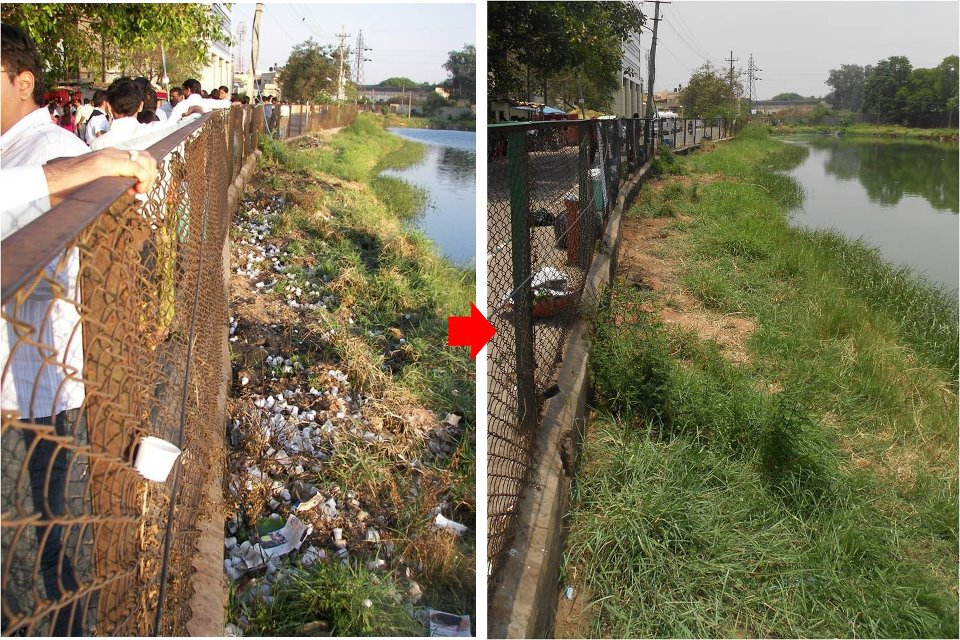

<figure aria-describedby="caption-attachment-1182" class="wp-caption alignleft" id="attachment_1182" style="width: 300px">

<figcaption class="wp-caption-text" id="caption-attachment-1182">Before (and after Spotfix) at Bagmane Lake; 8547 cups cleared - 16 bags of 500 cups each + another 47 to top it off.</figcaption></figure>

It’s been a while since I did an Ugly Indian update. To be precise, three months since [Volume 9](http://www.techsangam.com/2012/01/11/the-ugly-indian-chronicles-volume-9/). I’d like to highlight two key developments in this edition.

- The start of ‘engagements’ (for lack of a better word) with Bangalore’s technology firms. Dell, Netapp and Sasken (Spotfix videos below) are the early adopters who are bought into the idea that *Corporate Social Responsibility (CSR) starts from the footpath outside one’s campus*.
- After 18 months of footpath Spotfixes, [WonderLoo installations](http://www.techsangam.com/2011/12/19/the-ugly-indian-chronicles-volume-8/), and [road reclamations](http://www.techsangam.com/2012/02/06/road-reclamation-the-ugly-indian-way/), it’s finally time for a lake to receive some TUI love. Bagmane Lake is the lucky beneficiary of a Spotfix.

### Why this Kolaveri Dell? The Hope Song – by The Ugly Indian

<iframe allowfullscreen="true" class="youtube-player" height="394" src="https://www.youtube.com/embed/lYYsaee1pEk?version=3&rel=1&fs=1&autohide=2&showsearch=0&showinfo=1&iv_load_policy=1&wmode=transparent" style="border:0;" width="700"></iframe>

### NetApp

<iframe allowfullscreen="true" class="youtube-player" height="394" src="https://www.youtube.com/embed/oIJHBBe9nVk?version=3&rel=1&fs=1&autohide=2&showsearch=0&showinfo=1&iv_load_policy=1&wmode=transparent" style="border:0;" width="700"></iframe>

### All is well at Dell – Part 2

<iframe allowfullscreen="true" class="youtube-player" height="394" src="https://www.youtube.com/embed/7Zx6HsplofI?version=3&rel=1&fs=1&autohide=2&showsearch=0&showinfo=1&iv_load_policy=1&wmode=transparent" style="border:0;" width="700"></iframe>

### Sasken

<iframe allowfullscreen="true" class="youtube-player" height="394" src="https://www.youtube.com/embed/2NHrAdRI2h4?version=3&rel=1&fs=1&autohide=2&showsearch=0&showinfo=1&iv_load_policy=1&wmode=transparent" style="border:0;" width="700"></iframe>

<iframe allowfullscreen="true" class="youtube-player" height="394" src="https://www.youtube.com/embed/51wh0_Ec6Ec?version=3&rel=1&fs=1&autohide=2&showsearch=0&showinfo=1&iv_load_policy=1&wmode=transparent" style="border:0;" width="700"></iframe>

### Reclaiming Bagmane Lake

<iframe allowfullscreen="true" class="youtube-player" height="394" src="https://www.youtube.com/embed/4NkWD0VIQyM?version=3&rel=1&fs=1&autohide=2&showsearch=0&showinfo=1&iv_load_policy=1&wmode=transparent" style="border:0;" width="700"></iframe>

For more on this Spotfix, have a look at the captions on [pic1](http://www.facebook.com/photo.php?fbid=336189966440265&set=a.125833837475880.17876.123459791046618&type=1&permPage=1) and then [pic2](http://www.facebook.com/photo.php?fbid=336815693044359&set=a.125833837475880.17876.123459791046618&type=1&theater).

