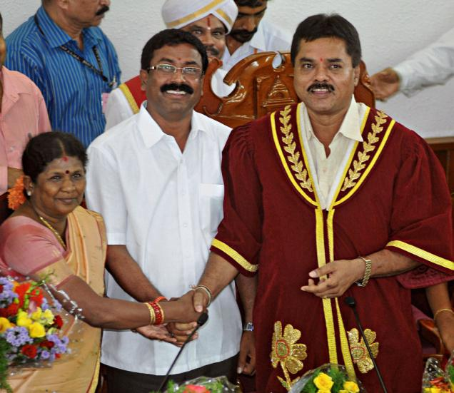
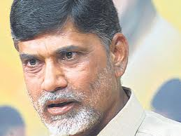

<figure aria-describedby="caption-attachment-1191" class="wp-caption alignleft" id="attachment_1191" style="width: 300px">

<figcaption class="wp-caption-text" id="caption-attachment-1191">Bangalore's newly minted mayor (Venkatesh Murthy) and outgoing mayor (Sharadamma) - Pic courtesy thethindu.com</figcaption></figure>

*\[Editor’s Note: This article was originally published on [Namma Bengaluru Foundation](http://namma-bengaluru.org/nbf/index.html)‘s website – on the eve of Bangalore Mayoral ‘election’. While last year’s mayor (Sharadamma) was described by ExpressBuzz as an [‘obedient wife’](http://expressbuzz.com/cities/bangalore/Mayor-Sharadamma-is-an-%E2%80%98obedient%E2%80%99-wife/270242.html), the newly elected mayor, Venkatesh Murthy from Padmanabhanagar, has been described as [“winning elections and serving as a councillor for the past 15 years.”](http://expressbuzz.com/cities/bangalore/venkatesh-murthy-new-mayor-srinivas-deputy/386332.html) (by no less than his mother)*

“*The twenty-first century is the century of city states. The GDP of New York and Tokyo are equivalent to that of India.*”

This quote is from bureaucrat Amitabh Pant – the IAS officer behind the *God’s own country*campaign and currently the CEO of Delhi Mumbai Industrial Corridor – an ambitious initiative that aims to create 7 new cities riding on the back of a high-speed rail network.

Urbanization forecasts from several sources support Pant’s assertion. However much we may romanticize India’s villages,the inexorable fact is that India (and the world) is rapidly urbanizing. According to urban economist Richard Florida, approximately 70 percent of global GDP and 85 percent of all innovation comes from 40-odd urban mega-regions. New York City alone has a GDP of about $1.2 trillion, making it the 12th or 13th largest economy in the world. Although cities are traditionally seen as a consequence of economic growth, they are in fact a *cause and consequence of economic growth*, and you cannot have robust economic growth without rapid urbanization.

In 1800, 2 percent of the world was urban. In 1900, it was 14 percent urban. In 2008, the world crossed the 50 percent threshold. By 2050, it is expected that the world will be 80 percent urban. Both India and China are witnessing the greatest migrations in human history as hundreds of millions leave the countryside for urban areas. In India alone, 300 million to 400 million people will migrate to cities over the next 25 years.

Against this backdrop, it behoves us to look at how exemplary mayors from across the world have transformed their *city states*. What kind of skills have they exhibited during the course of the city’s metamorphosis?

Back in 2005, Time Magazine consulted with leading urban experts to come up with [America’s best mayors](http://www.time.com/time/magazine/article/0,9171,1050214,00.html#ixzz1sVrz4H5y). Leaving aside luminaries like New York’s Bloomberg and San Francisco’s Gavin Newsom (who were obviously on Time’s list), I’ve cherry-picked Chicago’s Richard Daley and Atlanta’s Shirley Franklin whose accomplishments were highlighted thus by Time:

<figure aria-describedby="caption-attachment-1192" class="wp-caption alignright" id="attachment_1192" style="width: 300px">

<figcaption class="wp-caption-text" id="caption-attachment-1192">Richard M. Daley, longstanding Mayor of Chicago</figcaption></figure>

During an unbrokenstint of 16 years, Daley presided over Chicago’s transition from greying hub to vibrant boomtown, with a newly renovated football stadium, an ebbing murder rate, a new downtown park, a noticeable expansion of green space and a skyline thick with construction cranes. As federal and state dollars flowing to the city have dried up, he has used his influence to persuade corporations and the wealthy to kick in for big-ticket attractions, like the $475 million Millennium Park, nearly half of which was paid for by private donations. Since Daley took over the school system in 1995, he has brought graduation rates up from 51% to 54%, but he’s not stopping there. Last year he launched a reform plan in which old, failing schools are to be replaced with new ones that have more autonomy over their curriculums. So far Daley has $24 million in private commitments to fund the program.

<figure aria-describedby="caption-attachment-1193" class="wp-caption alignleft" id="attachment_1193" style="width: 193px">

<figcaption class="wp-caption-text" id="caption-attachment-1193">Shirley Franklin (Mayor of Atlanta) - Pic: courtesy upenn.edu</figcaption></figure>

Atlanta’s Shirley Franklin inherited an $82 million budget deficit, which was about 20% of the entire city budget and $37 million more than she had been led to expect. Atlanta’s homeless population was exploding, the city’s infrastructure was fraying, the streets had not been maintained in eight years, and the sewers were leaking so badly that state and federal environmental agencies were fining Atlanta $20,000 a day. She started by committing what might have been political suicide. She cut 1,000 jobs from the city payroll and got the city council to approve a 1% sales-tax hike and a 50% bump to property taxes. To prove she could take it as well as dish it out, she laid off half her staff and cut her own salary by $40,000. To restore faith in the local government, Franklin shepherded through the city council a new ethics code for municipal employees. She corralled 75 private firms to conduct studies of Atlanta’s budgetary, infrastructure and homeless problems and perform a massive audit of the city government—pro bono. She organized a task force she called the Pothole Posse to go after the city’s crumbling streets. She kept a running tally of cracks that were filled, combining good stewardship with quality political theatre. Since 2002, Franklin has turned in three balanced budgets and, in February (2005),she reported an $18 million revenue surplus.

According to the [World Mayor Project](http://www.worldmayor.com/), an initiative that aims to raise the profile of mayors worldwide as well as honour those who have made long-lasting contributions to their communities, a great mayor must possess the following qualities: leadership and vision, good management abilities, social and economic awareness, ability to provide security and to protect the environment as well as having the skill to cultivate good relations in communities with different cultural, racial and social backgrounds.

If this sounds like an impossible job description for the Indian political landscape, think again. India has *indeed* produced a political leader who provided a glimpse of what a mayor can achieve – given a sufficient political mandate. Still scratching your head? Okay, here’s the hint… Who was the last Indian politician who used a city as the central development strategy for a state’s renaissance? Chandrababu Naidu of course, Andhra Pradesh’s erstwhile Chief Minister.

<figure aria-describedby="caption-attachment-1194" class="wp-caption alignright" id="attachment_1194" style="width: 259px">

<figcaption class="wp-caption-text" id="caption-attachment-1194">Chandrababu Naidu, erstwhile CM of Andhra Pradesh</figcaption></figure>

The political cost of his *obsession with Hyderabad* (which earned him the epithet *Mayor of Hyderabad from* his opponents) was his partybeing rudely voted out of power in 2004 – after a mere 8 ½ years. The irony and ignominy of his party’s defeat was that even in Hyderabad (the biggest beneficiary of his rule), his party won just two assembly seats (out of a total of 15), both of which were incidentally lost in the next elections.Leaving aside his political hara-kiri, let’s examine what Naidu did for Hyderabad – a legacy that draws reluctant praise even from his detractors – a legacy that provides a blueprint for what a big city mayor in India can draw inspiration from.

Naidu aggressively sought to put Hyderabad on the world map, pitching it as a showcase city for an entire slew of new investors (notably multinational companies). He successfully wooed Bill Gates – which led to Microsoft makingHyderabad the headquarters of its India development center. At a time when Bangalore was the de facto choice of global technology firms and domestic IT majors, Naidu presented a compelling roadmap for Hyderabad (integrated urban planning, a modern new airport, wide and clean roads, and hitech software hubs). Just drive through HITEC City townships today and you’ll see that the Naidu roadmap has borne fruit. Hyderabad’s road and civic infrastructure seem a lot more prepared for urban growth than Bangalore… by a wide margin.

From a leadership standpoint, Naidu’s top contribution has been described as *corporatization of state machinery* – which suggests that running a city is not significantly different from running a corporation.

Later this week, Bangalore will ‘elect’ its next Mayor. A far cry from the American process of *election by popular vote*, Bangalore’s mayor will be selected from the existing Bruhat Bangalore Mahanagara Palike ([BBMP](http://www.bbmp.gov.in/)) council, a selection with quota constraints (i.e. a policy that needs to rotate between candidates from categories like Scheduled Caste/Schedule Tribe, Other Backward Caste, and Women).The most crippling constraint is that the term of the mayor (and deputy mayor) is one year. What kind of impact can a mayor make in one year? And where’s the incentive to bring about any positive changes if that can’t get you re-elected? Is it any wonder that most Bangalore citizens don’t even know who the mayor is?

Since next week’s mayor selection is practically a non-event, why did I bother with the above narrative? Hope, as they say, is always on the horizon. An expert committee on governance in the Bangalore Metropolitan Region (BMR) and the BBMP came up with a set of concrete recommendations (part of – to engender a paradigm shift from current policy focus on city level urban local government to a metropolitan level institution. The complete set of recommendations will be the subject of a future blog post but I’ll leave you with the text relating to the Mayor:

*It is felt that the challenge of governance in a complex metropolis like Bangalore requires a new leadership paradigm which guarantees political and administrative dynamism and stability. The Committee is of the view that a directly elected Mayor will fulfil this requirement and recommends that the BBMP should have a Mayor who is directly elected by the people with a fixed term of 5 years. The term of 5 years for the Mayor will allow him/her to emerge as a politically accountable leader at local government level with a democratic mandate comparable to political leaders at other levels of government. It is also recommended that the Mayor should be vested with executive powers of the Municipal Government.*

Sounds great, doesn’t it? There’s just the little matter of getting these recommendations (pending since 2008) passed. But hey, who said effecting positive change in India is easy?