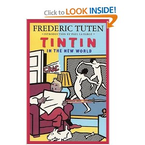

[Bringing 15 boxes of friends home](http://www.ulaar.com/2012/03/11/bringing-15-boxes-of-friends-home/) – the post that started it all off. This post recounts the voyage of our second batch of friends, henceforth dubbed as Part 2 of the series.

<figure aria-describedby="caption-attachment-1622" class="wp-caption alignleft" id="attachment_1622" style="width: 300px">

<figcaption class="wp-caption-text" id="caption-attachment-1622">Pic: courtesy Amazon.com</figcaption></figure>

In Dec 2011, my brother-in-law brought the second batch of books — to Chennai. So far so good. Since his parents were going to returning to US with him, I had a time window of two weeks to collect the books. Sathish, an ex-colleague and friend, (who has a home in Chennai) picked up the books. Two months later, he brought them to Bangalore. I finally picked them up in Mar 2012. A grand total of 9 boxes but they are all hardbound so quite heavy. I present the list below along with my commentary. As I accumulated these books over the years, I’ve been pretty religious about annotating when (and sometimes ‘where’) I bought the book.

- [Tintin in the new world](<iframe%20src=%22http://rcm.amazon.com/e/cm?t=ulaarcom-20&o=1&p=8&l=as1&asins=1580730337&ref=tf_til&fc1=000000&IS2=1&lt1=_blank&m=amazon&lc1=0000FF&bc1=000000&bg1=FFFFFF&f=ifr%22%20style=%22width:120px;height:240px;%22%20scrolling=%22no%22%20marginwidth=%220%22%20marginheight=%220%22%20frameborder=%220%22></iframe>%20)
- Bought at the Stanford Bookstore on Jul 27, 1998 (this would have to a week after moving to the SF Bay Area from Chicago – heady times!)

- [Ambassador’s Journal: John Kenneth Gailbraith](<iframe%20src=%22http://rcm.amazon.com/e/cm?t=ulaarcom-20&o=1&p=8&l=as1&asins=1557780714&ref=tf_til&fc1=000000&IS2=1&lt1=_blank&m=amazon&lc1=0000FF&bc1=000000&bg1=FFFFFF&f=ifr%22%20style=%22width:120px;height:240px;%22%20scrolling=%22no%22%20marginwidth=%220%22%20marginheight=%220%22%20frameborder=%220%22></iframe>%20)
- The paperback cover on Amazon is NOT the one I own. Mine has a green cover and it’s a hardbound. I’m currently reading this humorous and insightful account and transcribing my favorite bits – JK Galbraith has his very own [Galbraith category](http://www.ulaar.com/category/galbraith/) on my blog.

- [Primal Leadership](<iframe%20src=%22http://rcm.amazon.com/e/cm?t=ulaarcom-20&o=1&p=8&l=as1&asins=B0032TL7YY&ref=tf_til&fc1=000000&IS2=1&lt1=_blank&m=amazon&lc1=0000FF&bc1=000000&bg1=FFFFFF&f=ifr%22%20style=%22width:120px;height:240px;%22%20scrolling=%22no%22%20marginwidth=%220%22%20marginheight=%220%22%20frameborder=%220%22></iframe>%20)
- Bought in Dec 2005. Seems interesting enough but still remains unread. Found a bookmark from The Lenox Hill Bookstore, NY though it doesn’t prove that this book was purchased there. For the longest time, I was incapable of walking out of a bookstore without purchasing at least one book.

- [Mastering the Rockefeller Habits](<iframe%20src=%22http://rcm.amazon.com/e/cm?t=ulaarcom-20&o=1&p=8&l=as1&asins=0978774949&ref=tf_til&fc1=000000&IS2=1&lt1=_blank&m=amazon&lc1=0000FF&bc1=000000&bg1=FFFFFF&f=ifr%22%20style=%22width:120px;height:240px;%22%20scrolling=%22no%22%20marginwidth=%220%22%20marginheight=%220%22%20frameborder=%220%22></iframe>%20) (by Verne Harnish)
- 12 pages of testimonials, ghost writer

- [Hard facts, dangerous half-truths &amp; total nonsense](<iframe%20src=%22http://rcm.amazon.com/e/cm?t=ulaarcom-20&o=1&p=8&l=as1&asins=1591398622&ref=tf_til&fc1=000000&IS2=1&lt1=_blank&m=amazon&lc1=0000FF&bc1=000000&bg1=FFFFFF&f=ifr%22%20style=%22width:120px;height:240px;%22%20scrolling=%22no%22%20marginwidth=%220%22%20marginheight=%220%22%20frameborder=%220%22></iframe>%20) (by Stanford U Professors Robert Sutton &amp; Jeffrey Pfeffer)
- Professor Sutton was visiting Yahoo campus (2004/5) for a talk on “The Ambidextrous Organization” — this was a freebie book from the event. It’s a promising read.

- [The complete works of O. Henry](<iframe%20src=%22http://rcm.amazon.com/e/cm?t=ulaarcom-20&o=1&p=8&l=as1&asins=0385009615&ref=tf_til&fc1=000000&IS2=1&lt1=_blank&m=amazon&lc1=0000FF&bc1=000000&bg1=FFFFFF&f=ifr%22%20style=%22width:120px;height:240px;%22%20scrolling=%22no%22%20marginwidth=%220%22%20marginheight=%220%22%20frameborder=%220%22></iframe>%20)
- Bought in April ’95 (during my Chicago years) – this is arguably my first/only bibliophile book and warrants a separate post for one other reason – suspense!

- [All things bright and beautiful](<iframe%20src=%22http://rcm.amazon.com/e/cm?t=ulaarcom-20&o=1&p=8&l=as1&asins=0312330863&ref=tf_til&fc1=000000&IS2=1&lt1=_blank&m=amazon&lc1=0000FF&bc1=000000&bg1=FFFFFF&f=ifr%22%20style=%22width:120px;height:240px;%22%20scrolling=%22no%22%20marginwidth=%220%22%20marginheight=%220%22%20frameborder=%220%22></iframe>%20) (by James Herriot)
- Bought second-hand (undated).

- [The new industrial state](<iframe%20src=%22http://rcm.amazon.com/e/cm?t=ulaarcom-20&o=1&p=8&l=as1&asins=0691131414&ref=tf_til&fc1=000000&IS2=1&lt1=_blank&m=amazon&lc1=0000FF&bc1=000000&bg1=FFFFFF&f=ifr%22%20style=%22width:120px;height:240px;%22%20scrolling=%22no%22%20marginwidth=%220%22%20marginheight=%220%22%20frameborder=%220%22></iframe>%20) (by John Kenneth Galbraith)
- Bought in Mar 2000.

- Bhagavad Gita (in Hindi)
- Bought in Dec 2004 from the Birla Temple, Hyderabad. Went to Sunnyvale, CA – then a few years in a San Jose attic, a year in a Cupertino garage, a few months in Chennai and finally to our Bangalore apartment. Yes – a well-travelled hardbound indeed.

There’s more good news for the rest of our book friends in my sister’s garage. Another ex-colleague and friend (Ajay) is on a business trip to the Bay Area and has agreed to bring back a ‘significant number’ of books. How significant? I won’t answer that lest it jinxes things. Stay tuned… part 3 in this series is not too far away.