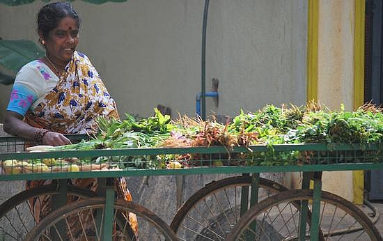
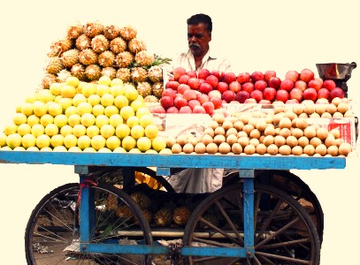

<figure aria-describedby="caption-attachment-1329" class="wp-caption alignleft" id="attachment_1329" style="width: 300px">

<figcaption class="wp-caption-text" id="caption-attachment-1329">A vegetable cart seller in Bangalore (Pic: courtesy blog.travelpod.com)</figcaption></figure>

Recently, Harish Hande wrote a cogent and passionate article on Forbes India. The main point in his article is that businesses need to look at social sustainability in a long-term and holistic manner. From his article…

> Amidst rising income inequality, corporations need to realise that social responsibility is essentially an insurance against social instability. Occupy Wall Street, the protests in Spain and Greece and the London riots are some classic examples to take cognizance of and learn from. They were not one-off events. Each of them has a deeper connection to social ‘un-sustainability’ that has crept in over decades of poor prioritisation by businesses and governments in their respective countries. India has a wonderful opportunity to show the world the right way of doing business.

He exhorts Indians to learn from the venerable neighborhood street vendor – a businessperson without an MBA degree who earns enough to feed her family without cheating anyone.

> Learn from the street vendor. My mother has been buying vegetables from a particular street vendor for two decades now. Think about it—irrespective of floods, strikes and holidays she comes around selling her vegetables. Every morning, she borrows money at an interest rate of 10 percent a day, pays Rs 50 for her cart rental and Rs 15 for kerosene. In the evening, she has to determine the pricing strategy for vegetables that remain, as she has no refrigeration at home. After all these expenses, she has enough to feed herself and her family. And she does all of this without an MBA. Has one ever been cheated by a street vendor? Has one ever heard about a street vendor going out of business?

Three figures stand out – daily working capital loan at 10%, daily cart rental of Rs. 50, and daily kerosene expense of Rs. 15. The interest rate might seem low but remember that it is a DAILY rate. In [Poor Economics](http://pooreconomics.com/), Banerjee and Duflo go into a great deal of detail into the MFI industry — first hypothesizing that the status quo of an exploitative interest rate was ripe for disruption by MFIs and eventually outlining the reasons why the interest rates charged by MFIs end up being as high as they are. Anyway, that’s fodder for a different blog post.

<figure aria-describedby="caption-attachment-1330" class="wp-caption alignright" id="attachment_1330" style="width: 300px">

<figcaption class="wp-caption-text" id="caption-attachment-1330">A fruit cart seller (Pic: courtesy digitalmusings.in)</figcaption></figure>

What got me thinking was the daily cart rental of Rs. 50. I thought of Naveen Krishna and his Varanasi-based social enterprise SMV Wheels. I have written earlier about SMV Wheels’ remarkable story — a product+services value proposition to rickshaw pullers which involves forming a 3-5 member group, not unlike a [Joint Liability Group](http://en.wikipedia.org/wiki/Joint_and_several_liability) (JLG); each group member could then purchase a cycle rickshaw from SMV Wheels through a deferred loan scheme – an interest-free deferred loan with weekly payments for 12-15 months, at the end of which the rickshaw puller owns the rickshaw. SMV Wheels procures the rickshaws at a cost of 11,000 INR and sells at a price between 12,000 and 13,000 INR. The ‘services’ includes accident insurance, no-frills banking services and revenue-share from outdoor advertising.

By now, you must have gathered where I’m headed. Is it possible to create an SMV Wheels-like social enterprise catering to the vegetable cart sellers? The cart will cost much lesser than a rickshaw so we are probably talking about a shorter repayment duration. Outdoor advertising on a vegetable cart might be a bit of a stretch..Maybe.

This morning, my runner friend and I had our first conversation with a vegetable cart seller and we gathered the following facts:

- She owns the cart – she paid 5,000 INR for it.
- She lives nearby and her cart is not mobile.

A lot more market research needed obviously. How many cart sellers own their own carts vs. renting? How many of them take their carts home vs. leaving them at their ‘station’? For starters, I need to stop buying vegetables from the Namdharis and the Spencers and… start purchasing (and conversing) with the vegetable/fruit sellers. About time, eh? If nothing else, the results of this market research might be useful to a budding social entrepreneur.Dear Bangalore Reader,Next time you shop at your neighborhood vegetable/fruit cart seller, do ask them these 2 questions and post their answers in the comments. Thanks.Related Reading:

- TechSangam SMV Wheels post – [Wheeling the UP rickshaw pullers away from exploitation](http://www.techsangam.com/2011/10/05/wheeling-the-up-rickshaw-pullers-away-from-exploitation/)
- Hande’s Forbes India article – [India can show the right way to do business](http://forbesindia.com/article/third-anniversary-special/harish-hande-india-can-show-the-right-way-to-do-business/32936/1)