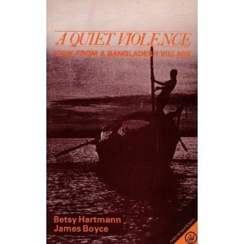

<figure aria-describedby="caption-attachment-1630" class="wp-caption alignleft" id="attachment_1630" style="width: 300px">

<figcaption class="wp-caption-text" id="caption-attachment-1630">Pic: courtesy Amazon.com</figcaption></figure>

In Abhijit Banerjee and Esther Duflo’s book, Poor Economics, they reference the following story from Betsey Hartman and Jim Boyce’s book – [A Quiet Violence (view from a Bangladesh village)](http://www.amazon.com/Quiet-Violence-View-Bangladesh-Village/dp/0862321727).

> The story describes two neighboring families, one Hindu and one Muslim, that were not particularly close to each other. The Hindu family lost its main earner and was starving; in desperation, the woman of that family would creep across the fence into the other family’s yard and steal some edible leaves from time to time. Hartman discovered that the Muslim family knew what was going on but decided to turn a blind eye. “I know her character isn’t bad,” the man said. “If I were in her position, I would probably steal, too. When little things disappear, I try not to get angry. I think ‘The person who took this is hungrier than me.'”

Let’s reflect on the quote by the Muslim man. This is, by no stretch of imagination, a justification for stealing. Rather, it’s a sign of humanity.