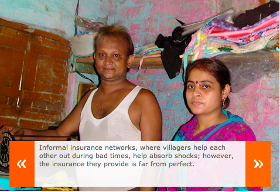

<figure aria-describedby="caption-attachment-1325" class="wp-caption alignleft" id="attachment_1325" style="width: 300px">

<figcaption class="wp-caption-text" id="caption-attachment-1325">Pic: courtesy pooreconomics.com</figcaption></figure>

I recently re-read Chapter 6 of [Poor Economics](http://www.techsangam.com/2011/07/07/teaser-on-banerjee-duflo-poor-economics/) (Barefoot Hedge-Fund Managers) because I was looking for a savings intervention RCT. I haven’t found that RCT yet but a related story — about how the poor help each other and how they don’t — provides insights into what kind of interventions might work for the poor.

> While traditional solidarity networks do help in absorbing shocks, the insurance they provide is far from perfect. If risks were well insured, it should be possible for a family to always consume more or less the same amount, dictated by its average earning capacity: In good times, they would help others, and in bad times, others would help them in turn. This is not what we usually see.
> 
> Health shocks, in particular, are very badly insured. In Indonesia, consumption drops 20 percent when a household member falls severely ill. A study in the Philippines documents that intra-village solidarity functions particularly poorly in the case of nonfatal severe illnesses. When a family has a bad harvest, or when someone loses his or her job, other families in the village come to the rescue. The affected family receives gifts, interest-free loans, and various other forms of assistance. But when individuals suffer a health shock, this is apparently not the case. The family is left to deal with it.

Ibu Emptat’s, one of the interviewed women in a small village in Java, story is illustrative of some counter-intuitive behavior. Ibu had borrowed from the local moneylender to pay for a cure for her husband’s eyes and was struggling with the payments. One of her relatively well-off daughters had given her parents a used (but still very nice) television, after having bought a new one for herself. *“Wouldn’t it have made sense for the daughter to have kept her old TV and given the parents the money to help with the loan repayment?”* the authors ask.

> What stops people from doing more to help one another? Why are some forms of risk not covered, or not covered well?
> 
> There are good reasons we may be unwilling to offer unconditional help to our friends and neighbors. For one thing, we may worry that the guarantee of help might create a temptation to slack off — this is what insurers call moral hazard. Or that people may claim that they are in need even when they are not. Or simply that the promise of mutual help may not be carried through: I help you, but when your turn comes around, you are too busy.
> 
> The other possibility is that the way most economists think about informal insurance, as situations where we help others because we might need their help in the future, may not be the whole story. It could be that we would help our neighbors in extremis even when we had no expectation of being in a similar position, for example, just because it is immoral to let your neighbors starve. This [story from Hartman and Boyce’s book](http://www.ulaar.com/2012/05/31/a-quiet-violence-view-from-a-bangladesh-village-an-excerpt/) drives the point home.
> 
> The fact that people may help each other out in hard times out of a sense of moral obligation, rather than because they necessarily expect to be helped in the future, can help explain why informal networks are not equipped to deal with health shocks. When even a very poor household that has enough to feed itself sees a neighbor who does not, it just shares what it has. But helping people to pay for hospitalization, for example, requires going beyond this basic art of sharing: Many households would need to chip in, given how expensive hospitalization can be. As a result, it makes sense to exclude expensive health events from the basic moral imperative to help neighbors in need, because it would require a much more elaborate social contract to carry it through.
> 
> This view of insurance as mainly a moral duty to help someone in need explains why, in the Nigerian villages, villagers helped each other out on an individual basis, instead of all contributing to a common pot, despite the fact that sharing risk in this other way would be more efficient. It might also explain why Ibu Emptat’s daughter gave her mother a TV but did not cover her health costs. She did not want to be the one child who was responsible for her parents’ health care (and didn’t want to presume the generosity of her siblings). So she chose to do something nice for them without biting off more than she could chew.