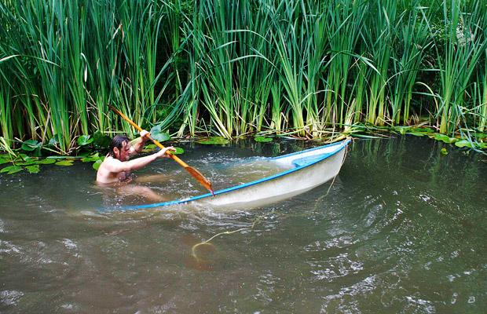

<figure aria-describedby="caption-attachment-1638" class="wp-caption alignleft" id="attachment_1638" style="width: 300px">

<figcaption class="wp-caption-text" id="caption-attachment-1638">Pic: courtesy telegraph.co.uk</figcaption></figure>

A writer is tasked with writing an article. His progress is akin to a man’s exertions on a paddle boat. Smooth rowing strokes at rhythmic intervals gets him closer and closer to his island destination. So what’s the catch in the analogy? Why are so many writers and bloggers struggling in the age of Facebook, Twitter and perpetually updating news websites?

The analogy is incomplete of course.

Before the paddle boat reaches the island destination, the paddler makes a few stops — taking pictures of (or simply admiring) some beautiful marine life. Some of these stops are germane to the purpose of his voyage to the island while others are just purely entertainment. The boat has a particularly unique angular hole. As long as it’s in motion, no water comes in. Every time the boat stops, water trickles in slowly. Longer the wait and more the number of stops, more water fills up in the boat. The paddler has no available device to plug the leak. However, he does have a small bucket to empty the water.

If this is beginning to sound like an optimization problem, it sorta is. The man needs to row as rapidly and smoothly as possible to reach his island destination. But if he makes very few stops, he potentially misses out on enriching aspects of his journey.

The modern writer (and I’m mainly talking about the amateur blogging fraternity that I belong to) faces similar problems. Completing his topic-of-the-day is akin to reaching the island destination. Enroute to his destination, he stops for varying durations at the “Twitter float” and the “Facebook float”. Stopping at these floats is a mixed bag. He *does* need to stop because they are both important distribution and news gathering platforms. In the absence of discipline, the stops come at a steep price. The context switches coupled with the sheer number of new impulses and thoughts weigh him down — just like the weighing down of the boat with accumulating water. And guess what? there’s no bucket to empty the water.

So what does the writer end up doing? *Err… umm… that other island looks more interesting. Heck, it even looks closer. How about I paddle there first and then return to the previous destination?* What a perfect way to camouflage one’s procrastination and lack of focus! Meanwhile, the list of unvisited islands keeps increasing.

**Despair Not!**

Oh fellow amateur writers! I have just the solution for you (and me).

No – I’m not about to recommend a *7 Steps* program to kick your (social media) addiction. My solution is a throwback to our school going days – the venerable timetable. Carve out three 15 min time slots during the day and restrict your social media consumption/interaction during just those time slots. For example, at the start of your day (i.e. *after* booting up your computer), right *after* lunch, right *after* dinner. Why should you anchor your social media breaks right *after* a task? Dr. B.J. Fogg, who heads up Stanford’s Persuasive Tech Lab, has several years of research to back this as the optimal habit formation intervention. If you haven’t heard of BJ (or Tiny Habits), I highly recommend you to join one of his [Tiny Habits](http://tinyhabits.com/) sessions.