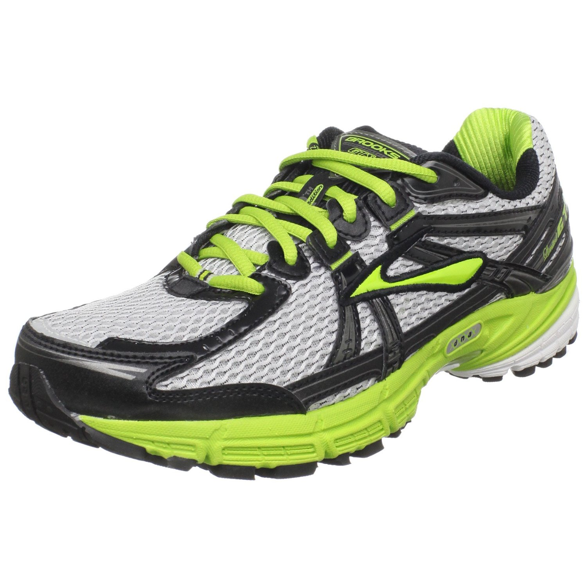

<figure aria-describedby="caption-attachment-1680" class="wp-caption alignleft" id="attachment_1680" style="width: 300px">

<figcaption class="wp-caption-text" id="caption-attachment-1680">Pic: courtesy amazon.com</figcaption></figure>

It’s been a little over 3 months since I changed my running shoe. I fuss and obsess over my new shoe like never before. To the extent that I’ve taken to washing them after every run. Strange, huh?

My previous shoe, the [Brooks Adrenaline GTS-11](http://www.amazon.com/Brooks-Adrenaline-Running-White-Silver/dp/B0040JHL4K/ref=sr_1_1?s=shoes&ie=UTF8&qid=1339657997&sr=1-1) (green), has served me exceedingly well. I’ve been a ‘Brooks running shoe guy’ for as long as I can remember. I started off with the GTS-6 (circa 2002) thanks to my running mentor/guru’s (Mike Clothier) recommendation and haven’t looked back ever since. Barring an Asics Gel-2140 (which I used concurrently with the GTS-9) in 2009-10, it’s been Brooks Adrenaline through and through. The GTS-11 has been retired from running and it has become my everyday ‘work shoe’ — which means I merely ‘walk’ in them. Don’t think GTS-11 is complaining because I subjected it to 1165 running kilometers in a little under 7 months. Its stint coincided with my most prolific running/racing schedule ever – 4 full marathons and one 50k ultra. When I eventually do retire GTS-11 as a ‘work shoe’, it shall be ceremonially raised to the rafters — akin to my very own Michael Jordan “Number 23” jersey in my <del>stadium</del> home – yeah!

You are probably wondering what my new running shoe is. It’s not a Brooks. Not an Asics either. Wait wait! I’m getting a little ahead of myself. Let me first take you through a scene from *Satte Pe Satta* (non-Indian readers: it’s a famous Amitabh Bachan movie inspired by the musical [Seven Brides for Seven Brothers](http://en.wikipedia.org/wiki/Seven_Brides_for_Seven_Brothers_(film))). Big B plays the oldest (and Sachin the youngest) of 7 brothers — don’t recall the actor identities of the middle five. Big B is the authoritative big brother who rules over the household – Sachin is his favorite brother and thus a disproportionate beneficiary of Big B’s largesse. Frustrated and angry with the unfair treatment meted out to them, one day the middle 5 brothers decide to teach Sachin a “lesson”. They egg Sachin on to challenge a notoriously wild horse in their stable. Sachin takes up the challenge, enters the stockade and is quickly rendered unconscious. Big B leaps in and rescues Sachin before further damage is done.

Moving now to a story closer home. You must have heard of the expression “walls have ears”. Bet you didn’t know that the different parts of our bodies have ears too. Heck, they can even talk. Only under certain conditions though. Just like the toys in [Toy Story](http://www.imdb.com/title/tt0114709/) can talk (and walk around) only in the absence of people, the parts of our body talk only when we are asleep. How do I know this? Because I overheard the most amazing conversation on the night of Nov 13, 2011.

How do I remember the exact date? Simple – that was the day I ran my first ultramarathon – a killer 50km on some nasty terrain under the most un-Bangalore weather conditions.

The texture of sleep on marathon nights can be dicey. There are times when you hit the sack and you are *out cold* for a solid 10 hours and you wake up feeling peachy – your quads would still be stiff and sore but the exhaustion would be completely gone. There are other times when you are so exhausted that it gets in the way of your falling asleep. When sleep does come, it comes in fits and spurts until you finally wake up at 2am to go to the bathroom (and that’s only because your bladder is *indeed* full to the brim). Deep sleep finally sets in after that.

The post-ultra night of Nov 13 was of the latter kind, but with a twist. Sometime before the 2am trip to the loo, it seemed like various parts of my body were twitching. At first it felt like a ‘mexican wave’, then I realized that there was a morse code like pattern in the twitches. Then I started hearing the ‘voices’ – a low baritone here, a screeching tenor there, also a few distinct sopranos. Eventually I realized that the body twitches and voices were connected and it dawned on me that I was not dreaming after all. I was partially awake and witnessing my body parts talking to each other using, what seemed to me, muscle twitching – which was bizarrely getting decoded into voices in my head.

**Unknown voice**: “Somebody PLEASE tell me he’s done with this running nonsense… for like TWO years!”

**Hippocampus**: “Ha ha. I would but I would be lying. A trusted source tells me he plans to run two more this season. Something to do with a ‘[BHUKMP](http://runnersforlife.com/group/earthquakebhukmprunners) pledge’ it seems…”

**Left &amp; right calves** (in unison): “We haven’t cramped this bad since the hills of Hyderabad. I wish he would take his hill training more seriously.”

**Right quadricep**: “Bunch of wusses! You guys are finally getting a taste of how LQ &amp; I feel.. during the last hour of every FRIKKING race!”

**Ankles**: “It was really tough for us today – like a rollercoaster we weaved, twisted and sheared for 6 hours. Stupid trail!”

**Knees**: “Yeah – stupid trail! He tripped and fell so many times and grazed us! Really lucky we didn’t incur any serious injuries.”

**Glutes**: “Hmm… is there ANYONE here who’s not hurting? Speak now or forever hold your peace!”

**Lungs**: “All ok! Sir yes sir!”

**Heart**: “All ok! Sir yes sir!”

**Soles &amp; Heels** (sheepishly): “Errr… we are also doing fine. No major strife to report.”

*(protracted silence…all lower body muscle groups stopped twitching)*

**Left Quadricep** (sneering): “Of course you must be doing FINE! Treated like the Queen of Sheeba — with those fancy running socks and those fancier shoes that he keeps changing every so often.”

**Heels**: “Actually those shoes have some nice cushioning which prevent me from getting hurt. You DO know that he is a HEEL striker and I wasn’t exactly designed for THIS kind of running.”

**Right Quadricep**: “And what’s your excuse for the pampering, dear soles?”

**Soles**: “Do you even know what we are made up of? There are the 5 toe mounds, medial plantar fascia, lateral plantar fascia, …”

**Knees** (rudely interrupting): “Right! We know as much about your anatomy as you know about the cartilages around me. You seem to admit that there’s no REAL reason why you should be encased in socks and covered in shoes.”

**Hippocampus**: “You know…lately he’s been lapping up articles about a new kind of running which, strangely, is supposed to be the old (REALLY OLD) way of running. The name McDougal keeps popping up in these articles. This running style (it’s called barefoot running) seems to be making an impression on the ‘right’ areas of his brain. Hmm…”

**Kidney**: “Shhh….. I think he’s going to wake up soon. I’m about to burst!”

The muscles stop twitching. The voices go silent. And I wake up.

Related posts:
- *[Achieving terminal velocity](https://www.ulaar.com/2012/06/26/achieving-terminal-velocity/)*
- *[A gift that keeps on giving](https://www.ulaar.com/2013/07/15/a-gift-that-keeps-on-giving/)*
