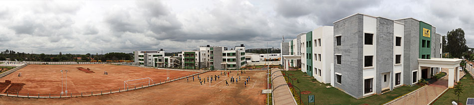
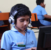

*\[Editor’s Note: Back in October, 2011 I visited the campus of an innovative Bangalore school (Samhita Academy) and learnt about Samhita’s unique model from Aparna Goenka. Aparna (Infosys alumnus) is trustee and Director at *Samhita Academy* runs the Advaith Foundation’s Ankur program – responsible for running a resident hostel for 20% of the children from poor families. I also briefly met with Asha Thomas (another Infosys alumnus) – chairperson of the Samhita Academy leadership team. If you are wondering why this blog is seeing the light of day \*8 months\* after my visit to Samhita, *[this post](http://www.techsangam.com/2012/04/23/why-some-blog-posts-have-a-longer-gestation-period/) sheds some light*.\]*

Last week, most schools in India (with the exception of International schools) reopened after the summer break. The Right to Education (RTE) act, passed by the ruling UPA government in 2009, cleared its final obstacle on April 12, 2012. The Supreme Court upheld the constitutional validity of the RTE act, striking down the petition of a consortium of private schools, and paved the way for its implementation in the 2012-13 academic year onwards. Unaided minority institutions and boarding schools are the only private schools exempt from the RTE act, which requires 25% of students to be admitted for free from poor families.

In Bangalore, activists from Karnataka Dalit Sangarsh Samithi (DSS) were [agitating last month](http://www.thehindu.com/todays-paper/tp-national/tp-karnataka/article3395555.ece?textsize=small&test=2) – miffed at the state government’s unwillingness to pressure private schools for the 2012-13 school year.

As middle-class India moves further and further away from lower-class India (think gated communities, malls, chauffer-driven imported cars), it should not surprise anyone that its schools would be any different. Complete economic segregation (aka “gentrification”) in Indian neighborhoods may be harder to achieve but 100% gentrification in schools (via private schools with high tuition fees) is more or less complete. It is this ‘comfortable’ gentrification that makes many parents and school administrators highly uncomfortable about a post-RTE world order.

In [this Hindu editorial](http://www.thehindu.com/opinion/lead/article3384805.ece), Majumdar and Mooij share an anecdote that epitomizes this discomfort. When the principal’s household help enrolled her son at Shri Ram (a top ranked school in Delhi), *“I \[the principal\] was shocked. A parent in my school, mopping my floors! I just couldn’t handle it. I can’t sit across the table from someone who sweeps my floors.”* A full page advertisement in Outlook magazine by an upmarket school in 2010 *“… warns parents that their maid servant might become their child’s guru if they do not send the child to a high fee paying private school”*, openly and unabashedly declaring the desirability of a social divide in the education system.

It’s against this backdrop that I’d like to relate Samhita Academy’s impressive story.

**In the beginning there was only Ankur…**

Advaith Foundation (Infosys CEO S.D. Shibulal’s family foundation) started a novel educational program (called Ankur) in 2004. Children are admitted at a very young age and Ankur assumes complete responsibility for their physical and emotional well being as well as their education. The former is achieved by a residential environment complete with *day-mothers* and *akkas*. The parent-child bond is nurtured through regular visits, however, the future of the child is essentially moulded and secured by Ankur. In the early years, 30 children were housed in 3 children’s homes and used to go to different English-medium schools in Bangalore.

Ankur’s initial model was successful but it was less than perfect. “The children would often be discriminated against” Aparna explained. “Even though the Ankur children wore the same uniforms as the rest, they still stood out and Ankur had little to no leverage with the host schools.” This was one of the key reasons for Advaith Foundation to start its own school.

<figure aria-describedby="caption-attachment-1399" class="wp-caption alignleft" id="attachment_1399" style="width: 300px">

<figcaption class="wp-caption-text" id="caption-attachment-1399">Samhita Academy Campus</figcaption></figure>

**The Samhita Academy**

The learnings from the Ankur program and a desire to provide quality education in an inclusive environment was the inspiration for Samhita – a self-sustaining school that caters to the educational needs of children from upper-middle class families while simultaneously including the children of Ankur in a ratio of 1:5. (One child from the Ankur community for every 4 children in the Samhita Academy). *This ratio has since changed to 25%, possibly making them the first Bangalore private school to adhere to the RTE.* As Mr. Somaiah (Estate Manager and Physical Training instructor) took me on a tour of the beautiful campus, I wondered if was actually inside an international school – you know.. like [this](http://site.tisb.org/facilities.html) or [this](http://indusschool.com/). Excellent campus with spacious classrooms, clean bathrooms, wide open corridors, an open quadrangle, vast grounds for cricket, football, basketball and playgrounds. Yes – the whole works! Children dressed in cheerfully unique yellowish-green uniforms. I was asked if I could identify any of the kids from Ankur. My answer was an unambiguous no.

<figure aria-describedby="caption-attachment-1405" class="wp-caption alignright" id="attachment_1405" style="width: 107px">

<figcaption class="wp-caption-text" id="caption-attachment-1405">Samhita kids in the computer lab</figcaption></figure>

**On-campus hostel for Ankur Kids**

One of the hostel administrators gave me a tour of the boy’s hostel (there’s a separate one for girls). The children’s beds in the spacious dorm room (around 17 kids) were laid out with one *akka’s* bed for every 3-4 kids. Bathrooms, a library, computer room and study rooms complete the physical layout of the first floor. The ground floor has office rooms for the administrators and *house mothers* and laundry facilities. An adjoining building has a canteen on the ground floor and a big auditorium/TV on the first floor.It’s worth emphasizing that the Ankur program at Samhita Academy goes way beyond RTE is intending to solve. Taking responsibility for the kids’ mental and emotional well being (besides education) means mimicking the home environment in middle-class families. Hence, a *house mother* with a support staff of *akkas*, supervising homework and tuitions on weekday evenings and weekends, TV time on Saturday afternoons, rotating temple &amp; church visits on Sundays, and lot of playtime on the weekends. The kids are visited by their families once a month. The families are obviously very happy that their child’s career prospects have dramatically improved but the meetings can get emotional as well. During the two regular school breaks, the kids return to their homes.I first heard about Samhita from Ravichandar (whom we wrote about here – [A time to ISR](http://www.techsangam.com/2012/03/15/a-time-to-isr-individual-social-responsibility/)). One of my takeaways was that the Ankur kids’ academic performance was ‘at least as good’ as the other kids. I asked Aparna how her team pulled this off and she replied: *“Periodic evaluations on the academic performance is meticulously reviewed by the staff and gaps, if any, are addressed immediately in the after-school program. One-on-one tuitions by the Ankur staff &amp; volunteers from The Samhita Academy is one of the ways. This ensures that the children continue as important players in the competitive environment of the classrooms.”***Samhita Academy’s Advisory Board**

The advisory board features a veritable who’s who of Bangalore’s luminaries – Infosys’s NR Narayana Murthy, Narayana Hrudalaya’s Dr. Devi Prasad Shetty, IIITB’s Professor Sadagopan, NPS Schools’ Dr. KP Gopalkrishna, and Feedback Consulting’s V. Ravichandar.