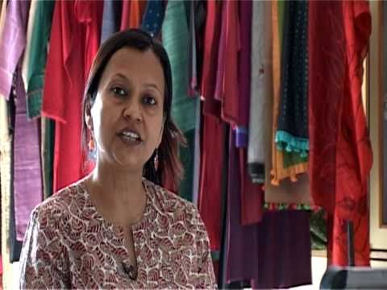

<figure aria-describedby="caption-attachment-1407" class="wp-caption alignleft" id="attachment_1407" style="width: 300px">

<figcaption class="wp-caption-text" id="caption-attachment-1407">Sumita Ghose (Rangsutra’s Founder/CEO)</figcaption></figure>

Put an impact investor on a panel at a social enterprise conference and you can be assured of at least two quotes.

- “There just aren’t enough *quality* social entrepreneurs”
- “The problem with the social enterprise ecosystem is that there are no exits”

Social entrepreneurs (on similar panel discussions) would counter point #1 with “there just aren’t enough impact investors who invest in early-stage enterprises.” Both make legitimate points but that’s not the focus of this post. Let’s examine the ‘problem of exits’. At a recent Dasra event in Bangalore, Elevar Equity’s Sandeep Farias cursorily mentioned that a few social enterprises “did have exits.” I didn’t get a chance to follow-up with Farias about those exits but it got me thinking. Exits can happen either through an IPO, acquisition, or through a follow-on funding round. Barring the MFI sector, no social enterprise has reached the IPO stage yet. I’m also not aware of any social enterprise acquisitions.

But follow-on funding rounds have certainly occurred. During my research for the [social enterprise poster children](http://www.firstpost.com/economy/the-poster-children-of-social-enterprises-in-india-252443.html) post, I learnt about Aavishkaar exiting Rangsutra with a 37% return in Feb 2012. This [Outlook article](http://business.outlookindia.com/article.aspx?264361) (Mar 2010) sheds light on the thought process (and imperatives) of impact investor funds. In the article, *Aavishkaar’s Vineet Rai is hoping Rangsutra will become a Rs 100 crore company in the next five years. That will facilitate one of his exit options: a stake sale to Fab India. “Otherwise, if it is still a Rs 10 crore company, we will sell our holding back to the promoters,” he says. Aavishkaar is a commercial fund in every sense and has to earn profits for the investors, who have put money into its Rs 60 crore micro-venture fund.*

Two years later, Aavishkaar decided to go with Plan B and [sold its stake in Rangsutra](http://startupcentral.in/2012/02/exclusive-aavishkaar-exits-rangsutra-crafts-at-37-percent-irr/). During my phone conversation with Sumita Ghose, she mentioned that three angel investors had bought Aavishkaar’s stake. And here’s a little more background on Rangsutra from my Firstpost article:

> While everybody knows about Fabindia’s impressive range of ethnic wear and home furnishings, few are aware of the impressive backend aggregation – over 40,000 craft-based rural artisans comprise Fabindia’s production network. The artisan producer groups are organised as NGOs, social enterprises, or as Community Owned Companies (COC). The COC model is something that Fabindia actively started promoting in 2007 through its subsidiary – Artisans Micro Finance Limited (AMFL). A minimum 26 percent equity in these COCs is held by the artisans, 49 percent by AMFL, the rest by external investors and Fabindia employees.
> 
> [Rangsutra](http://rangsutra.com/) is one such social enterprise that received an investment from AMFL. Founded by Sumita Ghose in 2006, Bikaner-based Rangsutra now boasts an artisan network that exceeds 2,000 and annual revenues near Rs 8 crore. About 90 percent of Rangsutra’s products reach Fabindia’s retail outlets and the remainder are exported. Ghose is currently evaluating Rangsutra’s eCommerce options.

Are you aware of similar investor exits from social enterprises? If yes, please do leave a comment.