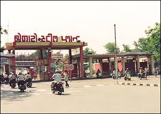
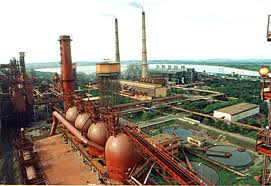

<figure aria-describedby="caption-attachment-1692" class="wp-caption alignleft" id="attachment_1692" style="width: 267px">

<figcaption class="wp-caption-text" id="caption-attachment-1692">Bokaro Steel Plant main gate (Pic: courtesy sail.co.in)</figcaption></figure>

In [Ambassador’s Journal](http://www.amazon.com/Ambassadors-Journal-Personal-Account-Kennedy/dp/0241016193), John Kenneth Galbraith writes about many interesting things during his tenure as US Ambassador to India. The snippets on Bokaro Steel City (where I was born) caught my attention. All Bokaro residents are aware of the Russian collaboration and the ‘many things Russian’ about Bokaro (stations inside City Park, Russian Colony, etc.) What will be news to most is that, during the Kennedy years, American aid and collaboration — for Bokaro Steel Plant — was a distinct possibility. Below are relevant extracts from Galbraith’s various journal entries.

*April 21, 1961 – New Delhi*

> I had my first press conference yesterday morning.
> 
> …
> 
> Then we did get into economics. I put the fourth government-owned steel plant at Bokaro within the range of American aid. I had no instructions but one should use what freedom he has, for it is evidently a rare blessing.
> 
> *(Within the footnote, Galbraith adds the following)* This became a highly controversial matter. My position — that public sector plants could be financed by the United States and that this one was eligible in principle — was strongly supported by President Kennedy, strongly opposed by Republicans and a source of great nervousness in the US bureaucracy which, at one time, reversed the President’s approval on the grounds that he was running undue political risk. This is discussed on several later occasions.

*May 26, 1961* – New Delhi

> Later we saw Swaran Singh, the Steel, Mines and Fuel Minister. I had indicated our possible willingness to finance the new Bokaro steel plant in the public sector. The Indians, as I have told, had then laid down a variety of conditions under which we might be allowed to do so — technical direction by Americans and management of projects by Indians and other interesting dualities. This is a hangover from the day when we seemed so anxious to help that we agreed to anything. I made clear that if we were providing the money — if we do — we must be able to ensure that a good job is being done. Today at the meeting we got a paper indicating agreement on this point. Diplomacy is easier from a strong bargaining position. The harder test would have been to make these arrangements if we were not the prospective source of the money.

<figure aria-describedby="caption-attachment-1693" class="wp-caption alignright" id="attachment_1693" style="width: 271px">

<figcaption class="wp-caption-text" id="caption-attachment-1693">Inside look at Bokaro Steel Plant (Pic: courtesy indianetzone.com)</figcaption></figure>

*Sep 13, 1961* – Washington

> 
From lunch, I went to see Frank Coffin (Former Congressman from Maine. Then Deputy Administrator of AID and the Managing Director of the Department of State’s Development Loan Fund. Now a Federal Judge.) to weigh in on Bokaro – evidently they thought I was getting too far ahead. I urged its importance; the unwisdom of letting the Russians get the jump on us; and the diffused and anonymous nature of our aid in the absence of such projects. I believe I made an impression.

I forgot to say that I had tea with B.K. Nehru last evening. He showed me a letter describing the Nehru-Khrushchev talks. Nehru asked Khrushchev if he would guarantee our access to Berlin.; K. said he would. He was agreeable about Kennedy, thought he had been handicapped by his small majority and attacked Adenauer.

*Sep 23, 1961* – New Delhi

> 
By a combination of persuasion, threats, blackmail, promises to resort to higher authority, appeals to patriotism and promises of what the Soviets will do, I seem to have a provisional approval of our financing of the fourth steel mill at Bokaro. Now we must find a way of building it with competence and distinction.

This project is very important. It is needed, useful and symbolic. Many of the things we are doing are rather anonymous — we provide copper and other nonferrous metals which are needed and useful but not very dramatic. And our past help to private-sector plants, such as Tata’s, has evoked the comment, “The Americans help the Tatas and Birlas who are already rich. By contrast, the Soviets or British build plants that belong to the people.” Now we are in the same league — provided that we can perform.

*Oct 24, 1961* – New Delhi 
> 
Ty Wood has returned from Washington with a proposal for getting U.S. Steel in on the Bokaro mill as a private enterprise operation. Of the $500 million required, $100 million would be subscribed in common stock and the rest as a loan, possibly guaranteed, from the U.S. and India. One-third of the $100 million of common stock would be held by each of U.S. Steel, private Indian capitalists and the Indian Government. Half of U.S. Steel’s investment would be cash, the rest in technology and “know-how.” This means they would get control of a $500 million firm for ten years — their control is guaranteed for that time — for an investment of $16.7 million. A real bargain.

*Jun 23, 1962* – New Delhi
> 
Yesterday I met with the U.S. Steel team which is investigating the Bokaro steel mill and had them to lunch. Their appearance here is a ritual. (In the footnote, Galbraith later mentions “This was not so. Their work proved valuable.”). One or two good men could have gone over the engineering and clerical data and passed upon the plausibility and need for the mill in a couple of weeks.

*Oct 8, 1962* – Chandrapura-Raipur
> 
At six this morning we stopped at Chandrapura and picked up a covey of Damodar Valley Corporation and Hindustan Steel (what came to be known as “SAIL”) officials, the latter headed by J.M. Shrinagesh, the Chairman and one of the distinguished tribe hitherto encountered which functions in various parts of Indian life with additional members in the United States and Germany. The train then proceeded to the proposed site of the Bokaro steel plant, a half-hour distant, where we disembarked. The air was fresh and almost cool and the countryside, which is gently rolling, was a bright lush green. After an introduction to the various young engineers who are being assembled for the project and a lecture on plant layout, sources of raw material and the like, I went with Shrinagesh to a flight strip whence we took off for a half-hour trip over the site and the Damodar Valley. The Valley is underlain with coal and scarred by open cast pits, tipples and piles of waste but nonetheless rather attractive at this time of year. We circled an adjacent mountain about 5,000 feet high, the back and saddle of which are spotted with tiny white temples.

*Oct 20 – Nov 20, 1962*: Sino-Indian war

(Editor's Note: Dates inserted here only for completeness. I haven’t read Galbraith’s account of the war yet. Don’t believe this war had any bearing on the Bokaro American aid decision.)

*Feb 7, 1963* – New Delhi
> 
General Clay is heading a committee to review the AID program. He has decided that there must be no assistance to Bokaro as long as it is in the public sector. In other words, for blatant ideological reasons, he is going back to the policies of the Eisenhower Administration. These were a grievous failure. Nothing substantial was done to advance private investment; and they talked about it enough to cause everyone to suppose our concern was to sustain capitalism rather than help the Indians. I have shifted to a purely pragmatic policy of whatever works. This even relaxes the tension on private enterprise.

 
I have written a careful rebuttal to Clay making it clear that he would lose sadly in any effort to carry his case to the public. I sent the message unclassified so that he won’t be in any doubt as to my willingness to do so. He has just joined Lehman Brothers in New York and will not want to start his banking career there with a public brawl. As for me, I would welcome it.

*Feb 20, 1963* – New Delhi
> 
The last three days have been intensely busy, much of the time with superficialities. I got off a long airgram to the Department putting General Clay right on Bokaro which I again sent unclassified so that it would have the greatest possible readership with every possible threat of leakage. I noted again that the previous administration had talked about supporting private enterprise while financing the public sector. They thus got the worst of both worlds. We were stopping the talk, cooling the debate over private and public enterprise, and had done very much better as a result.

*Apr 15, 1963* – Ahmedabad-Baroda-Veraval-New Delhi
> 
My life is currently divided between Kashmir and Bokaro, two problems inherited and on my hands for nearly all of these last two years. Today or tomorrow I’m seeing Nehru for the climactic session on Kashmir. I have prepared the way in every possible fashion, and I have some hopes of a fairly generous and forthcoming proposal for the Valley. On Bokaro, my problem is Lucius Clay. He has come out against aid to publicly owned enterprises. So over the weekend I issued a statement to the American press that there was no such commitment and that the issue should be decided on its merits. I left no doubt what I believed these to be. I have written a long memo on the subject which I would also like to have Washington release. Their hope, as always, is that the controversy will blow away. I can’t see why people are so afraid of a little fight. It does wonders for my disposition.

*May 10, 1963* – New Delhi 
> 
The other occurrence of the week was much more pleasant. The President came out strongly on the side of helping the Indians build the Bokaro steel plant and he said it should be supported in the public sector. It was a marvelous no-nonsense statement. For weeks, the AID people have been worrying about Congressional reaction. Characteristically they have been seeking to protect the President on matters where he doesn’t need or, one gathers, especially want protection. Now he has moved in and settled matters. He made the statement in a press conference. I followed it up here with a brief press conference in which I drew attention to the President’s answers. I also noted that the Congress still had to act and there were many technical and administrative details to be worked out. The papers this morning are full of it. For the last few days, Blitz, Link and the left generally have been busy assuring India that the U.S. is seeking to undermine Indian socialism. The President’s action is an unfair blow to these constructive thoughts.

(Feb 14 Update: race day ‘report’ covered in [Running the Course – Mumbai Marathon 2010](https://www.ulaar.com/2010/02/14/running-the-course-mumbai-marathon-2010/))

*******************************

*May 10, 1963* is the last Bokaro-specific journal entry in Galbraith’s memoir. His term ended on Jul 12, 1963 and the new ambassador’s (Chester Bowles) term started on Jul 19, 1963. I’ve cobble together some relevant article links and related dates: 

- [Foreign Aid: the Bokaro Issue](https://content.time.com/time/subscriber/article/0,33009,874945,00.html) Time, Jun 28, 1963
- Assassination of JF Kennedy (*Nov 22, 1963*)
- Death of Jawaharlal Nehru (*May 27, 1964*) 
- [India: Pride & Reality](https://content.time.com/time/subscriber/article/0,33009,834188,00.html) Time, Aug 13, 1965
(this last article is 11 pages of pure gold - I may well showcase the juicy bits in a separate post)

From other news articles, the Soviet collaboration seems to have been announced sometime in 1965. I would love to fill the gaps in the Bokaro-America -> Bokaro-Soviet narrative. Any Bokaro/SAIL historian who can add to the story, please leave a comment below. 
