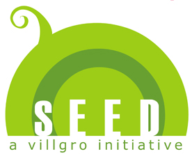

<figure aria-describedby="caption-attachment-1429" class="wp-caption alignleft" id="attachment_1429" style="width: 276px">

<figcaption class="wp-caption-text" id="caption-attachment-1429">Logo courtesy villgro.org</figcaption></figure>

Villgro, Chennai-based incubator and seed impact investor, announces the launch of a high-touch mentorship and training program (called SEED) for social entrepreneurs. They have crafted a 6-month program to address several complaints they’ve heard from entrepreneurs who’ve attended similar programs. The cohort size (at 10) is designed to be small, keeping in mind their key goal to maximize the number of social enterprises that will be get funding after graduation. They are focused on social entrepreneurs who’ve moved beyond the idea phase. Specifically, Paul Basil, founder and CEO of Villgro, says: *“This is not just for people who have ideas. It is for people who have tested their ideas and failed, and who have sufficient learning so that they won’t fail again the second time.”*

The SEED program is supported by the Global Social Benefit Incubator (GSBI) Network from Santa Clara University, ALTIS Business School at the Universita Cattolica del Santo Cuore, and the Loyola Institute of Business Administration.

**SEED Partners**

The investment partners will include Ankur Capital, Village Capital, and RTBI, who would be actively involved in the selection of the SEED cohort and provide ongoing feedback to make them ‘seed investor-ready’. SEED will likely add more investment partners.

The knowledge partners are Intuit, GSBI Network, elevar Equity, D-Rev, Innovation Alchemy, and Impact Law Ventures. These partners have either committed time, resources or curriculum to SEED and will be in attendance at some point during the 6-month program.

Villgro calls out Unreasonable Institute, Dasra, and GSBI Network as “models of inspiration” — nice touch!

**Curriculum &amp; High-touch Mentoring**

SEED has structured three sessions in-residence in Chennai during Nov 2012, Jan 2013, and March 2013, and high-touch mentoring in the months in between. The residency modules are described thus on their [curriculum page](http://villgro.org/index.php?option=com_content&view=article&id=169&Itemid=140): *Imagine staying for 3-5 days with your energizing cohort, surrounded constantly by more experienced entrepreneurs, investors, mentors, and sector leaders, together in a location that facilitates those conversations. Every day will be an intense growing process, allowing you to see things differently, tweak, refine, and test – with high-quality people to bounce ideas off of at all times.*

**The Mentors**

Five mentors shall coach the 10 entrepreneurs during the program. The following three are already on board:

- PR Ganapathy (aka “Guns”), an IIM(A) and Infosys alumnus and experienced executive with proven track record in scaling B2B businesses and significant experience in the Outsourcing, Financial Information and Telecom sectors. Besides mentoring rural social enterprises at Villgro, Ganapathy also volunteers with Teach For India in Chennai.
- Thomas Pulankev, an IRMA alumnus and a former Vice-President at SELCO. Thomas advises Villgro’s incubated energy enterprises on various aspects of enterprise development and helps select new incubates in the area of sustainable energy.
- Mukesh Sharma, a chartered accounting by training and founder of Vija Capital Advisor Private Limited, an early-stage investment banking and business advisory platform. Mukesh is also on the board of Biosense Technologies, a Villgro incubatee.

Somewhat orthogonal to the SEED program but perhaps relevant, Villgro has also announced its plans to raise a $10-million (Rs 55 crore) social enterprise fund from foundations and investors in the US.

**Key Dates**

- Jun 30, 2012 – Application deadline
- Aug 3, 2012 – In-person interviews with selection panel
- Sep 4, 2012 – SEED Cohort 2012 announced
- Mar 2, 2013 – SEED graduation

The [Villgro SEED](http://villgro.org/index.php?option=com_content&view=article&id=160&Itemid=139) page has a ton of additional details on the program. It’s exciting to see a well crafted training &amp; mentorship program and it will be an interesting wait for the first cohort of social entrepreneurs.