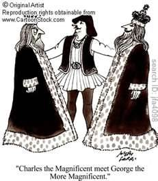

<figure aria-describedby="caption-attachment-1710" class="wp-caption alignleft" id="attachment_1710" style="width: 231px">

<figcaption class="wp-caption-text" id="caption-attachment-1710">Pic: courtesy cartoonstock.com</figcaption></figure>

The conversation below is between four Indian kids. Indian kids who know that *marathon* equals the precise distance of 42.2 km and isn’t a modifier like “5k marathon” or “10k marathon”. The conversation took place sometime in 2010. I wasn’t a live witness but my friend Shalini related it soon after.

A: “My father has run a marathon!”

P: “MY father has run a 50k ultra!”

S: “MY father has run a 75k ultra!”

(pause… pause… pause)

A: “My father’s FRIEND has run a 100k ultra!”