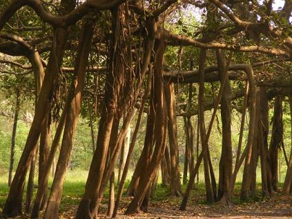

 
 India’s largest banyan tree, Kolkata 

During tonight’s good night ritual with the kids, the following conversation with my 9-year old.

> S: Does a banyan tree have any fruits?
> 
> Me: No.
> 
> S: Does it have any flowers?
> 
> Me: I don’t think so.
> 
> S: Then what’s the USE of a banyan tree?
> 
> Me: Well, it gives a LOT of shade. It grows up to be a really tall tree and, more importantly, a really broad tree.

After I returned to my desk, I learned a lot more things about the banyan tree (epiphytes, Bodh Gaya, Bhagavad Gita, etc.) which I’ll share with S at a suitable time. But.. the thought-provoking question for me was broader than a banyan’s boughs – does every living thing need to have some “use”?

Do leave your answer in the blog’s comments.

*Update (Jun 28)*: I omitted to mention what answer my atheist friend (and Richard Dawkins fan) gave \*last year\* – “all living beings (including humans) have just ONE purpose/use and that is to reproduce!”
