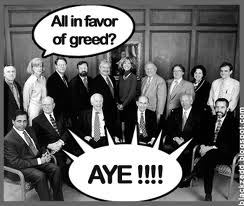

<figure aria-describedby="caption-attachment-1459" class="wp-caption alignleft" id="attachment_1459" style="width: 244px">

<figcaption class="wp-caption-text" id="caption-attachment-1459">Pic: courtesy nonprofituniversityblog.org</figcaption></figure>

In a recent Business Standard article, [How Janalakshi got to the top](http://business-standard.com/india/news/how-janalakshmi-got-totopthe-mfi-heap/477791/), the following quote from its chairman Ramesh Ramanathan caught my attention.

> “As a student of institutions, I learnt that the market was a double-edged sword,” says Ramanathan. When contemplating a structure for Janalakshmi, he wondered what would happen if he “took greed off the table”. “Would I be as motivated?” he asked himself. “Ten years later I’m still as fired up,” he says.

He was referring to the organisation’s unique bifurcation into a for-profit operational company and a not-for-profit holding company. The former (Janalakshmi Financial Services) is run as a regular professional for-profit financial services firm which is allowed to raise equity. The main promoters, like Ramanathan, have their equity stake held in the latter – Janalakshmi Social Services.

The founders of Rural Shores (Murali Vullaganti, Sudhakar Ram, CN Ram and two others) share a similar belief system with Ramesh Ramanathan and his co-founders and that’s reflected in how they’ve structured their company. Here’s the relevant extract from the [Rural Shores post](http://www.techsangam.com/2011/06/23/india-largest-rural-bpo-ambitious-plan-create-hubs-rural-district/) I wrote last year.

> The unique thing about Rural Shore’s formation was that all six co-founders share a common belief that it’s the social cause that’s *solely* driving them and, by corollary, don’t intend to materially benefit from the venture. This wasn’t a token *Do no evil* verbal pledge but a deliberately codified decision – a decision to create a separate charitable entity (Rural Shores Foundation) and transfer founder equity to it.

Ramanathan, Vullaganti and their co-founders are part of an extremely small minority of social entrepreneurs who’ve structured their organizations this way. The traditional way for social entrepreneurs to sidestep the ‘greed issue’ is to structure the organization as a non-profit. In recent times, Khan Academy’s Sal Khan is the most high-profile illustration of that model.

And finally, the following blurb on [RangDe](http://www.rangde.org/about-rang-de.htm)‘s About page also caught my attention:

> Rang De is registered as a non-profit organisation not because we are against the ‘p’ word but because we believe we are on a mission and cannot afford to lose focus. We are not in the oftly debated argument about profit or non profit. Our single minded focus is to ensure that our borrowers pay interest rates that are fair and our social investors can make a meaningful difference to other people’s lives.

It caught my attention because India’s two other peer-to-peer online lending platforms (Milaap.org and Micrograam) are structured as for-profit social enterprises. Since RangDe, Milaap and Micrograam are all [Bangalore-based social enterprises](http://www.techsangam.com/2012/06/21/list-of-social-enterprises-in-bangalore/), I look forward to meeting them and trying to discern how this distinction makes a difference in their strategy, operations and outlook (assuming it does).