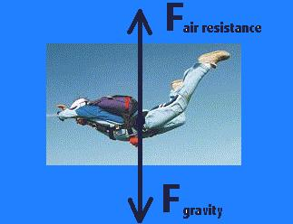
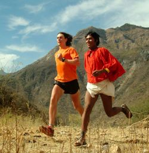
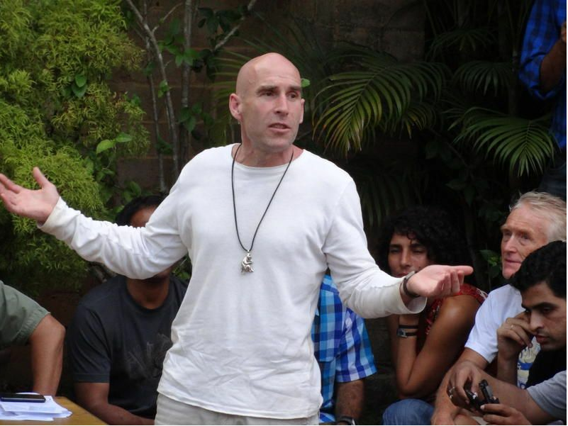
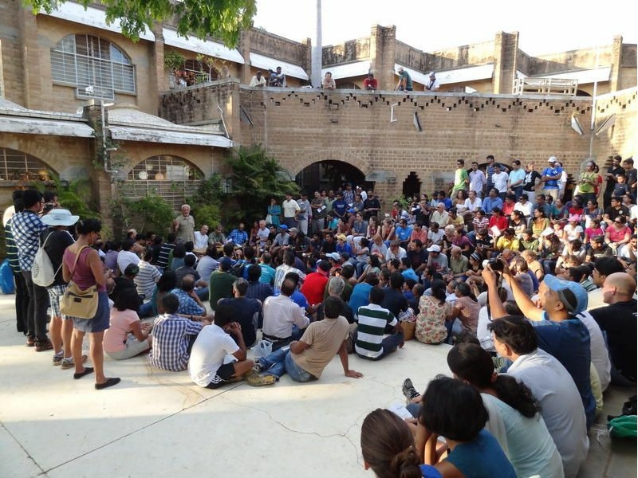

<figure aria-describedby="caption-attachment-1773" class="wp-caption alignleft" id="attachment_1773" style="width: 323px">

<figcaption class="wp-caption-text" id="caption-attachment-1773">Pic: courtesy northallertoncoll.org.uk</figcaption></figure>

This is Part 2 of an unfolding story on barefoot running. It continues from [It’s all a vast upper body conspiracy!](http://www.ulaar.com/2012/06/14/its-all-a-vast-upper-body-conspiracy/)

**Two months later…**

After my strange *out-of-the-body-voices-in-my-head* experience on Nov 13 2011, you’d think that my life would be altered for ever. Not quite. I still continued to blog about social enterprises and impact investing. I continued my training runs for Mumbai Marathon 2012. I was having trouble sticking to the grueling (5 days a week) running regimen of Hal Higdon’s Advanced plan. Life went on.

I would be lying if I claimed to not think about the night of Nov 13. Did it really happen? And “what” exactly happened? Was it a case of Jiddu Krishnamurti’s *be aware of yourself* mantra gone awry? Or had I discovered my personal version of a [Being John Malkovich](http://www.imdb.com/title/tt0120601/) portal? Let’s go with the latter speculation for a moment. Assuming I *had* indeed discovered a portal into my head or body, what did I want to do about it?

Should I just pretend that nothing out of the ordinary happened on Nov 13? Or should I try to recreate the environment and conditions for a repeat ‘performance’?

Hmm… This ‘performance’ was reminiscent of a seance (of which I’m strictly going by my seance specialist cousin’s vivid descriptions decades ago). Instead of external ‘spirits’, I had internal ‘voices’? These inner voices raise other interesting questions. If I heard the voice of the pulsating brain (the one I dubbed ‘Hippocampus’), was it different from my ‘conscious brain’?

“Too much ‘quiet time’ on my damn hands. What I needed was a nightly dose of trans-atlantic mind-numbing conference calls!” I scolded myself.

After a week’s rest, I resumed my training plan for Mumbai Marathon. Uncharacteristically, I missed one long run and had at least two bad weeks (bad = running &lt; 25% of target mileage). After a [disastrous pre-race start](http://www.ulaar.com/2012/02/01/for-a-few-minutes-less-a-race-report-from-mumbai-marathon-2012/), I still managed to shave [two minutes off my personal best](http://www.ulaar.com/2012/02/07/for-a-few-minutes-less-running-the-mumbai-marathon-2012/). Many lessons but at least I managed a PB.

Four down. One more to go. Completing Auroville Marathon on Feb 12 would make it “five in a season” and ten overall. Of course I wasn’t planning on ‘merely completing’ it. I wanted to make amends for squandering perfect conditions at Mumbai. Moreover, last season’s PB was at Auroville 2011 where I ran my first ever negative splits (2:14 / 2:12).

<figure aria-describedby="caption-attachment-1782" class="wp-caption alignright" id="attachment_1782" style="width: 250px">

<figcaption class="wp-caption-text" id="caption-attachment-1782">Ultra-marathoner legend Scott Jurek running with a Taramahura Indian (Pic: courtesy talesofarunner.wordpress.com)</figcaption></figure>

**Born to Run**

Just about every runner I know (and some non-runners) has read Christopher McDougall’s [Born to Run](http://www.amazon.com/Born-Run-Hidden-Superathletes-Greatest/dp/0307266303). I won’t tell you about the book — chances are you’ve read it already. If you haven’t, go ahead and read the reviews on Amazon and you’ll be hard-pressed NOT to buy the book right away. Unless you are as weird as me. Even though I *wanted* to read it, it just hadn’t become a big enough priority for me in 2011. In fact, I still haven’t read it. But I hang out with enough runners to know the gist of the book.

Still. As though McDougall divined that there were entire legions of runners intrigued enough about the barefoot running movement (yes – 2011 was definitely the year when it acquired the status of a ‘movement’) but hadn’t yet bothered to buy/borrow the book, he wrote this seminal article on New York Times – [The Once and Future Way to Run](http://www.nytimes.com/2011/11/06/magazine/running-christopher-mcdougall.html?_r=1&pagewanted=all). Go ahead, read it. Fifteen minutes of your time and it won’t cost you a dime.

…

…

If you still haven’t read that article, may I urge you again to read it?

…

…

Okay. Now that you’ve read the article, I’d like to share the key points that resonated with me. For someone who’s spent the better part of two decades building/evangelizing technology products and being a gadget freak for most of those years, it might be a bit paradoxical to confess that I’m a bit of a minimalist. I can listen to Philip Glass for hours without getting bored. I also like listening to the didgeridoo drone. I think you get the drift.

Running appealed to my minimalist streak. Team sports require several other people. Individual racquet sports (squash was my passion before running) require at least one other player. A runner needs just one person to show up – himself. The running gear is also minimal – shoes, sweat band, and a Garmin. What if I didn’t even need shoes? *That* is the essential possibility that excited me. **What if?**

The second aspect that excited me was that barefoot running might just be the one *best* way of running. By *best*, I mean the “most natural and most efficient way” which automatically implies minimizing proclivity to injuries and maximizing longevity. McDougall’s article links to an Alberto Salazar interview two years ago where he opines about [The one right way](http://www.chrismcdougall.com/blog/2010/08/there-has-to-be-one-best-of-running-its-got-to-be-like-a-law-of-physics-%E2%80%94alberto-salazar-u-s-olympian-3-time-new-york-city-marathon-champ-current-head-of-nike-elite-project/):

> There has to be one best way of running. It’s got to be like a law of physics. And if you deviate too much from that – the way I did in my career – it can be a big handicap. **Dathan can’t be a heel striker and expect to run as good as the best forefoot runners**. You can be efficient for a while with bad form–maybe with a low shuffle stride – but eventually that’s not good for your body. It’s going to produce tightness and muscular imbalances and structural problems. Then you get injuries, and if you’re not careful – if you don’t take care of the muscular and structural issues – the injuries can put you into a downward spiral.

This article probably did the most to strengthen my impulse to try out barefoot running. Had I read McDougall’s book, maybe I’d have got there sooner? Who knows!

But I still had the season’s last marathon to run so I wasn’t going to attempt any tomfoolery before that.

<figure aria-describedby="caption-attachment-1783" class="wp-caption alignleft" id="attachment_1783" style="width: 300px">

<figcaption class="wp-caption-text" id="caption-attachment-1783">Barefoot Ted at Auroville 2012 (Pic: courtesy aurovilleradio.org)</figcaption></figure>

**Barefoot Ted at Auroville**

Ted McDonald (popularly known as “Barefoot Ted” since featuring prominently in McDougall’s book) is an *independent athlete committed to re-discovering primal natural human capacities and encouraging others to do the same. Having spent the last 7 years focused on mastering barefoot long distance running, BFT now focuses on sharing his insights through coaching clinics and speaking engagements.* Other relevant links: BFT’s [bio page](http://barefootted.com/bio.html) and the sandals company he founded – [Luna Sandals](http://barefootted.com/shop/).

BFT’s talk on race day eve was highly anticipated… and he didn’t disappoint. The good folks at Auroville recorded his talk and it’s accessible via [this Aurovilleradio.org page](http://www.aurovilleradio.org/city-life/mobility/2601---barefoot---ted--s-speech).

He expectedly took several digs at shoe manufacturers but the funniest one was a visual which I’ll try to reproduce with words – *Let’s say you picked up a glass of water to drink and, for some strange reason, your hand misses the mouth by a few inches. The shoe manufacturers would solve this problem by designing an elaborate bidirectional motor system that could move your elbow by a few inches.* “Err.. how about just making a slight manual adjustment to your arm movement?” BFT quipped.

<figure aria-describedby="caption-attachment-1785" class="wp-caption alignright" id="attachment_1785" style="width: 300px">

<figcaption class="wp-caption-text" id="caption-attachment-1785">Crowds thronged to hear Barefoot Ted outside the Visitor Center (Pic: courtesy aurovilleradio.org)</figcaption></figure>

There were a few questions from the audience on the best way to ‘transition’ to barefoot running. BFT’s recommendation was to start by ‘going bare’ before eventually switching to minimalist footwear. The rationale for ‘going bare’ first is that there’s no better way for the soles to provide feedback to the brain. Moreover, it’s nearly impossible to have bad form when running barefoot (ever tried landing barefoot on your heels?)

Anand Anantharam, co-founder of [Barefoot Runners Foundation of India](http://www.barefootrunnersindia.org/), was (at least partly) instrumental in getting Barefoot Ted to visit India. He reminded the predominantly Indian audience that *“It has not been THAT long since we Indians were running around barefoot, including many in the current generation. So we have a lot less to ‘unlearn’, in stark contrast to the American and European runners.”*

As I trooped behind the long snaking line of runners waiting to wolf down the pre-race pasta dinner, I wondered what tomorrow would bring. An opportunity to race – of course. An opportunity to push the body and mind to its limits – of course. Thoughts of ‘personal bests’ are best left ‘unthought’ but I haven’t quite evolved to that level yet.

*Next article in series: [Time to pitter patter](http://www.ulaar.com/2012/09/10/my-first-barefoot-run-time-to-pitter-patter/)*