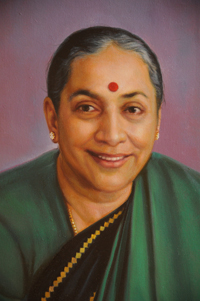

*\[Editor’s Note: In Verghese Kurien’s autobiography ([I too had a dream](http://www.flipkart.com/books/8174364072)), he recounts his first encounter with Margaret Alva in 1984, when she accompanied the Queen of Netherlands. The Queen wished to visit Anand, meet Kurien and find out the truth behind the torrent of accusations that were being thrown at NDDB and him — in the wake of a series of anti-Operation Flood publications.\]*

> <figure aria-describedby="caption-attachment-1797" class="wp-caption alignleft" id="attachment_1797" style="width: 200px">

<figcaption class="wp-caption-text" id="caption-attachment-1797">Margaret Alva (recently sworn in as Rajasthan Governor) – Pic courtesy wikipedia.org</figcaption></figure>
> 
> When a head of state travels to our country the government generally attaches a minister to the visiting dignitary. In this case, as the dignitary was a woman, Margaret Alva escorted the Queen. I had never met Margaret Alva before. As our meeting commenced, she came and sat next to me on the Indian side of the table, as it were. The Queen of Netherlands began her cross-examination. Clearly, she had done her homework well and grilled me for a long time. At the end of it, when she was finally satisfied that she had left no questions unanswered, the Queen said, ‘Dr. Kurien, you have convinced me. Now I know what you are planning to do. My worries and the worries of the people in my country are certainly not justified and from now on we will be your strong supporters. In fact, Dr. Kurien, when you next come to Europe, do come and visit us and I will arrange for you to come and speak at the Institute of Social Studies.’
> 
> When the Queen of Netherlands said this, Margaret Alva suddenly piped up and said, ‘Your majesty, whatever you might think of him, I think Dr. Kurien is an MCP!’
> 
> I was astounded. This was the first time ever that we had met and she was accusing me of being a male chauvinist pig. I looked at her questioningly. Then she said, ‘ Please allow me to explain. Do you see the crest of the NDDB? It is a bull. It should, in fact, have been a cow. After all, NDDB is about dairy development. Doesn’t that prove my point?’
> 
> I thought this was getting a bit out of hand and the time had come to say something in my defence so I looked at the honourable Minister and said, ‘Madam, no bull, no milk.’ The Queen burst out laughing. Margaret Alva was dumbfounded. She knew she could say nothing more. But after this incident we became good friends.