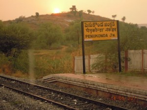

<figure aria-describedby="caption-attachment-1480" class="wp-caption alignleft" id="attachment_1480" style="width: 300px">

<figcaption class="wp-caption-text" id="caption-attachment-1480">Penukonda (70km from Anantapur and 14km from Gutturu) – Pic courtesy tripmodo.com</figcaption></figure>

*\[Editor’s Note: Earlier this month I was invited by [Dr. Trilochan Sastry](http://www.techsangam.com/2011/12/04/the-many-lives-of-trilochan-sastry-%e2%80%93-academic-social-activist-social-entrepreneur/) to attend the Anantpur Cooperative Federation Annual General Meeting (AGM). The meeting, held at the cooperative-owned groundnut processing mill in Gutturu village of Anantpur district (Andhra Pradesh), was both educational and inspirational. The meeting lasted nearly 3 hours and ended with a sumptuous lunch for everyone. My observations and detailed conversations with a few farmers provided valuable insights into the workings of a farmer cooperative and also served to showcase the healthy dynamic between Center for Collective Development (CCD) and the cooperative. The trip to Gutturu was my first (and *long overdue)* “rural” field trip since I started writing this blog. This is Part 1 of my 2-part report.\]*

**Conversation with JV Ramana Reddy** (Federation’s General Secretary)

- Ramana Reddy is one of the early cooperative leaders (from nearby Gunipalli village) and played a key role in the setup of the groundnut processing mill.
- Six villages and 800+ farmers represented in this federation (Average farm size ~ 5 acres); represents 20% of the overall farmers in region.
- Sowing season normally starts in July but in recent years it has shifted to May-Jun. Harvesting season Nov-Jan.
- Government officials expecting bribes to approve 24×7 electricity for the mill. Filing an RTI finally did the trick.
- Mill capacity is 40,000 bags/year. Last year’s volume was 10,000.
- Showed me accounts receivable for the year; 2 crores + turnover

**AGM Proceedings – Part 1**

- Twelve folks (including cooperative board members, senior farmers, Dr. Sastry and Chennai-based food consultant Dr. Ashok) seated at the dais.
- The emcee was Prasad, CCD’s Anantpur District Manager who kicked off proceedings. Program starts with a soulful song sung by an old farmer.
- Federation President Narayanaswamy provided key highlights for the year and concluded with future product development – *chikkis*, masala *pappu*, etc.
- Ramana Reddy followed with a detailed review of the accounts payable (and sales data) and gave a long speech which included effusive thanks to Dr. Sastry (*“we are all here because of him only”)*.

**AGM Proceedings – Part 2**

Mohan, ex-CCD manager for Anantpur and current CCD manager for Cuddapah, gave an impassioned speech starting with an important clarification that “You/farmers are doing it ALL – collecting money, selling, accounting, etc. CCD is just helping and advising.”

- Getting the right/best price is most important; building mill &amp; processing groundnuts is next most important
- Lot of sleepless nights by Ramana Reddy, Ashok Reddy, etc. during mill construction
- Explained depreciation – what may ‘seem like’ less money in year#2 of mill operation (compared to year #1) is not true. Assets are becoming ours. No more loan payments.
- No bribe given to any government officials. (lot of pride)

*(Two more senior farmers — Pulla Reddy and J Prabhakar Reddy — invited to the dais.)*Satyanarayana Reddy (cooperative’s Vice President) shared additional financial figures, thanked CCD profusely and talked about new products (chikki, masala pappu, etc.) – there seems considerable excitement around value added product development.Uma Maheshwari &amp; Suri were the next arrivals on the podium. The duo had recently been trained in *chikki* (popular Indian groundnut and jaggery based snack) manufacturing &amp; marketing in Bangalore – a trip that also included visits to various retail outlets. Maheshwari put up a very effective show for the audience. Product by product, he rattled off the retail price in Bangalore along with the Anantpur farmer’s average selling price – in most cases, there was a huge difference in price. Cost of making chikki was highlighted as ‘fairly minimal’.*(Open invitation for anyone to come to the dais and share their views/suggestions.)*Anjanayelu (from Talacharla village) suggests: “Since we are planning to create so many value added products, why not divide &amp; conquer? Have one *sangha* (group) take up product X, another do product Y, etc.?”Next up was Dr. Ashok – the Chennai-based food technologist, food marketer and chief guest. Haltingly (but in decent Telugu), he spoke passionately about wanting to maximize profits for the farmers by getting products to the ‘right market’. *In my conversation with Dr. Ashok (b**efore the AGM started), he was confident about strong demand in the interior towns as long as product quality was guaranteed.*
*—– rest of the reporting continues in Part 2 —–*