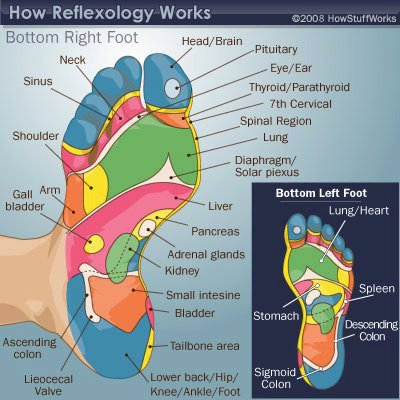

The contents of this post picked up from a [Global Healing Exchange](https://www.facebook.com/GlobalHealingExchange) link shared on Facebook by one of my friends. Something tells me that my experiments in barefoot running might find some relevance with this field. Hmm….

<figure aria-describedby="caption-attachment-1803" class="wp-caption alignleft" id="attachment_1803" style="width: 400px">

<figcaption class="wp-caption-text" id="caption-attachment-1803">Pic: courtesy howstuffworks.com and Facebook</figcaption></figure>

*Foot Reflexology has become a well respected ADJUNCT to regular medical care. It is used in Hospitals, by Physical Therapists and Chiropractors to enhance MOST forms of medical treatments.*

*It is not a “miracle” or a “faith healing” type thing. Sometimes, like other therapies, it takes a few sessions.*

*Foot reflexology can help ease the pain of achy joints and muscles, relieve headaches and toothaches, improve the functioning of major systems of the body.*

*Foot Reflexology works by applying pressure at specific points on the bottom of the foot. This is not the same as acupressure or acupuncture.*

*In fact, the only thing that is the same is that medical science can’t prove how it works…they just know it does!!*

*There are over 7,200 nerve endings at the bottom of each foot. Nerves connect to every organ, every limb and region of the body through the brain and spinal column. It is thought that foot reflexology works in much the same way. Even though we don’t actually work the nerve endings, the correlation of the bottom of the feet to every region of the body definitely exists. It was originally called “The Zone” therapy in the early 20th century and was successfully organized into a comprehensive therapy by a physical therapist, Eunice Ingham in the ’40s. She coined the term “reflexes” when referring to this therapy.*

*Foot reflexology can increase the blood flow to the part of the body being worked, which in turn increases the oxygen going to that part.*

*The increased blood flow helps take away toxins that build up in each cell of the body each day.*

*This brings more health and vitality to the region plus adds a sense of over-all well-being. When our feet feel good, we feel good!*

*Learn to do foot reflexology to help your family and friends feel better! Get help getting your body back to its’ natural state of health by teaching your family to do foot reflexology on you!*

*Please realize that foot reflexology is NOT a substitute for medical treatment, you are always encouraged to seek professional medical help when needed, however, this therapy can be used in conjunction with most treatments for most conditions.*

*Please, if being treated by a medical professional, get that professional’s permission before doing foot reflexology for that medical condition.*