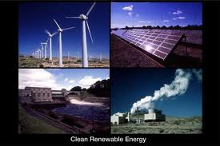

<figure aria-describedby="caption-attachment-1497" class="wp-caption alignleft" id="attachment_1497" style="width: 275px">

<figcaption class="wp-caption-text" id="caption-attachment-1497">Pic: courtesy solar-green-wind.com</figcaption></figure>

Earlier today, I read a tweet from SELCO’s official account that talked about a sustainability energy challenge launched under the umbrella of SELCO Labs. SELCO Labs, the innovation and incubation arm of SELCO started in April 2009 and is hosted inside the premises of SDM Institute of Technology, Ujire, Karnataka.

The most interesting and revealing aspect of the challenge is this sentence – *The product/service/system must be a socially relevant solution related to water, food, health, well-being, livelihoods, transport or education that operates under the umbrella of renewable energy and sustainability.* This sounded like the start of SELCO’s foray into other social enterprise verticals but Harish Hande quickly quashed my speculation :). They continue to be focused only on sustainable energy. SELCO Labs (and thus this challenge) is part of SELCO Foundation which has the mandate to look at sustainable energies in general.

Details on the challenge and background information have been picked up from SELCO Labs’ challenge site.

> **Background / Stats**
> 
> One person in five on the planet still lacks access to modern electricity. Twice that number, three billion people, rely on wood, coal, charcoal or animal waste for cooking and heating. Nearly one billion people lack access to safe drinking water and 2.6 billion lack access to basic sanitation. In a global economy, this is inequitable – and unsustainable. The United Nations Foundation in an attempt to mobilize clean efficient energy access for all has declared 2012 as the year of ‘Sustainable Energy for All’. Energy “transforms lives, economies and the planet”- and we at SELCO believe the key to ensuring and enabling ‘access to all’ is Innovation.
> 
> **Challenge Details**
> 
> SELCO- SEC is offering a total of Rs. 60,000 to the winning team(s) that creates a sys­tem with the potential to positively impact the environment while transforming lives. *The product/service/system must be a socially relevant solution related to water, food, health, well-being, livelihoods, transport or education that operates under the umbrella of renewable energy and sustainability.* The winning team gets a chance to take their concept forward through SELCO Labs.

More on the challenge [here](http://sustainableenergychallenge.org/) and at the [SELCO Labs](http://www.selco-india.com/selco_labs.html) website.

*Updated*: Harish Hande quickly wrote back to me clarifying that SELCO is NOT entering into any other social enterprise vertical. SELCO Labs is the initiative of SELCO Foundation which has the mandate to look at sustainable energies in general. The Energy Center concept, School Light Program, Hybrid Dryers are some their key initiatives.