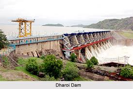
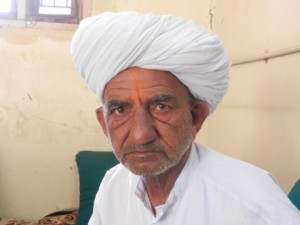

**All revolutions don’t have to be red in color.* Milk is white and water is blue. – Old jungle saying*

*\[Editor’s Note: Meera Sanyal, CEO of RBS India who contested parliament elections in 2009 as an independent candidate in South Mumbai, went on a 15-day field trip to Gujarat in Mar 2012. She wrote a wonderful blog post about Hari Bhai – once the village head of Kiyadaar’s milk cooperative who went on to apply cooperative principles to kickstart a movement in water management which is being dubbed as a “blue revolution”. This post is based entirely on Meera Sanyal’s field report – with my usual cherry-picking methodology.\]*

<figure aria-describedby="caption-attachment-1521" class="wp-caption alignleft" id="attachment_1521" style="width: 274px">

<figcaption class="wp-caption-text" id="caption-attachment-1521">Dharoi Dam (Pic: courtesy indianetzone.com)</figcaption></figure>

**Background**

- India has approximately **142 million hectares** of land under agricultural cultivation of which **60%** is rain-fed.
- In **Gujarat**, which lies in a semi arid zone, **70 %** of land is **rain-fed**. Rainfall is erratic and ranges from **350-1800 mm**.
- In 2007, RBS India Foundation starts working in **Mehsana** and **Sabarkantha** districts (in partnership with [DSC](http://www.dscindia.org/aboutdsc.htm)) in the areas of Watershed Development and Participatory Irrigation Management.
- Scope of coverage: **150 villages**, **40,000** families, and a command area of **38,000 hectares**.

**The first win – repairing the sub-canal**

> In 1979, the building of the **Dharoi dam** on the **River Sabarmati**, brought the promise of irrigation to Kiyadaar. Unfortunately this remained only a promise. Until 1997, Kiyadaar like many other villages in Mehsana, received no water at all from the irrigation canals of Dharoi. So Hari Bhai, got the villagers together. They studied the canal system and realised that the gradient of the sub canal, to their village was wrong, thus making it impossible for the water to flow towards their village. When entreaties to official departments failed to yield results, the villagers labouring together, first remedied the gradient problem and then repaired the sub canal.

**Pani Panchayat of Kiyadaar**

> Once the water started reaching the village, they realised that a roster system would be needed to ensure that each farm in the village received its fair share of water. Thus was born the Pani Panchayat of Kiyadaar. Villagers agreed the days on which each farm would receive water. They took into account acreage as also the nature of crop each farmer was growing. Penalties were agreed and levied for misuse. Because **governance was local, voluntary and mutually beneficial, the results were excellent.**

<figure aria-describedby="caption-attachment-1522" class="wp-caption alignright" id="attachment_1522" style="width: 300px">

<figcaption class="wp-caption-text" id="caption-attachment-1522">Blue Revolution Man – Hari Bhai (Pic: courtesy meerasanyal.wordpress.com)</figcaption></figure>

**Kiyaadar -&gt; Kaira as Blue -&gt; White**

> In 2007, DSC approached our Foundation for support in extending the Kiyadaar model to other villages in the Mehsana district. Hari Bhai became mentor and guide to many other villagers and the experience of **Kiyadaar became a catalyst** for other villages to adopt the same methods.

**Federating the Pani Panchayat**

> Soon it became clear that a system of regulation would be required between villages at the head of the canal, along its length and at the tail, to ensure that tail end deprivation did not take place. So a **Federation of villages along the canal was formed**, to ensure that all villages along the length of the canal received their fair share of water. Hari Bhai was selected as the Secretary of the Federation of Canal No 2 ( there are 3 main canals from the Dharoi dam).

**Grassroots Success Begets Government Rebates**

> Clearly this was a **win-win situation**. Villages and farmers, were getting the benefits of irrigation and so took an interest in maintaining and regulating the usage if water. This reduced the administrative burden on the irrigation dept. So as an incentive, the Govt granted a rebate on the water cess, to every village with a Pani Panchayat (or WAU), and to all villages that were members of a Canal Federation.
> 
> At present the economics of the water in Mehsana are as follows. Every farmer in a WAU village is a member of the cooperative and pays Rs 50 for his/ her share. The WAU collects the water cess from farmers and undertakes maintenance of the canals. For this the WAU receives a **rebate of 50% on the water cess** (currently Rs 276 for 1 watering of 1 hectare) from the Irrigation Dept, which benefit is shared amongst the farmers of the village.
> 
> The Presidents of the village water cooperatives, jointly comprise the General body of the Canal Federation. Every Village cooperative contributes Rs 20/ hectare to the Canal Federation. The Federation in turn undertakes maintenance of the main canal and supervision of water distribution between villages, and pays for Chowkidars and operators. For this they receive a **further 20% rebate** on the water cess, from the Irrigation Dept, which is shared amongst the member villages.

**Hari Bhai = Tribhuvan Das for water**

> So once again using Hari Bhai as a role model, we started spreading the message on the benefits of matters like soil testing, using vermicompost &amp; bio pesticides, setting up Self Help Groups for women to clean, grade, and pack products, using drip irrigation &amp; mulching techniques etc. His presence at a farmers gathering, and his image on a poster, bring immediate recognition and acceptance of these messages.

**So… you want to see numbers?**

- The area irrigated by Dharoi dam has DOUBLED – from 18,000 to 36,000 hectares!
- Average net income of farmers has risen by 42% – from Rs. 12,000 to Rs. 17,000 per hectare.
- Average costs have declined by Rs. 2,000-3,000 per hectare.
- Usage of chemical fertilizers has reduced by 2100 tonnes; pesticide usage also reduced by 600 liters.
- Soil testing indicates that soil health of 6000 hectares has significantly improved.

*Hari Bhai, may your tribe increase! And may your tribe of followers increase even more!*Meera Sanyal’s original blog post: [Hari Bhai of Kiyadaar &amp; the Blue Revolution](http://meerasanyal.wordpress.com/2012/03/31/hari-bhai-of-kiyadaar-the-blue-revolution-2/)