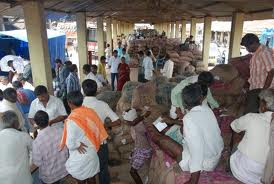
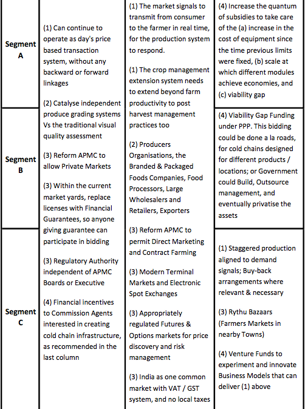

*\[Editor’s Note: This is Part 2 of a two-part article – originally published on Scribd.com by Sivakumar Surampudi (aka “Shiv”), a 22 year ITC veteran and [architect of e-Choupal](http://www.techsangam.com/2011/09/20/itc-e-choupal-model-to-increase-farmer-revenue-and-its-own-bottomline/). Part 1 [link here](http://www.techsangam.com/2012/07/05/supply-chains-for-horticultural-products/) and original Scribd link [here](http://www.scribd.com/doc/92107829/Supply-Chains-for-Horticultural-Products). If you are reading this via RSS or email and the table below is not very clear, you may click through to the blog.\]*

**The Market**

<figure aria-describedby="caption-attachment-1562" class="wp-caption alignleft" id="attachment_1562" style="width: 250px">

<figcaption class="wp-caption-text" id="caption-attachment-1562">One of Maharashtra’s APMC (Agriculture Produce Market Committee)</figcaption></figure>

A large majority of the fruits and vegetables in the country are currently marketed through the *“open market transactions system”* under the conventional APMC regulations. Market yards set up under the APMC Acts are playing a vital role in terms of price discovery, as well as product aggregation &amp; disaggregation along the chain. However, the way these markets are currently organised, there are serious inefficiencies resulting in the consumers paying higher prices while the farmers get an unfairly low share of those prices. With some reforms (covered in the next section), the effectiveness of the market yards can be significantly improved, yet they cannot deliver complete solution to the problem at hand, as the transactions will still be based on day’s prices only. Market yard processes cannot be geared to coordinate along the whole chain, so necessary for several fruits &amp; vegetables as per the dynamics described in the product section above.

<figure aria-describedby="caption-attachment-1563" class="wp-caption alignright" id="attachment_1563" style="width: 274px">

<figcaption class="wp-caption-text" id="caption-attachment-1563">Bangalore APMC Yard (Pic: courtesy bangalorenext.com)</figcaption></figure>

Accordingly, there is a need to develop *“privately coordinated supply chains”* to supplement the open markets to take care of those dynamics. Such chains can be vertically integrated by a variety of anchor players, such as the Producers Organisations, the Branded &amp; Packaged Foods Companies, Food Processors, Large Wholesalers and Retailers, Exporters etc. Mechanisms like Direct Marketing and Contract Farming can be used in different contexts as appropriate. Modern Terminal Markets, with Anchor Buyers at the front-end and crop management programmes with the Farmers at the back-end can play a similar role.

Thus, any supply chain solution in the horticulture sector needs to be designed to suit the context of three product segments and two marketing systems.

**The Solution**

Given the complexities of the horticulture sector, the desirable transformation can be achieved only if a multi-pronged strategy is deployed, involving four points of intervention, viz. (1) Market Linkages, (2) Agents, (3) Institutional Change, and (4) Financial Incentive.

