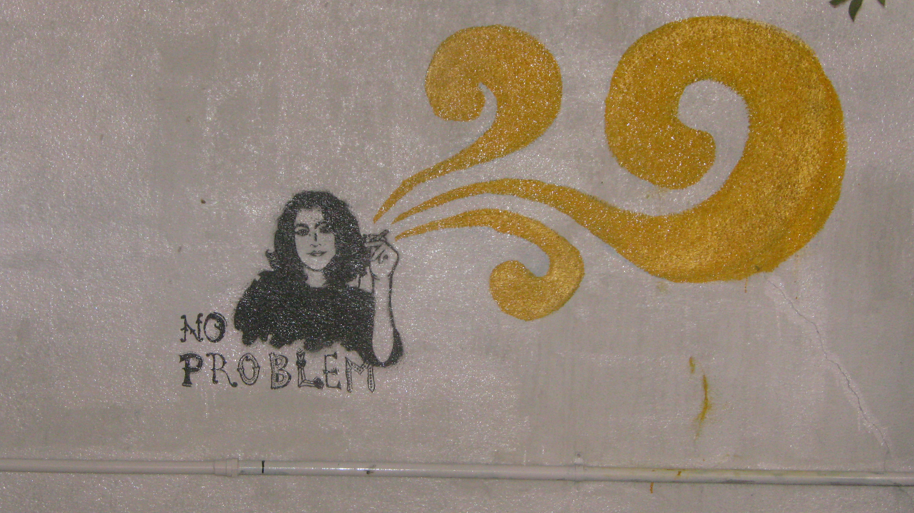
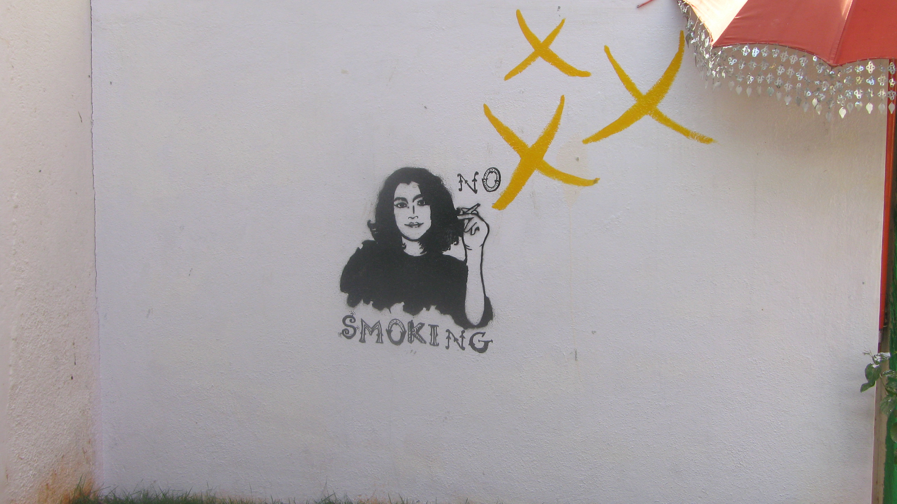

<figure aria-describedby="caption-attachment-1849" class="wp-caption aligncenter" id="attachment_1849" style="width: 573px">

<figcaption class="wp-caption-text" id="caption-attachment-1849">The “Ok to Smoke” sign</figcaption></figure>

<figure aria-describedby="caption-attachment-1853" class="wp-caption aligncenter" id="attachment_1853" style="width: 573px">

<figcaption class="wp-caption-text" id="caption-attachment-1853">And its counterpart</figcaption></figure>

Bangalore peeps, How well do you know your city? Do you know where these signs are? Leave your answers (or guesses) in the comments.