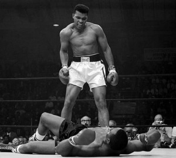

Another day. [Another list](http://www.sociableblog.com/2012/06/27/10-greatest-social-entrepreneurs-of-all-time/).

Not.Going.To.Get.Worked.Up.This.Time. (Hint: [my reaction](http://www.techsangam.com/2011/12/05/calling-bullshit-on-forbes-list-of-top-30-social-entrepreneurs/) to the Forbes list of 30 social entrepreneurs)

But seriously there’s nothing to get worked up about a “greatest of all time” list .

I mean, after all, social entrepreneurship has been around for centuries. Social enterprises have dramatically changed people’s lives in the past century. Worldwide poverty rates has seen double-digit declines since the Kennedy years. The entire course of nations in the developing world has changed thanks to outstanding social entrepreneurs.

*(Crackle… zap… *crackle*… *zap*) Err… what did you say?*

Sorry, I need to explain the interruption and how it will alter the narrating style for the rest of this post.

My system has an in-built *hyperbole detector* that is rather <del>sensitive</del> hyper-sensitive. Every time I indulge in hyperbole (through speech or by writing), it sets off a spasmodic [Taser](http://en.wikipedia.org/wiki/Taser)-like reaction. Let’s parse the above to see where I ran afoul of my hyperbole detector.

**Social entrepreneurship has been around for centuries.**

Wikipedia tells me that social entrepreneurship was first coined (as a term and concept) in the 1950’s by Michael Young – a British sociologist, social activist and politician. In the 1980’s, Young was described by Harvard professor Daniel Bell as ‘the world’s most successful entrepreneur of social enterprises.’ The term came into widespread use in the 1980s/1990s by Ashoka founder, Bill Drayton. In summary, social entrepreneurship has been around for (at most) 60 years. Round 1 goes to *hyperbole detector*.

(Additional reading: Wikipedia article on [social entrepreneurship](http://en.wikipedia.org/wiki/Social_entrepreneurship), TechSangam post on [social entrepreneurship](http://www.techsangam.com/2011/05/04/defining-social-entrepreneurship/).)

**Social enterprises have dramatically changed people’s lives in the past century.**

Okay maybe not *past century*, but social enterprises have indeed improved people’s lives dramatically. Exhibit A is Grameen Bank – with its 2,500 branches, it reaches out to almost 85,000 villages in Bangladesh. Grameen Bank impacts lives of more than 40 million people by giving credits to almost 8 million people. The loan recovery rate is higher than 98 percent. 100 percent of loans are financed from the Bank’s deposits, making it entirely independent of external support. 60 percent of the borrowers find their way out of poverty. Exhibit B is Fab India – while most business folks might be aware that its annual revenue for 2011-12 is expected to cross Rs 500 crores, few are aware of the impressive backend aggregation – over 40,000 craft-based rural artisans comprise Fabindia’s production network. Round 2 goes to me.

(Additional reading: [Grameen Bank impact](http://www.grameencreativelab.com/live-examples/grameen-bank-the-mother-of-grameen-social-business.html) and [The poster children of social enterprises in India](http://www.firstpost.com/economy/the-poster-children-of-social-enterprises-in-india-252443.html))

**Worldwide poverty rates has seen double-digit declines since the Kennedy years.**

High growth across most of the developing world has helped nearly half a billion people escape $1.25 per-day poverty between 2005 and 2010. Never before have so many people been lifted out of poverty over such a brief period. But.. many of them have merely moved from “extreme poverty” to just “poverty”. And “double-digit declines” since the 1960s? Who am I kidding? Round 3 goes to *hyperbole detector*.

<figure aria-describedby="caption-attachment-1556" class="wp-caption alignleft" id="attachment_1556" style="width: 300px">

<figcaption class="wp-caption-text" id="caption-attachment-1556">The original “Greatest” – Muhammad Ali</figcaption></figure>

**Entire course of nations in developing world has changed thanks to outstanding social entrepreneurs.**

Barring Bangladesh and Muhammad Yunus, no other country in the developing world can lay claim to this statement. On a lenient grading scale, round 4 points are split between *hyperbole detector* and me. In any case, the match squarely goes to *hyperbole detector*.

Now that I understand *hyperbole detector*‘s point of view, it’s easy to see that “Greatest” and “All time” were like the color red to a Spanish bull. When you hear “Greatest of all time”, chances are Mohammed Ali is the first name that comes to mind. Or, depending on which sport catches your fancy, it might be Roger Federer, Sachin Tendulkar, Jahangir Khan, or Babe Ruth.

**So… Greatest Social Entrepreneurs of all time?**

- In the 60 (or 40) odd years since social entrepreneurship started, there simply haven’t been enough social entrepreneurs (of any kind) to be attempting these kinds of lists.
- Muhammad Yunus is obviously a giant. There’s a reason he was awarded a Nobel Prize in 2006. Those folks at the Nobel Prize Foundation usually don’t jump the gun. Operative word [“usually”](http://www.nobelprize.org/nobel_prizes/peace/laureates/2009/press.html).
- Bill Drayton is founder of Ashoka – an organization that’s like a talent search and club/network for social entrepreneurs but, last I checked, he hasn’t started a social enterprise. Then again, if Forbes can confuse impact investors for social entrepreneurs (point #1 [here](http://www.techsangam.com/2011/12/05/calling-bullshit-on-forbes-list-of-top-30-social-entrepreneurs/)), what’s a Sociableblog.com to do?

***Somewhere in the world, it’s the 1960s.***

I heard this quote from a VC acquaintance who heard it from someone in Silicon Valley. It sums up the state of the social enterprise ecosystem — in India and in the rest of the developing world. So let’s quit messing around with lists like “greatest of all time” and “Top X” and do our bit in getting more people to participate in this ecosystem. We need more social entrepreneurs. And we need more people joining these social enterprises. The rest will follow — in due course.