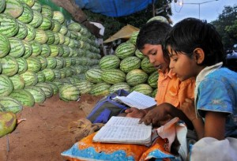

Earlier today, I caught a tweet with the intriguing title *RTE: The Unasked Question*. Glad I clicked on it because the linked article (by Jaideep Prabhu) made for a very interesting read.

Prabhu is a doctoral student (in history) at Vanderbilt University and also the International Affairs &amp; Security Editor at the [Centre Right](http://centreright.in/) blog. He sees little good in the *(probably) well-intentioned but train wreck of legislation that is RTE*. But that’s not even the thrust of his article – selective quotes below.

On the current dismal state of India’s education system:

> It has become about giving more people the same poor education than actually reforming India’s decrepit education system to produce able citizens; worse, the government is hijacking private infrastructure to do so. Despite constant reminders from industry about the poor quality of students and [shameful](http://blogs.timesofindia.indiatimes.com/the-real-truth/entry/pisa-results-shame-india-but-is-anyone-surprised-really) [results](http://www.thehindu.com/news/national/article2804134.ece) of international evaluations (such as PISA), there is little that the Government is doing to actually improve education in India. And the cost of this non-action? A whopping [Rs. 1.78 lakh crores](http://articles.timesofindia.indiatimes.com/2009-09-29/india/28090500_1_funding-pattern-student-teacher-ratio-rte) (though there are “assurances” that the cost will decrease by 66% within five years).

On India’s *real* problems (six to be precise) with education:

> 1. A poor curriculum,
> 2. Poor quality of teachers
> 3. Insufficient teachers
> 4. High truancy of teachers
> 5. Inadequate physical resources (buildings, blackboards, drinking water, toilets, etc.)
> 6. Use of teachers to do non-school work, such as election or [census](http://www.indianexpress.com/news/census-teachers-on-duty-school-work-stuck/740850/0) work

<figure aria-describedby="caption-attachment-1588" class="wp-caption alignright" id="attachment_1588" style="width: 300px">

<figcaption class="wp-caption-text" id="caption-attachment-1588">Pic: courtesy thehindu.com</figcaption></figure>

Is it an education budget problem? No, writes Prabhu.

> Lest this be blamed on insufficient funds, let it be known that despite being a Third World country, India is no longer short of money – the [education budget](http://www.livemint.com/2012/03/16153749/Education-sees-18-increase-in.html) has witnessed a rapid climb from Rs. 204 billion in 1997-2002 through Rs. 438 billion in 2002-2007, Rs. 52,060 crores in 2011, to a planned Rs. 61, 407 crores in 2012. Over three-quarters of this is slated for primary and secondary education.

Not just loss of future pecuniary benefits to the children…

> This wasting away of India’s most valuable resource – its children – does not stop with merely the loss of future pecuniary benefits to the children themselves, but undercuts national growth (not just financial) in the long run. Social problems will remain unresolved; environmental issues will not be taken with due seriousness; economic questions will be slave to petty party politics; and the twin challenges of inclusive growth and quality of life will receive little to no attention. None of these can be genuinely taken up with a closed mind, an attitude that doesn’t question the status quo. But none of this is the focus of the RTE.

On the philosophy of education and paideia…

> Obviously, India needs a massive overhaul in not just education, but also the philosophy of education. Universities have become credentialing offices and are seen only in a utilitarian perspective. The notion of [paideia](http://jaideepprabhu.org/2012/04/08/paideia/) has been completely lost. To paraphrase Thomas Browne, no man should approach the temple of knowledge with the soul of a money changer. And yet, with legislation like the RTE, the government is ensuring that more people get poor and incomplete education, most probably at the cost of deteriorating quality for everyone. Piggybacking on private infrastructure as the RTE does is only a few steps away from the nationalisation enacted by Indira Gandhi in the 1970s which brought the country to its knees.

And he concludes with:

> By distracting the populace with talk of minorities and reservations, the government is only admitting that it is incapable of the, admittedly, Herculean task. The United Progressive Alliance has abdicated all responsibility for governing, while the primary opposition, the Bharatiya Janata Party, is absconding. The RTE has caused bitter opposition across the country which it would not have had the Rs. 1.78 lakh crores been sanctioned to raise teacher pay, raise teacher standards, provide better facilities, and create a functional curriculum (by way of example, I’d suggest something similar to the [International Baccalaureate](http://www.ibo.org/general/what.cfm)). *If even 10% of India’s children can learn to think critically, there is great hope for this mutt of a country.*

&gt; “this mutt of a country”

Can honestly say I’ve not heard that epithet for India before!

Link to Jaideep Prabhu’s article:[ RTE: Asking the Unasked Question](http://jaideepprabhu.org/2012/07/10/rte-asking-the-unasked-question/)

**Related links**:

- [Samhita Academy: Trailblazing the RTE path before it became a law](http://www.techsangam.com/2012/06/17/samhita-academy-trailblazing-the-rte-path-years-before-it-became-a-law/)
- [Supply Demand Wars in Education Policy – Part 1](http://www.techsangam.com/2011/09/02/supply-demand-wars-in-education-policy-part-1/)
- [Supply Demand Wars in Education Policy – Part 2](http://www.techsangam.com/2011/09/06/the-supply-demand-wars-in-education-policy-part-2/)
- [Middle ground between the supply-wallahs and demand-wallahs](http://www.techsangam.com/2011/09/07/middle-ground-between-the-supply-wallahs-and-demand-wallahs/)
- [Pratham’s Contributions to the Indian Education Policy Debate](http://www.techsangam.com/2011/09/10/prathams-contributions-to-indian-education-policy-debate/)