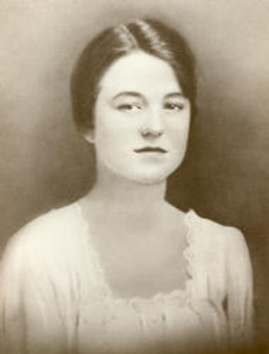

Clara Myrtle Grey Bird (1900-1988), photo taken in 1917. No relation to “Clara Huling” but most relevant Google Images ‘period’ match

When my [second batch of friends arrived](https://www.ulaar.com/2012/05/20/second-batch-of-friends-arrived-a-few-months-ago/) a few months ago, the most interesting book was [The Complete Works of O. Henry](http://www.goodreads.com/book/show/31624.The_Complete_Works_of_O_Henry). O Henry, which happens to be the pen name of William Sydney Porter was an American writer (from the late nineteenth century era) who mostly wrote short stories, stories known for their wit, wordplay, and clever endings.

I’m yet to read the hefty omnibus that I’ve been recently reunited with. The book bears my tell-tale calligraphic signature. Right below is scrawled “April 1995” which means it was from [my Chicago years](https://www.ulaar.com/2008/11/11/memories-of-an-american-life-4-years-in-chicago/).

In faded black ink, higher up on the same page, a clearly feminine flourish had rendered the following:

*Clara W. Huling*

*4434 Volta Place N.W.*

*Washington DC*

*1938*

 Wow. Fifty-seven years after Clara W Huling’s purchase, this book had made its way from Washington DC to Chicago. Three years later, the book traveled to the Western California coast – first to Mountain View, then Sunnyvale, Santa Clara, back to Sunnyvale for five years before spending nearly 4 years in ‘solitary confinement’ (in my cousin’s attic in South San Jose). Then it traveled by air (in a suitcase) ferried by my kind brother-in-law to Chennai. The final leg of its journey (Chennai to Bangalore) was facilitated by my friend and ex-colleague Sathish.

I had in my possession the closest thing to a *rare edition*. Getting more specific, it’s a Deluxe Edition from Garden City Publishing Company and it was published in 1937. The copyright lines suggest that this book was originally published by Doubleday, Doran &amp; Company, Inc. in 1899.

Armed with a modern search engine, I began my search for “clara huling”. Top matches are from ancestry.com and names.whitepages.com but this esoteric match (a 1875 ruling [Clara N. Huling v. Robert Bennett](http://files.usgwarchives.net/pa/lycoming/court/bennett-huling1875.txt)) from Lycoming-Northampton County PA Archives Court caught my attention – *The final determination is that Bennett (aged 67) is a lunatic.* Clara N. Huling is listed in the court documents as his daughter so let’s estimate her age in 1875 to be 40. If she had survived until 1938, she would have been 103. Not implausible but what’s highly unlikely is her buying a small-print edition of O. Henry at that age. Moreover, this daughter of Michael Bennett was Clara **N** Huling, not Clara **W** Huling.

Digging into the ancestry.com and whitepages.com listings seemed like “too much hay” so I did some address searching using Zillow and Trulia.

According to Zillow the house was built in 1931 and it’s a condo. Trulia disagrees slightly – pegging the built-year at 1933 and calling it a townhouse. They seem to agree on other attributes – lot size of 3,242 sqft and size of 2,320 sqft. The current owners (Llyod and Mardan Zand) bought the house from Jason and Mariana Zand in Nov 2002. Sadly the prior sales history is missing on both Zillow and Trulia. This DC-area [Blockshopper page](http://dc.blockshopper.com/property/13530069/4434_volta_place_nw) has an aerial map and some more information – though none relevant for my archeology dig.

I returned to Whitepages and Ancestry.com but the trail went cold. Or maybe this post wants to be read now.

*Closing Note*: Washington DC area friends &amp; acquaintances, if you find yourself in the Washington-Foxhall area (specifically the Foxhall Village historic district), feel free to walk over to 4434 Volta Place and relate this story. If anyone locates a descendent of Clara W Huling and if they are interested in retrieving a bibliographic family heirloom, they can leave a comment on this post. 🙂

*2021 Update*: As part of my clean-up purge sometime in the Covid "reopening" months, I sold most of these books (including this volume) to Blossom Books (on Church Street). And by 'sold', I mean I got store credit which is being used to purchase new (or new old) books. The next level of detachment with books (as possessions) I suppose..
