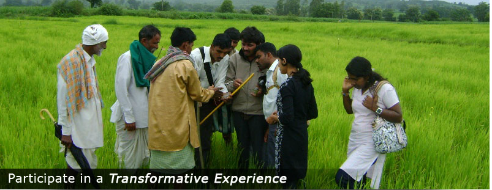
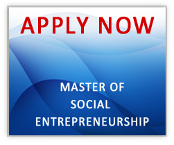

<figure aria-describedby="caption-attachment-1595" class="wp-caption alignleft" id="attachment_1595" style="width: 449px">

<figcaption class="wp-caption-text" id="caption-attachment-1595">Pic: courtesy detmse.com</figcaption></figure>

The Deshpande Education Trust (DET) feels that it isn’t doing enough to further the cause of social entrepreneurship in India. I’m so glad they felt that way.

A week ago, DET announced the launch of its Master of Social Entrepreneurship program at its main campus in Hubli, Karnataka. It’s a *two-year residential program affiliated with Karnataka University Dharwad and approved by the Government of Karnataka. With more than twenty-five courses and 100 credits, MSE offers students essential skills in social innovation, entrepreneurship, leadership development and business practice taught by scholars and practitioners who actively engage in leading enterprises and promoting entrepreneurship.*

**India’s First Such Program?**

No, but India’s second such program. Turns out that Tata Institute of Social Sciences (TISS) has been offering an [M.A. degree](http://www.tiss.edu/TopMenuBar/admissions/masters-programmes) in Social Entrepreneurship for at least a few years now. Outside India, [Hult University](http://www.hult.edu/en/programs/master/social-entrepreneurship/) (San Francisco &amp; London campuses) started offering a one-year Masters degree in Social Entrepreneurship in 2011 and [Goldsmiths](http://www.gold.ac.uk/pg/ma-social-entrepreneurship/) (University of London) offers a 1 year full-time or 2 years part-time MA degree program. A more complete list would be the subject of a future post.

**Faculty &amp; Networks**

While DET’s [faculty lineup](http://www.detmse.com/trainer.html) seems reasonable enough, the most interesting value proposition might be a rich set of sister organizations and networks. The [DCSE](http://www.detmse.com/network.html) (Deshpande Center for Social Entrepreneurship) has so far incubated nine social enterprises and has strategic collaborations with scores of social enterprises.

**Applications and Deadlines**

Applications for the program are due July 30th 2012 and courses will begin August 22nd 2012. For more information on the program and admissions process: **[www.detmse.com](http://www.detmse.com/).**

<figure aria-describedby="caption-attachment-1599" class="wp-caption aligncenter" id="attachment_1599" style="width: 251px">

<figcaption class="wp-caption-text" id="caption-attachment-1599">Clicks through to Application Form</figcaption></figure>