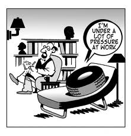

<figure aria-describedby="caption-attachment-1869" class="wp-caption alignleft" id="attachment_1869" style="width: 221px">

<figcaption class="wp-caption-text" id="caption-attachment-1869">Pic: courtesy robert.foo.my</figcaption></figure>

Problem with starting your morning with Twitter (or Facebook) is that you might exceed your “daily dose” by 9am itself. On the bright side (especially if you are a blogger), you might read something that makes you go “Aha! I know JUST the post I need to write today.” This works great when you’ve been agonizing between the post that you were *supposed to write* and the one that you *wanted to write*. Since the winning post came out of the blue, there’s no residual guilt either. Sweet.

From my Twitter timeline this morning:

> Most people want long-term behavior change (a "path"), but I say best solution is a fixed-term intervention (a "span"). Then repeat.
> 
> — BJ Fogg (@bjfogg) [July 10, 2012](https://twitter.com/bjfogg/status/222799699319599105?ref_src=twsrc%5Etfw)

> [@bjfogg](https://twitter.com/bjfogg?ref_src=twsrc%5Etfw) true. That's what helped me quit smoking. Told myself I wasn't quitting – just taking a break. So far break has lasted 3 years.
> 
> — Esben Rasmussen (@EsbenRasmussen) [July 10, 2012](https://twitter.com/EsbenRasmussen/status/222801828222472192?ref_src=twsrc%5Etfw)

> .[@EsbenRasmussen](https://twitter.com/EsbenRasmussen?ref_src=twsrc%5Etfw) And it's how I (inadvertently) became vegetarian. I was just "trying it out" for 6 weeks. Now, 20 years later . . .
> 
> — BJ Fogg (@bjfogg) [July 10, 2012](https://twitter.com/bjfogg/status/222802624636923904?ref_src=twsrc%5Etfw)

> [@bjfogg](https://twitter.com/bjfogg?ref_src=twsrc%5Etfw) that's how I became vegan too. I tried out vegetarian for 10 weeks and then 4 months later I tried being vegan for 30 days. It stuck
> 
> — Tom Holowka (@TomHolowka) [July 10, 2012](https://twitter.com/TomHolowka/status/222832877862256640?ref_src=twsrc%5Etfw)

The conversation reminded me of our Return2India decision. Why we were returning was easily answered. If you are new to this blog, you’ll find different answers [here](http://www.ulaar.com/2008/06/02/why-are-we-moving-back-to-india/), [here](http://www.ulaar.com/2010/04/11/why-we-are-in-india-bollywood-inspired-version/) and [here](http://www.ulaar.com/category/r2ia-voices/).

The second popular question was “Are you moving for ***good***?” Good as in permanent / final / will not ever return.

Depending on who asked the question, our answers ranged from “Yes, for good.” to “Well. We’d like it to be permanent.” to “Well. If things don’t work out, we can always come back.”

None of the answers were false – together they represented our continuum of intent. In hind sight, the smartest thing we did was not putting too much pressure on ourselves. Sure – we both really REALLY wanted the move to work out. But we told each other that if the move didn’t agree with either of us, the option of returning to US was always there.

“Don’t tie yourself up in knots.”

This advice, from a friend and mentor, when I was contemplating a stay-or-walk professional decision is relevant to the R2I decision as well. By not getting too attached to the desired outcome, strange as it may sound, you give yourself an opportunity to be surprised… in unexpected ways.

*Main baat hai ki tension nahin lena ka!*

(Translation: main thing is to not get worked up.)