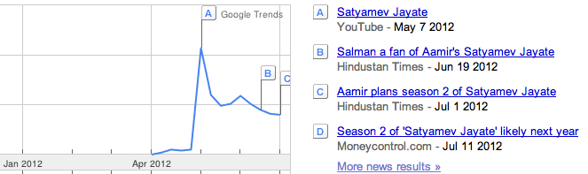
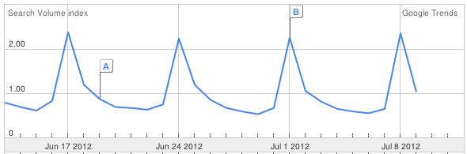
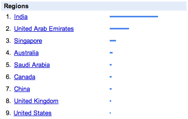
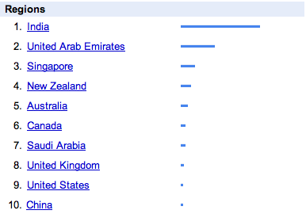
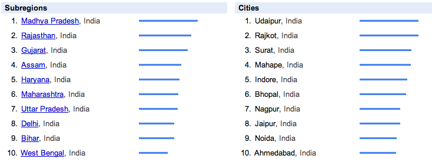
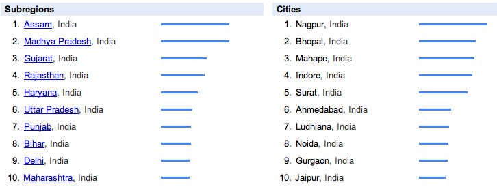

<figure aria-describedby="caption-attachment-1630" class="wp-caption alignleft" id="attachment_1630" style="width: 150px">

<figcaption class="wp-caption-text" id="caption-attachment-1630">Pic: courtesy dishtracking.com</figcaption></figure>

After reading the umpteenth article about Aamir Khan’s Satyamev Jayate, I decided it was finally time to do some good old fashioned digging, using Google Trends. All trend graphs in this post are for query term **“satyamev jayate”**. I might dig into episode-specific query terms in a subsequent post.

<figure aria-describedby="caption-attachment-1618" class="wp-caption aligncenter" id="attachment_1618" style="width: 600px">

<figcaption class="wp-caption-text" id="caption-attachment-1618">Default view: All Regions, Last 12 months. 1st episode airs May 6.</figcaption></figure>

Changing the time frame to “Last 30 days” yields the expected weekly (Sunday) trend. Jun 17 episode (domestic violence) drew more searchers than Jun 24 (pesticides &amp; organic food). The Sunday search volume probably correlates with TRPs.

<figure aria-describedby="caption-attachment-1619" class="wp-caption aligncenter" id="attachment_1619" style="width: 590px">

<figcaption class="wp-caption-text" id="caption-attachment-1619">All regions, Last 30 days</figcaption></figure>

**Where (in the world) are Indians searching for “satyamev jayate”?** While UAE &amp; Singapore near the top of the list are not surprising, US and UK at the bottom of the Top 10 regions *does* surprise me. Availability/cost of the Star Plus channel in certain international markets? More theories in the last section below.

<table><tbody><tr><td><figure aria-describedby="caption-attachment-1620" class="wp-caption alignleft" id="attachment_1620" style="width: 280px">

<figcaption class="wp-caption-text" id="caption-attachment-1620">Last 12 months</figcaption></figure>

</td><td><figure aria-describedby="caption-attachment-1621" class="wp-caption alignleft" id="attachment_1621" style="width: 280px">

<figcaption class="wp-caption-text" id="caption-attachment-1621">Last 30 days</figcaption></figure>

</td></tr></tbody></table>

**Drilling down into the “India searchers” – THIS is where it gets really interesting.**

The table (on the left) shows top 10 states and cities for the last 12 months; the table (on the right) shows top 10 states/cities for the last 30 days. Surprising findings:

- Not a single South Indian state/city in the Top 10.
- Mahape is a suburb of Navi Mumbai (yes – had to look that up)
- Assam the top state in the last 30 days! There are no densely populated cities in Assam and the entire state population is about 35 million.
- Punjab tears into the Top 10 in the last 30 days — possibly due to the episode on pesticides?

<table><tbody><tr><td><figure aria-describedby="caption-attachment-1622" class="wp-caption alignleft" id="attachment_1622" style="width: 280px">

<figcaption class="wp-caption-text" id="caption-attachment-1622">States and Cities – Last 12 months</figcaption></figure>

</td><td><figure aria-describedby="caption-attachment-1623" class="wp-caption alignleft" id="attachment_1623" style="width: 280px">

<figcaption class="wp-caption-text" id="caption-attachment-1623">States and Cities – Last 30 days</figcaption></figure>

</td></tr></tbody></table>

**Who are these searchers?**

Web searchers of “satyamev jayate” fall into one or more of these buckets (let me know if I missed any):

- They either don’t subscribe to Star Plus, or have missed the show and want to watch it online at [satyamevjayate.in](http://www.satyamevjayate.in/)
- They want to engage/interact with the show – the website offers numerous interaction features – comments, Ask a question, Share your story, Share your solution… It’s quite exhaustive actually.
- Call to action (polls, donations, etc.) for people who’ve watched the show