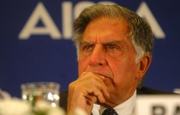

<figure aria-describedby="caption-attachment-1613" class="wp-caption alignleft" id="attachment_1613" style="width: 300px">

<figcaption class="wp-caption-text" id="caption-attachment-1613">Ratan Tata (Pic: courtesy thehindu.com)</figcaption></figure>

It’s not what you might think. I’m not going to launch into a tirade about Ratan Tata’s business accomplishments, legacy or any failed opportunities. Any tycoon that takes a conglomerate from $10 billion to $100 billion in revenue in 21 years while retaining the unique employee-friendly *Tata culture* and not employing the *Ambani doctrine* deserves a big round of applause. There was that little blemish from the Radia Tapes but it was vague and inconclusive anyway.

If you are scratching your head, let me quickly employ some theatrics. “Friends, Indians, countrymen, lend me your ears. I’m here, neither to bury Ratan Tata (the businessman) nor to praise him. I’m here to celebrate his upcoming role as a full-time philanthropist.” And, by the way, did you know that 4.5% of Tata Group’s profits go to its charitable foundations?

On Dec 28, 2012 Ratan Tata turns 75 and retires from Tata Sons leaving the conglomerate in the able hands of Cyrus Mistry. In a recent [interview with Charlie Rose](http://www.charlierose.com/view/interview/12440) \[duration: 32 min\], Tata talked about his post-retirement plans.

The interview also featured Rockefeller Foundation President Judith Rodin. The Foundation, celebrating its centennial this year, honored Tata with a Lifetime Achievement Award for incorporating public good into the business model of the Tata Group.

The top quote from the Charlie Rose interview was:

> “My most visible goal is to do something in nutrition to children in India, and pregnant mothers because that would change the mental and physical health of our population in years to come.”

If the [HUNGaMA](http://hungamaforchange.org/index.html) initiative (by Naandi Foundation) on combating malnutrition needed a high profile push, they sure as hell got one. If I know Naandi’s Manoj Kumar well, I reckon he’s already talked to Tata. According to HUNGaMA, 42% of children under five are underweight and 59% are stunted in the survey’s 100 Focus Districts (from these six states – Bihar, Jharkhand, Madhya Pradesh, Orissa, Rajasthan, and Uttar Pradesh). More survey takeaways [here](http://www.techsangam.com/2012/01/11/nine-key-takeaways-from-hungama-survey-on-hunger-and-malnutriti/).

The three areas Tata wants to focus on are rural development, water conservation and child nutrition. Last year we wrote about a Tata Trust funded social enterprise Head Held High which has been delivering [BPO-level education to illiterate villagers in 8 months](http://www.techsangam.com/2011/06/21/bpo-level-education-for-illiterate-villager-8-months/).

Tata also dwelled on the topic of water conservation and shared the factoid that 80% of India’s rainfall goes (uncollected) into the seas.

Bill Gates retired from Microsoft in Aug 2008 (at the ripe young age of 52) to spend nearly all his time guiding the world’s richest philanthropy – Bill and Melinda Gates Foundation. Four years later, the impact of Gates Foundation is already so pronounced that it has prompted the likes of Malcolm Gladwell to ‘predict’ that 50 years from now, Steve Jobs (“Jesus” to the world’s entrepreneurs) would have been forgotten but Bill Gates would be remembered — not for Microsoft, but for his indelible contributions as a philanthropist and humanitarian.

It’s my personal wish that Ratan Tata be remembered more for his philanthropic legacy than his business legacy. I know he’s 75 but surely he can make a visible impact on India’s BOP!