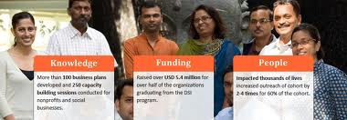

<figure aria-describedby="caption-attachment-1635" class="wp-caption alignleft" id="attachment_1635" style="width: 380px">

<figcaption class="wp-caption-text" id="caption-attachment-1635">Pic: courtesy dasra.org</figcaption></figure>

Last month, we wrote about Chennai-based Villgro’s announcement of its new [high-touch training program](http://www.techsangam.com/2012/06/19/villgro-launches-high-touch-training-program-for-social-entrepreneurs/) for social entrepreneurs. [Dasra Social-Impact](http://www.dasra.org/) (DSI) is a grand daddy when it comes to “executive education for social entrepreneurs”. Six cohorts and 132 alumni later, DSI is now accepting applications for cohort #7. The application deadline is July 20, 2012 and, this time, looking to support *50 outstanding leaders from Indian NGOs and social businesses*.

**About Dasra and DSI**

Dasra, which calls itself a catalyst for social change, is a strategic philanthropic foundation operating on a triad of executive education, advisory research and group philanthropy.

DSI is a transformative executive education program designed to help social change-makers achieve financial sustainability and scale. Spread over seven months, DSI participants work with the Dasra team, dedicated volunteers, external mentors, amongst other resources to build their capacity in operating, fundraising and scaling their organizations.

B Social Impact International had originally started this training/capacity building program in 2006. In 2009, Dasra took over the program from SI International and has been running the program since.

**Program Details**

The 7-month program hinges on three workshops (each lasting one week) in Sep 2012, Jan 2013, and Mar 2013. Workshop #1 is themed around elevator pitches, scaling and business models. Workshop #2 is themed around impact assessment, fundraising and pitching. Workshop #3 topics include company valuation, hiring challenges, and still more investor pitches.

Every cohort has the opportunity to access (win) up to $250,000 of committed funding from KL Felicitas Foundation, Halloran Philanthropy, TONIC and a few other individuals. The unique aspect is that the winner(s) are decided through a peer funding process. Yes – the cohort decides (among itself) which social enterprise is most worthy of receiving the funding.

A key objective of any incubation/accelerator program is to increase the enterprise’s chances of raising capital. The crowning glory of the DSI program is that the cohort graduates at the annual event of the Indian Philanthropy Forum – an event attended by philanthropists and investors.

**Previous DSI Cohorts**

Last year’s winners of the DSI peer funding were

- Simpa Networks, Daily Dump, and Waste Capital Partners (social businesses), and
- Aangan Trust, Apnalaya, and Magic Bus (NGOs)

Peer funding winners in previous years include Milaap, SMV Wheels, and Industree Crafts. The full list of funding recipients can be referenced [here](http://www.dasra.org/Funding%20Recipients). The complete list of [DSI alumni](http://www.dasra.org/Alumni) is organized well by category – Child Development, Education, Environment, Health, Human Welfare, and Livelihood.**Mentors**

[Individual mentors](http://www.dasra.org/Individual-Mentors) and [corporate mentors](http://www.dasra.org/Corporate-Mentors) from Bain in 2011.

**Partners**

Halloran Philanthropies, Omidyar Network, social-impact International, Thomson Reuters Foundation, Vodafone India Foundation. The longer (complete) list on Dasra’s [partner](http://www.dasra.org/our-partners) page.

**Testimonials**

*“Only when I came to Dasra, did I realize that there are different ways to increase impact, and that scale does not necessarily mean dilution of impact.” – Kalyani Subramanyam, Naz Foundation (Cohort 5)*

*“Dasra has amongst the best facilitation I’ve seen in a training. Dasra’s trainers and staff bring rich experience to the table, but also know when to just step back and let the cohort share and learn from each other.” – Michael MacHarg, Simpa Networks (Cohort 6)*

Read other testimonials from Industree’s Neelam Chhibber, Ayaappa Masaggi and more on Dasra’s [cohort page](http://www.dasra.org/DSI-Cohort).

**Other Details**

Application deadline: Jul 20, 2012 (that’s ONE WEEK from today).

Apply here: **http://dasra.org/Apply-for-upcoming-cohort**

The program cost per entrepreneur is 4 Lakh INR but Dasra subsidizes it down to 1 Lakh INR.