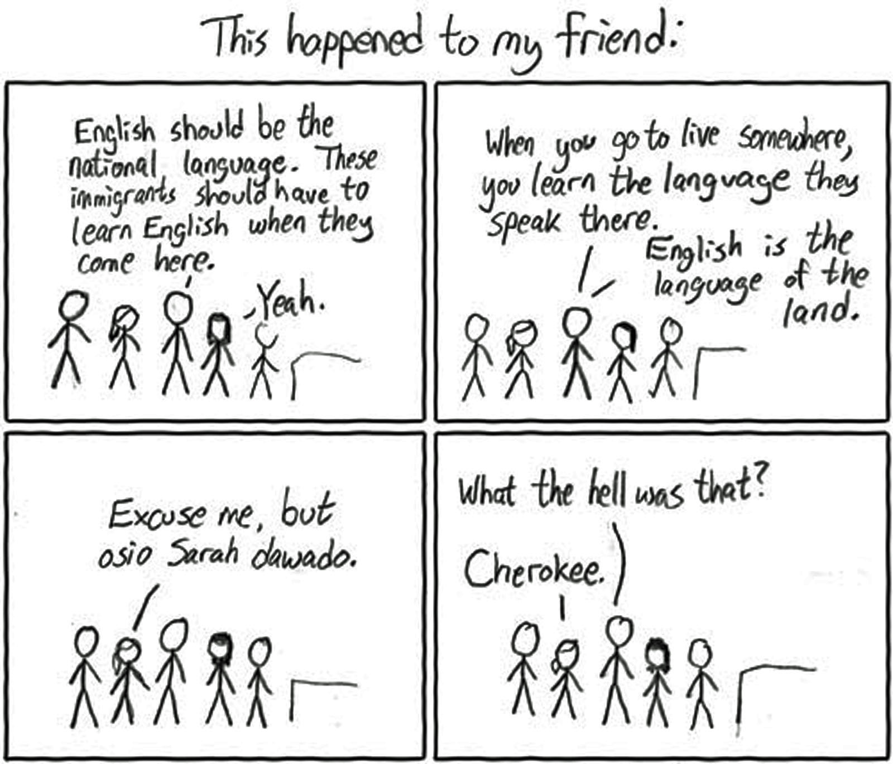

Pic: courtesy upenn.edu

A few weeks ago we went roller skate shopping for our older son. We avoided all the fancy sports outlet chains (who only stock skates with integrated shoes – such a scam!) After visiting a few mom-and-pop stores we went to the store where we would eventually make our purchase.

Our family was conversing amongst us in English and we were talking to the two store clerks in Hindi. The other customers were also talking to the clerks in Hindi. At some point, I noticed that the store clerks were conversing in Telugu (my mother tongue).

It was finally our turn at the checkout counter. In an inspired moment, I asked her (in Telugu), “If I talk in Telugu, will you give me a discount?”

For a few seconds, she had a look one normally reserves for aliens… and then she gushed “Oh! You are from Andhra!”

She continued (in Telugu of course) “After an entire day of customers trooping in and out, many annoying ones at that, to hear you suddenly talk in Telugu it took our day’s tiredness away. Of course I’ll give you a discount. Normally it would be 10% but since you are speaking Telugu it is 15%!”

I could have been Sunil Singh (from Bihar) or David Abraham (from Chennai) but I had *spoken* in Telugu. That was the key *connector* . She may not be *this* harried every weekend and might not give an extra discount to *every* Telugu speaking customer but would definitely feel similarly *connected*.

Replace Telugu with French, Bangalore with New York and similar stories are probably playing out throughout the world. Language matters in India. Also in the rest of the world.
