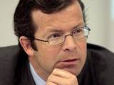
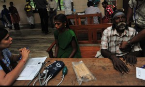

<figure aria-describedby="caption-attachment-1647" class="wp-caption alignleft" id="attachment_1647" style="width: 160px">

<figcaption class="wp-caption-text" id="caption-attachment-1647">Prince Max von und zu Liechtenstein (aka “Prince Max”) – CEO of LGT since 2006</figcaption></figure>

LGT Venture Philanthropy is the philanthropic / impact investor arm of Princely Family of Liechtenstein/LGT Group. LGT Group is the largest privately owned private banking and asset management group in Europe and the Family Office of the Princely Family of Liechtenstein. Until this morning, I didn’t know that Lichtenstein was even a *country.* Assuming that many of this blog’s readers might share my ignorance (reasonable assumption?), let me share some quick Liechtenstein facts:

- 4th smallest country in Europe with an area of 160 square km.
- In 1990, Liechtenstein becomes the 160th member of the UN
- One of only two double landlocked countries (Uzbekistan is the other) wedged between Switzerland and Austria
- Its population of 35,000 residents is exceeded by the number of incorporated companies (thanks to attractive tax laws).

The LGT Group’s [chronology of key events](http://www.lgt.com/en/lgt-group/history/) (since 1920) might be of interest to some of you. LGT Venture Philanthropy was founded in 2007 by Prince Max – to continue the long family tradition of active philanthropic engagement also within LGT Group. Their focus statement reads like this: *For the funds of the Princely Family the focus lies on developing countries and the venture philanthropy approach. The portfolio shows a number of possibilities: from donations in the health sector in Africa, to an equity investment in waste management in Peru to a bridge loan for tuberculosis treatment in India. In the case of the LGT Venture Philanthropy Foundation, any generated profit is channeled back into the foundation and will be used for additional donation/investments.*

To date, LGT Venture Philanthropy (LGT VP) has funded seven organizations in India, of which four are social enterprises. Funding has ranged from grants and loans to equity investments. Below are short blurbs on the seven organizations including the amount (and type of) funding received.

**\#1: Aangan Trust** (Mumbai-based charitable trust)

Aangan’s mission is to *improve quality of care of state-run children homes in India*. Aangan’s monitoring and capacity building initiatives help in identifying corrupt practices such as diversion of children into unregulated shelters, and reduction of physical abuse as well as improvement of facilities in the homes. Prevention programs identify at risk children and uses community based initiatives with local partners to address children’s rehabilitation needs.

LGT VP’s performance dependent grant of USD 467,000 (paid over four years) funds the expansion into 100 homes in four new states – translating into a direct impact on the lives of 12,500 more children each year. The 2012 target is to reach 475 active homes and 47,500 children.

**\#2: Driptech** (Pune-based social enterprise)

Driptech (through its innovative and cost-effective drip irrigation technology) enables farmers and their families to exit the poverty cycle by increasing water efficiency – saving up to 70% of water – and enhancing the crop yield by 20% to 90%. Local governments also benefit from decreased water consumption and associated pollution from diesel pumping. Details of convertible note from LGT VP (which would now be equity since Driptech has completed a Series A round)

- USD 50,000 convertible note in Oct 2009 to finance Driptech’s initial sales roll out in China
- USD 200,000 convertible note in Dec 2010 as pre Series A funding used to increase production, hiring of sales team in India and China, and a technical team in USA

**\#3: Educate Girls – EG** (Mumbai-based charitable trust)

EG works towards improving girls’ enrolment, retention and academic performance in government schools by leveraging existing community and government resources. EG empowers girls while ensuring the buy-in and support of parents, teachers, village communities as well as the government. EG’s programs cost approx. USD 2.50 per year per girl reached.

A performance-dependent grant of USD 500,000 from LGT VP in three tranches supports EG in its ramp-up phase to enter minimum one new district in 2011, thus reaching at least additional 150,000 girls next year.

**\#4: Green Oil** (Delhi-based social enterprise)

Green Oil’s mission is to regenerate wastelands through planting Jatropha and convert organic waste into renewable energy and natural fertilizer. Green Oil helps generate secure, long-term income for landless laborers. Small and marginal farmers which use its organic fertilizer are able to increase their income. Green Oil manages large quantities of waste which would otherwise be dumped in the open, leading to air and ground water pollution. Their first waste-to-energy power plant is being setup in Rajasthan. LGT VP made an equity investment of USD 600,000 in two tranches.

**\#5: Husk Power Systems** (Patna-based social enterprise)

Husk Power Systems (HPS) pioneered a gasifier-based mini electric distribution system powered by discarded rice husks and provides off-grid electricity to villagers and by doing so, will also offset a total of 2.2 million units of CO2 by 2013. Improved lighting conditions and elimination of indoor air pollution caused by kerosene lamps provide a better quality of life. A convertible note of USD 300,000 from LGT VP was used to support HPS’s expansion into Bihar and Uttar Pradesh.

**\#6: Mann Deshi** (Pune-based social enterprise)

Mann Deshi’s mission is to empower poor rural women to achieve sustainable livelihoods through education and microfinance. Mann Deshi aims to reach over 25,000 women through it business school programs and, with the establishment of a new for-profit microfinance company, Mann Deshi Leasing and Finance Company (MDLFC), expand the reach of these financial literacy courses to all the customers of the company.

A grant of USD 170,000 from LGT VP was used to set up the MDLFC and to strengthen the business school. The grant will be distributed to its female clients enabling them to act as co-founders and hold their stake in MDLFC.

<figure aria-describedby="caption-attachment-1640" class="wp-caption alignright" id="attachment_1640" style="width: 300px">

<figcaption class="wp-caption-text" id="caption-attachment-1640">Operation Asha field office – treating TB patients. Pic: courtesy guardian.co.uk</figcaption></figure>

**\#7: Operation Asha** (registered NGO in India &amp; USA)

Operation ASHA has lowered the default rate of the treatments by 40-60 times, increased detection of tuberculosis patients by 78%, achieved a treatment success rate of 89% and reduced the death rate to 2%. LGT VP’s grant of USD 60,000 in 2009 and a loan investment of USD 440,000 in 2010/11 is being used to further the replication in more Indian states.