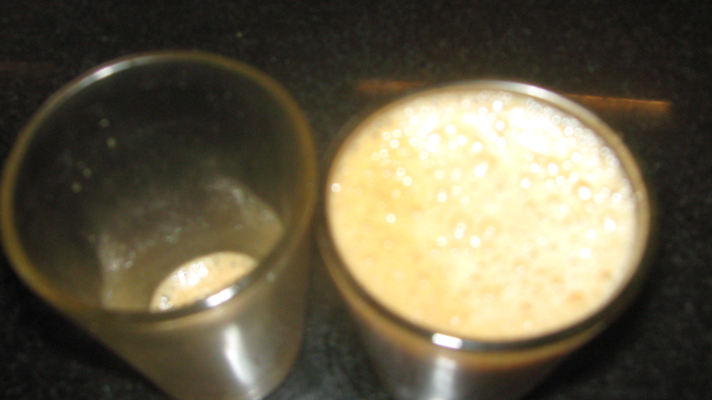
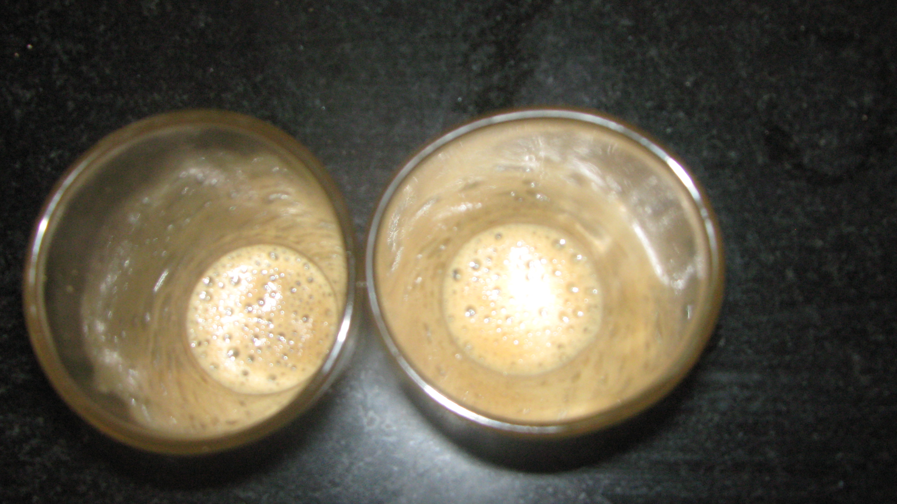
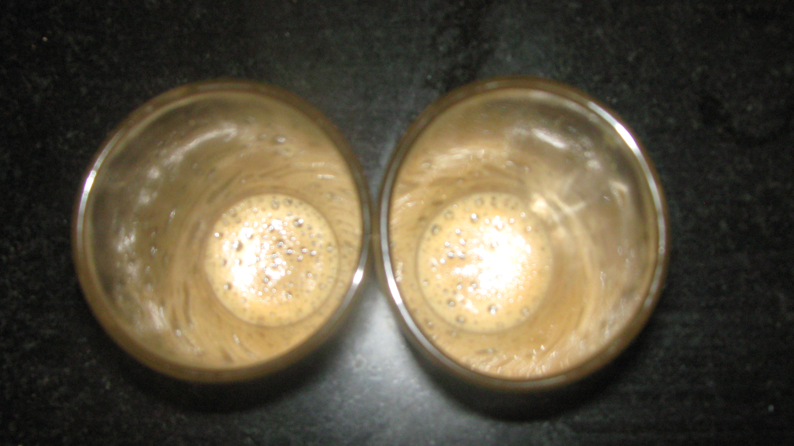

These days I’ve been getting my daily coffee fix at Foody’s on Nanjappa Road, Shantinagar (off Double Road). It’s right opposite the quirky and charming [Jaaga](http://www.jaaga.in/), which has been serving as my office for the past two months. Don’t let “*right opposite”* fool you – one still needs to cross the formidable Double Road twice and need to deal with two directions of traffic. Some day I’ll post a video so you can fully appreciate the ordeal.

But the coffee is *always* worth the ordeal. A strong authentic South Indian filter kaapi for Rs. 7! You can get a stronger brew at no extra charge. So far I’ve resisted the temptation for the stronger brew for fear that I might like it. At Rs. 7/pop, I could probably sip a cup every hour and not feel a twinge of guilt. But do I?

No sir. Strange as it may sound, I’m becoming quite disciplined in life. Rhythm and predictability have now become “good words” in my vocabulary. My first Foody’s coffee is at 8:30am – park car -&gt; walk to Foodys -&gt; buy coupon -&gt; drink coffee -&gt; cross road to Jaaga -&gt; start my workday. My second Foody’s coffee is between 10:30am and 11am. That’s it – two coffees.

On some Thursdays (when my morning speed training run has been rather intense), I need two coffees at the 10:30am break. A few weeks ago, I noticed something weird when I got my second back-to-back cup. Can you spot what’s different between the two cups in Picture #1?

<figure aria-describedby="caption-attachment-1892" class="wp-caption aligncenter" id="attachment_1892" style="width: 300px">

<figcaption class="wp-caption-text" id="caption-attachment-1892">Pic #1: What’s different between the two cups? (besides full vs. empty)</figcaption></figure>

If you can’t make out any differences, have a look at this next picture – both cups are empty.

<figure aria-describedby="caption-attachment-1893" class="wp-caption aligncenter" id="attachment_1893" style="width: 300px">

<figcaption class="wp-caption-text" id="caption-attachment-1893">Pic #2: Both cups now empty. What’s different?</figcaption></figure>

If you still haven’t figured out, here’s a slightly different view of the two empty cups.

<figure aria-describedby="caption-attachment-1894" class="wp-caption aligncenter" id="attachment_1894" style="width: 300px">

<figcaption class="wp-caption-text" id="caption-attachment-1894">Pic #3: left side cup unchanged, right side rotated 90 degrees</figcaption></figure>

Comment away 🙂

