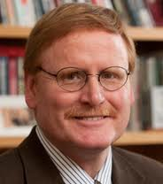
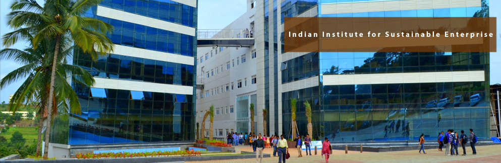

*\[Editor’s Note: I was alerted to the existence of the Indian Institute for Sustainable Enterprises (IISE) by Priya Naik, CEO of [Samhita Social Ventures](http://csr.samhita.org/) (IISE’s outreach partner). If you are thinking of starting a company targeting the BoP customer or are interested in BoP markets, you definitely want to read this post all the way to the end.\]*

Quick question (No Googling please): Do you know who Stuart (“Stu”) Hart is?

If you answered yes, please leave a comment as to what you do professionally. Also mention when you first heard of him.

Quick question #2 (again, no Googling please): Do you know who CK Prahalad is?

This time, if you answered “no”, please Google for the answer 🙂

\*\*\*\*\*\*\*\*\*\*\*\*\*\*\*\*\*\*\*\*\*

<figure aria-describedby="caption-attachment-1667" class="wp-caption alignleft" id="attachment_1667" style="width: 184px">

<figcaption class="wp-caption-text" id="caption-attachment-1667">Stuart Hart (Pic: courtesy cornell.edu)</figcaption></figure>

**About Stuart Hart**

In collaboration with C.K. Prahalad (University of Michigan), Professor Stuart Hart (Cornell University) wrote the path breaking 2002 article *The Fortune at the Bottom of the Pyramid*, which provided the first articulation of how business could profitably serve the needs of the four billion poor in the developing world. Professor Hart is one of the world’s top authorities on the implications of environment and poverty for business strategy. His article *Beyond Greening: Strategies for a Sustainable World* won the McKinsey Award for Best Article in the Harvard Business Review for 1997 and helped launch the movement for corporate sustainability. Early in this blog’s journey, we wrote about Hart and Prahalad [here](http://www.techsangam.com/2011/03/31/the-various-connotations-and-implications-of-bop-bottom-of-pyramid/).

**About IISE &amp; Green Leap Innovation**

The Indian Institute for Sustainable Enterprises (IISE) is a Bangalore-based educational institute/incubator founded by Professor Hart, Dr. Premachandra Sagar (of Dayanand Sagar Institutions), and a [few others](http://theiise.net/founders.html). The IISE aims to dramatically increase the rate and success of *Green Leap Innovation*, both through corporate initiatives and new ventures. To realize this vision, IISE has assembled a complete innovation ecosystem to foster the creation of tomorrow’s distributed and sustainable intrastructure, including an education platform, incubator, investment fund, technology bank, cluster (social) network, learning laboratory, and field support system.

<figure aria-describedby="caption-attachment-1668" class="wp-caption alignright" id="attachment_1668" style="width: 300px">

<figcaption class="wp-caption-text" id="caption-attachment-1668">IISE Bangalore Campus</figcaption></figure>

If the developing world were to suddenly catch up to current US standards, and with the population projected to grow to 9 billion, world consumption rates would increase *elevenfold*. This could literally destroy the natural systems—soils, watersheds, fisheries, forests, and climate—that underpin all economic activity, and indeed, human existence. Serving the BoP sustainably therefore requires *“leapfrog” green innovation*: the incubation today of the environmentally sustainable technologies and industries of tomorrow.

**Post Graduate Certificate in Sustainable Enterprises**

The PG Certificate in Sustainable Enterprise (IISE’s flagship offering) is a one-year program that starts in Aug 2012. The course has been distributed into three phases with gaps in between to facilitate working on-field. The class size for the first batch will be in the 30-35 range. With a faculty that includes the eminent Professor Hart, it should attract a lot of applications for admission.

**Application Procedures &amp; Timelines**

The brochure is accessible at this [Dropbox link](https://www.dropbox.com/s/t2b5sp06am3xa0k/IISE_PG_Cert_Brochure.pdf) and the application form can be downloaded from [here](http://www.samhita.org/system/datas/6097/original/IISE_Certificate_-_Application_Form.docx).

Applications are due by midnight **July 20, 2012**. Short-listed candidates will be contacted for further screening. IISE will also provide student sponsorship based on the quality of the participant. Candidates with good academic record or recommendations or a good track record of work will be selected for this sponsorship.

The [six premises](http://theiise.net/sixkeypremises.html) that serve as the under-pinning of the IISE strategy.