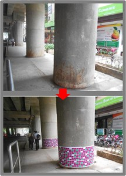

### 1000 Facebook Likes and 56 shares in 22 hours – for ONE picture!

*My original headline read 500+ Likes in 2 hours. I changed it to “725 Likes and 26 shares in three hours”. This morning I was about to update to “900 Likes in 18 hours” but, instead, decided to wait for the 1000 milestone – it came at 1:35pm IST. It was fun refreshing the FB page in the last 30 minutes.*

- No semi-nude or racy film celebrities involved.
- Not a cartoon lampooning the latest Bhupathi-Paes spat.
- Not the latest Amul ad.
- Not the latest cartoon lampooning Poschim Bengal’s Didi.
- Not the million-and-tenth infographic celebrating Tendulkar’s achievements.

….

….

….

It’s *this picture* that The Ugly Indian (TUI) posted on their Facebook page a few hours ago. Their page has 13,700+ fans of which 1000 “liked” it in 22 hours. That’s an astounding **7.3%**! Wow.

<figure aria-describedby="caption-attachment-1659" class="wp-caption aligncenter" id="attachment_1659" style="width: 215px">

<figcaption class="wp-caption-text" id="caption-attachment-1659">Before (top) and after (bottom)</figcaption></figure>

Whoever said *a picture is worth a thousand words* was clearly born in the pre-Facebook millenium and didn’t anticipate the power of conversations on a Facebook photo. Click through to this [Facebook photo page](https://www.facebook.com/photo.php?fbid=390215251037736&set=a.125833837475880.17876.123459791046618&type=1&theater) and you’ll see the rest of the story — *where* these pillars are and *how* The Ugly Indian engages with its fans.

The color choices are not arbitrary, as a fan notices and TUI confirms in the comments..

> Asha GM: Again TUI artisans at work…and you have chosen the metro color combo for the pillars and the curb …great idea.
> 
> TUI: @Asha GM, glad you noticed. These are the Metro colours indeed.
> 
> Tushar: better than the urgh original but the purple is too jarring. maybe a few pillars can be red and yellow like Kar flag colors …
> 
> TUI: colour choice in public spaces is a very sensitive thing – as lots of meanings can be imputed from casual use of colours. We always play safe – this is the Purple Line of the Metro, and it is an abstract design that should offend nobody. Its job is to deter people from spitting on the pillar, and give the impression that it is clean from a distance. People on this FB group are focused on the design – people who walk by react very differently to public design. Just stand next to the pillar and see how people respond.

Just a few weeks ago, TUI created this [Year of SpotFixing in Bangalore’s City Center](https://www.facebook.com/media/set/?set=a.385480351511226.84597.123459791046618&type=1) album. Instead of adding the 70-odd pictures in one shot, they added 10-15 per day. Over the duration of 4 days, the album got more than 500 Likes which, I then thought, was an amazing accomplishment. Until today i.e. None of the 20-30 other Facebook pages I track have an engagement remotely close to TUI.

### What could explain this?

Errr… could it possibly be the fact that TUI is actually *doing* something? Achieving sustainable positive change in Bangalore using an experimental approach, adopting psychology principles and designing systems that are nudging people to change their behavior (ever so slightly), and, most importantly, inspiring people (both in and outside Bangalore to go out and do copy-cat SpotFixes. [*Kaam chalu mooh bandh*](http://www.techsangam.com/2011/11/22/five-amazing-things-about-the-ugly-indian/) anyone?