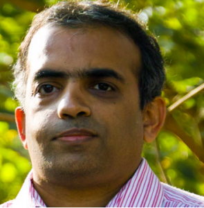

\[Editor’s Note: The Bangalore citizen for all seasons (Ashwin Mahesh) shared an interesting note about [BDA](http://bdabangalore.org/) (Bangalore Development Authority) on Facebook last night. I’m reproducing it here with his permission. A few weeks ago, the Karnataka High court addressed the BDA thus, *“Mr Commissioner, the BDA requires immediate surgery, not only major heart surgery, but for multiple organ failure. The entire system has failed and collapsed. Your town planning department has gone to the dogs. Your engineering section and others are beyond control. About allotment section, we read (newspapers) every day.”* This [TOI article](http://timesofindia.indiatimes.com/city/bangalore/Mr-Commissioner-BDA-needs-major-surgery/articleshow/14726496.cms) provides more details. The High Court asked BDA commissioner Pradeep Singh Kharola to take immediate corrective action. Kharola, who was appointed as BDA commissioner on Jun 1, 2012 (yes – that’s about **six** weeks ago) has just been transferred out presumably due to the change in Chief Minister.\]

<figure aria-describedby="caption-attachment-1678" class="wp-caption alignleft" id="attachment_1678" style="width: 295px">

<figcaption class="wp-caption-text" id="caption-attachment-1678">Bangalore Citizen Extraordinaire (Pic: courtesy ashwinmahesh.in)</figcaption></figure>

**Ashwin Mahesh on the BDA**

Since the newly appointed BDA Commissioner has been more newly transferred away, the position is vacant now. But rather than fill this job, I think the government should close BDA once and for all. I have broadly categorised the reasons into two – the first set of reasons is to document that BDA does not serve any useful purpose, and the second set is to show that it is blocking other agencies from doing their stated purpose too.

**BDA does not serve any useful purpose**  
We may think of the role of the BDA as consisting of three parts:

1. planning land use in the city region,
2. carrying out infrastructure works, and
3. identifying and developing land for the housing needs of a growing population, including the weaker economic sections.

But when we look at the evidence we find several problems with the theory as well as the practice.

1\. Much of the housing that is developed for the middle class and high-end market is from the private sector, and BDA has not been a significant contributor to new housing in recent decades. The most recent layouts it developed are mostly empty, even today. For the poor, its record is even worse – almost no housing for the poor has come about as a result of BDA’s efforts. Moreover, at a time when 800 people move to Bangalore everyday, BDA is simply too slow to develop housing fast enough to meet this demand.

2\. BDA acquires land from farmers around the city, packages this land into sites, and gives them to middle class consumers. **The price given to farmers is less than the true value of the land, and it is this difference between the acquisition price and the allotment price which becomes the BDA’s profit. But** ***this kind of forced non-market intervention leads to all sorts of crimes***. The main reason that BDA is closely linked with the land mafia and its crimes in the city is the arbitrary price gap created by the use of the land acquisition law.

3\. BDA’s role in infrastructure development is only partial, and also very slow. Much of the infrastructure in the city is built by [BBMP](http://www.bbmp.gov.in/) itself, and there is no coherence in planning between the two. The Peripheral Ring Road, planned many years ago, has not even started. Also, BDA’s role is limited to road infrastructure, and many other agencies are involved in other aspects of infrastructure development.

4\. BDA is not a source of ideas about urban development. At a time when urbanisation is becoming a defining aspect of Indian life, we find that the urban planning authority in the region has virtually no new ideas of its own for the development of the city. Even when its higher officials are shown examples of what other cities have done, they have not replicated it here. The BDA has not carried out a single town planning scheme in all its existence.

5\. Planning for land use alone is useless. In theory, BDA is supposed to plan for water supply, sanitation, transport, social infrastructure, and much more. But in practice, it does not do anything other than land use zoning, and that too on a property-by-property basis. What Bangalore needs is an integrated plan across all sectors, and this BDA has never done.

6\. It is increasingly well understood that cities must plan for the entire region around them, and not just the city. ***BDA’s jurisdiction is only slightly larger than BBMP, whereas the area of the Bangalore Metropolitan region is 6 times larger*** than that. BDA’s planning therefore is highly limited in its ability to influence regional matters. Moreover, BDA’s plan for the city is often at cross-purposes with the regional plan developed by [BMRDA](http://www.bmrda.kar.nic.in/).

**Existence of BDA hurts other efforts**

While it is bad enough that BDA does not serve its own stated goals properly, it also gets in the way of good outcomes that can be achieved by others. This is true in both constitutional and operational terms.

1\. According to the 74th Constitutional Amendment Act, which was passed 20 years ago, integrated and statutory planning for the entire Bangalore metropolitan region is supposed to be carried out by a regional planning body, and cover all topics (infrastructure, economy, health, education, transport, and so on). But the BMRDA, which was set up for this purpose, remains toothless. Until this is rectified, we can never fix the development deficits of the region.

2\. In theory the BMRDA should make plans that are binding on all the other agencies. But in practice, none of the others ([BMTC](http://www.bmtcinfo.com/), [BMRCL](http://www.bmrc.co.in/), BBMP, or even BDA) take BMRDA seriously. As a result, the cost and effort at BMRDA is continuously wasted, and the city suffers from the lack of an integrated plan.

3\. Recently, the Centre has made it clear that its funds through JnNURM will not be given anymore unless the amendments under the 74th Constitutional Amendment Act are carried out. This includes creation of a statutory planning body for the region – Metropolitan Planning Council (MPC) with representation for elected representatives from local bodieas as well as domain experts. We are therefore looking at a scenario where we resist doing the right thing, and reluctantly carry out half-hearted measures under funding pressure.

4\. The most harmful of all this is that the competitiveness of the city diminishes, as long as we delay the much-needed reforms. Last year, the City Competitiveness Index ranked Bangalore as #3 in the country, but this year we are at #7. It will get worse unless we intervene.

All of these were promised repeatedly by BJP in the manifestos of BBMP election, General Elections and Assembly Elections. This promise should be kept, before the term of the Assembly ends. All it takes is three steps in lawmaking:

(a) ***Close BDA in its current form***, and convert it into Bangalore Infrastructure Works Authority, an agency to implement large infra projects (in all sectors – roads, drains, pipes, anything).

(b) ***Pass the MPC Bill mooted by BMRDA itself***, or the more comprehensive BMRG Bill proposed by ABIDe, to make this new planning arrangement compliant with the constitution, and of permanent value to the region.

(c) ***Establish BMRDA as the Secretariat of the MPC***, the only planning agency for the entire Bangalore region, and task it with planning all aspects of development – economic, social, cultural, developmental.

You can follow Ashwin Mahesh on his [Facebook page](https://www.facebook.com/ashwin.mahesh) (where all the conversations occur) or via Twitter (@ashwinmahesh).