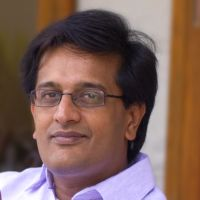
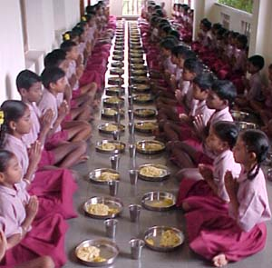

<figure aria-describedby="caption-attachment-1462" class="wp-caption alignleft" id="attachment_1462" style="width: 200px">

<figcaption class="wp-caption-text" id="caption-attachment-1462">Pic: courtesy aspenideas.org</figcaption></figure>

*\[Editor’s Note: The publishing delay of this post is a deeply personal reminder on the need for an “editor” hat — even for a one-person blogging organization. A partial defense for why this post underwent a \*10 month\* gestation period can be [found here](http://www.techsangam.com/2012/04/23/why-some-blog-posts-have-a-longer-gestation-period/). If you agree that I’ve indulged in adequate self-flagellation, I’ll move on with the story. Ok? Back in August 2011, during a trip to Hyderabad to run my 6th marathon, I had a fascinating conversation with Manoj Kumar, CEO of Naandi Foundation, learning about his (and Naandi’s) journey). I have since written two Naandi posts – [What we can expect from HUNGaMA](http://www.techsangam.com/2012/01/10/what-we-can-expect-from-naandi-foundation-landmark-hungama-survey/) and [9 takeaways from HUNGaMA survey](http://www.techsangam.com/2012/01/11/nine-key-takeaways-from-hungama-survey-on-hunger-and-malnutriti/) but this post centers around Manoj (the Naandi CEO). Last year, Manoj was made a Fellow of the US based Aspen Global Leadership Network.\]*

As I researched India’s various midday meals program (back in July 2011), I learnt that Naandi Foundation’s midday meals program was similar in scale to the more famous Akshaya Patra. What’s more, Naandi Foundation was also impacting other important areas like education and community drinking water. Naandi’s website introduces their CEO (Manoj Kumar) impressively thus:

<figure aria-describedby="caption-attachment-1463" class="wp-caption alignright" id="attachment_1463" style="width: 300px">

<figcaption class="wp-caption-text" id="caption-attachment-1463">Naandi-powered midday meals in Orissa’s Keonjhar district (Pic: courtesy bizodisha.com)</figcaption></figure>

*As CEO of Naandi Foundation, Manoj feeds 1.2 million hungry children every day, provides safe drinking water to 3 million people in rural areas, runs over 1700 schools guaranteeing quality education to over 100,000 children and works with 15,000 adivasi small farmers to export over a million kilograms of coffee every year. Most of this is done by convincing governments to outsource inefficiently run programs for the poor to Naandi. Under his leadership Naandi also became the first and largest grantee of the Michael and Susan Dell Foundation specifically focused to become a game changer for India’s education scene.*

The relevance to this blog increased after I read this: *Having taken Naandi to a scale and prominence that makes it one of the top-notch not-for-profits in India today, Manoj is now busy breaking down Naandi into separate for-profit social business ventures. Having created a social business venture for provision of safe drinking water, his eyes are now set on doing the same for education in India.*

Through a fortuitous email exchange with ITC eChoupal’s Sivakumar (whom I interviewed in late August for [this post](http://www.techsangam.com/2011/09/20/itc-e-choupal-model-to-increase-farmer-revenue-and-its-own-bottomline/)), I managed to catch Manoj Kumar in the midst of some hectic travels. At a Banjara Hills Cafe Coffee Day on a Saturday evening, I listened to Manoj recount his fascinating journey — from his development economist roots to setting up an MFI field office to insights from a visit to Bangladesh’s BRIC office to the circumstances of his meeting Dr. Anji Reddy to shaping Naandi’s impactful forays into multiple social enterprise categories.

**Path to Naandi**

Trained as a development economist from University of Kerala (Kariavattom), Manoj’s first job was with SIDBI, a subsidiary of Industrial Development Bank of India (IDBI) Mumbai, where he cut his teeth on all things venture capital and investments. An introduction to Vijay Mahajan led to his next assignment — to setup Basix’s Mangalore operation. After making the Mangalore operation profitable in two years, he moved to Hyderabad to assume Indian operational leadership of US-based Foster Parents Plan International. An annual budget of Rs. 300 crores ensured that Manoj could think and act big. Dr. Anji Reddy’s Naandi Foundation, then a fledgling organization with a modest charter, was impacting 75 children. Manoj approached Reddy with a grant pitch to scale operations to 3,000 children. Reddy accepted and, incidentally, the Reddy-Kumar relationship was also born. Reddy would spend the next few years trying to convince Manoj to lead Naandi Foundation, eventually succeeding in 2000.

**Evolution of the Naandi DNA**

The founding vision of Naandi was to bid for government projects and run them efficiently as only the private sector can. The first pitch (to run AP’s midday meals program) was to (then Chief Minister) Chandrababu Naidu and his cabinet. The second successful pitch was to Madhya Pradesh’s CM, Uma Bharti – again to run the state’s midday meals program. In the initial years, Manoj and the Naandi team were vertical agnostic. When Manoj started getting one too many calls from Member of Parliaments (from different states) on the lines of *“I’ve heard that you run programs very efficiently. Can you help us with \[Insert Program Name\]”*, he knew it was time for Naandi to focus.

The areas of focus turned out to be child nutrition, education, drinking water, and sustainable livelihoods. Most of our discussion centered on child nutrition, education and a few sundry topics like Abhijit Banerjee’s RCTs and Individual Social Responsibility.

**Collecting from the Government**

As we noted in the earlier post on Akshaya Patra and Naandi Foundation’s [midday meals programs](http://www.techsangam.com/2011/07/03/surprise-surprise-the-crown-jewels-in-indias-midday-meal-programs-are-charitable-trusts/), the public-private partnership calls for the government to reimburse a fixed amount for every recipient of the program. When Manoj went to collect on his first invoice, he was taken aback when politico-babu machinery calmly asked for “their 2% cut.” A disturbed Manoj appealed to the minister (who shall remain anonymous) who said *“Come on, Manoj! I didn’t know you were so naive. If you don’t want your cash flows to be affected, just invoice higher to adjust. We are trying to feed a few million kids, not solve world hunger!”* Ok – the minister didn’t really say the last bit but he might as well have.

Manoj had resolved to *not pay a cut to anyone* so it took 18 long months before Naandi Foundation got its first cheque from the government. He averted Naandi’s first existential crisis through a multi-pronged strategy – working capital loans from banks, exerting indirect pressure via the beneficiaries, donor support, and constantly bearing down upon the concerned ministers and bureaucrats.

**Education &amp; Schools**

It was hard to tell whether Manoj was more passionate about combating child malnutrition or reforming India’s schools. Naandi’s foray into education is via coaching classes with a unique learning pedagogy. Coaching classes for… grades 1 through 5! Naandi’s teachers are not regular teachers (with B.Ed degrees). They are ‘trained’ by teachers with B.Ed degrees but their teaching style is more facilitative and thus are called ‘learning facilitators’. It’s no coincidence that Manoj is completely plugged into all of Banerjee Duflo’s RCTs and research around education, including the [Pratham balsakhi program](http://www.techsangam.com/2011/09/10/prathams-contributions-to-indian-education-policy-debate/).

The initial trials of the Naandi coaching programs were all in maoist-infested Chhatisgarh government schools. Here’s what’s most interesting – it’s not an ‘after school’ program but a ‘before school’ program – 5:45am to 8am. The trial was a rousing success with the top 50 district rankers all being coached by Naandi. Good news travels fast. Parents of many private schools (who were only marginally better than government schools) wanted Naandi coaching for their kids too… and they were ready to pay. A [Samhita Academy style](http://www.techsangam.com/2012/06/17/samhita-academy-trailblazing-the-rte-path-years-before-it-became-a-law/) social enterprise model is already underway.

**A few quotes and predictions from Manoj**

- “90% of Indian NGOs are corrupt. But the non-corrupt 10% are awesome.”
- “I predict that within 5 years, private organizations will be allowed to run government schools.” Reminded me of [Karuna Trust](http://www.karunatrust.com/?page_id=8)‘s amazing work in running 70+ government PHCs (Primary Health Care Centers).

There are at least three more posts that need to be written – deep-dives into Naandi’s education, community drinking water, and sustainable livelihood verticals. Stay tuned.